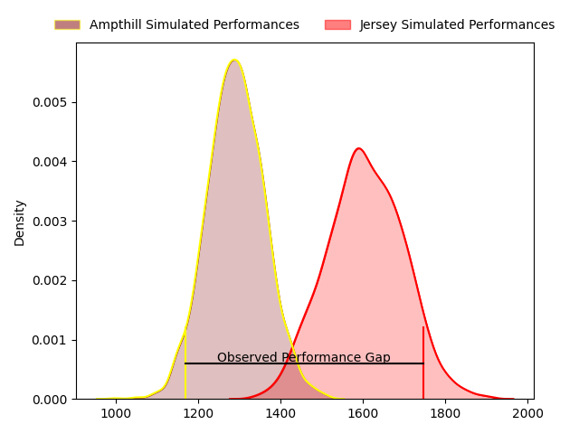
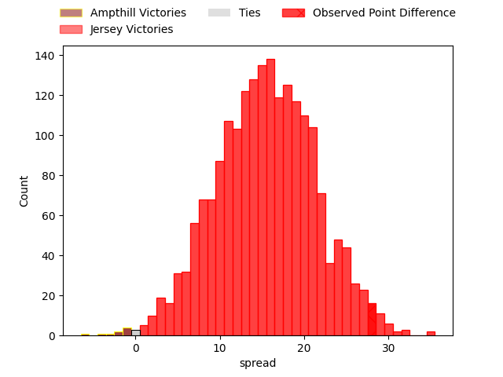

---  
layout: page  
title: Ampthill at Jersey; 15-43  
date: 2023-04-29 16:00:00 18:00:00 -0500  
categories: match review  
---
# Ampthill at Jersey; 15-43

# Club Level Predictions

The first set of predictions treats a club as the smallest object, as the club develops its members, organizes a gameplan, and deploys its players as needed for each match. This club model has a prediction of 0.851, which translates to predicting Jersey to win by 15.5.

Each club has a rating and a rating deviation (simiar to a Glicko system), and expected performances can be generated. This allows for simulated matches and spreads like the ones below.
## Projected Performances

## Projected Spreads

## Projected Results

# Player Level Predictions

Treating teams instead as an entity made up of the currently active players, I have ratings for each player in an altogether different system. These can be combined to form team ratings once teamsheets are announced, weighting starters a bit higher than the reserves. After the match is played, players can be weighted by their minutes on the field, allowing for an accurate measure of the team's composition. With these compiled team ratings, we can make predictions, measure inaccuracy, and update the individual player ratings.
## Prediction with Player Minutes: Jersey by 32.0

Jersey by 28.0 on a neutral field

There were 5 large changes in win probability in this match
## Prediction without Player Minutes: Jersey by 35.0

Jersey by 31.0 on a neutral pitch

|   Away Minutes | Away Player       |   Away elo |   Away Percentile |   Number |   Home Percentile |   Home elo | Home Player                 |   Home Minutes |
|---------------:|:------------------|-----------:|------------------:|---------:|------------------:|-----------:|:----------------------------|---------------:|
|             50 | Sam Crean         |      67.22 |               nan |        1 |                73 |      87.43 | Huw Owen                    |             47 |
|             50 | Matt Gallagher    |      86.11 |                70 |        2 |                87 |      98.67 | Eoghan Clarke               |             55 |
|             50 | Aleki Lutui       |      64.28 |               nan |        3 |                64 |      82.92 | Steven Longwell             |             80 |
|             68 | Charlie Beckett   |      79.27 |                55 |        4 |                88 |     100.56 | Sean O'Connor               |              7 |
|             80 | Harry Wilson      |      58.12 |                16 |        5 |                54 |      79.11 | Macauley Cook               |             80 |
|             80 | Fyn Brown         |      72.99 |                41 |        6 |                92 |     108.21 | Max Argyle                  |             55 |
|             16 | Josh Smart        |      68.78 |                32 |        7 |                90 |     105.22 | Lewis Wynne                 |             80 |
|             80 | Morgan Strong     |      65.57 |                24 |        8 |                80 |      91.97 | James Andrew Dun            |             80 |
|             55 | Lewis Finlay      |      54.76 |                11 |        9 |                 4 |      46.74 | James Elliott               |             58 |
|             55 | Tom Hardwick      |      73.06 |                39 |       10 |                25 |      65.32 | Russell Bennett             |             80 |
|             80 | Alexandrer Harmes |      69.74 |                37 |       11 |                95 |     113.92 | Will Brown                  |             58 |
|             80 | Gwyn Parks        |      76.37 |                47 |       12 |                93 |     111.75 | Dan Barnes                  |             55 |
|             80 | Thomas Hitchcock  |      65.83 |                25 |       13 |                51 |      77.95 | Alex McHenry                |             65 |
|             68 | Conor Rankin      |      68.6  |                27 |       14 |                91 |     105.84 | Tomi Lewis                  |             80 |
|             80 | Tomas Bacon       |      73.01 |                40 |       15 |                80 |      96.99 | Brendan Owen                |             80 |
|             64 | Paddy Ryan        |      88.03 |                70 |       16 |                65 |      83.95 | James Scott                 |             73 |
|             30 | Dominic Hardman   |      75.95 |                48 |       17 |                94 |     105.71 | Samuel Alexander Grahamslaw |             33 |
|             30 | Sid Blackmore     |      72.82 |                37 |       18 |                74 |      89.73 | Alun Lawrence               |             25 |
|             30 | Jevaughn Warren   |      75.02 |                41 |       19 |                21 |      63    | Jordan Holgate              |             25 |
|             25 | Joshua Bragman    |      67.98 |                26 |       20 |                54 |      78.37 | James Hadfield              |             25 |
|             25 | Gavin Williams    |      67.37 |               nan |       21 |                74 |      91.75 | James Mitchell              |             22 |
|             12 | Cai Devine        |      61.87 |                19 |       22 |                60 |      81.49 | Ben Woollett                |             22 |
|             12 | Josh Skelcey      |      71.04 |                39 |       23 |                55 |      80.11 | Adam Nicol                  |             15 |

