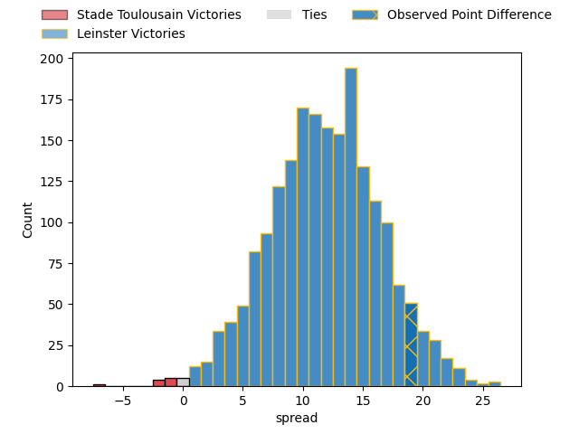

---  
layout: page  
title: Stade Toulousain at Leinster; 22-41  
date: 2023-04-29 16:00:00 18:00:00 -0500  
categories: match review  
---
# Stade Toulousain at Leinster; 22-41

# Club Level Predictions

The first set of predictions treats a club as the smallest object, as the club develops its members, organizes a gameplan, and deploys its players as needed for each match. This club model has a prediction of 0.792, which translates to predicting Leinster to win by 11.8.

Each club has a rating and a rating deviation (simiar to a Glicko system), and expected performances can be generated. This allows for simulated matches and spreads like the ones below.
## Projected Performances

## Projected Spreads

## Projected Results

# Player Level Predictions

Treating teams instead as an entity made up of the currently active players, I have ratings for each player in an altogether different system. These can be combined to form team ratings once teamsheets are announced, weighting starters a bit higher than the reserves. After the match is played, players can be weighted by their minutes on the field, allowing for an accurate measure of the team's composition. With these compiled team ratings, we can make predictions, measure inaccuracy, and update the individual player ratings.
## Prediction with Player Minutes: Leinster by 9.7

Leinster by 5.7 on a neutral field

There were 5 large changes in win probability in this match
## Prediction without Player Minutes: Leinster by 11.4

Leinster by 7.4 on a neutral pitch

|   Away Minutes | Away Player          |   Away elo |   Away Percentile |   Number |   Home Percentile |   Home elo | Home Player          |   Home Minutes |
|---------------:|:---------------------|-----------:|------------------:|---------:|------------------:|-----------:|:---------------------|---------------:|
|             51 | Cyril Baille         |     102.8  |                92 |        1 |                80 |      91.25 | Andrew Porter        |             68 |
|             51 | Peato Mauvaka        |      68.39 |                32 |        2 |                88 |      98.9  | Dan Sheehan          |             68 |
|             51 | Dorian Aldegheri     |      83.53 |                65 |        3 |                95 |     109.6  | Tadhg Furlong        |             60 |
|             51 | Richie Arnold        |      70.17 |                35 |        4 |                42 |      71.68 | Ross Molony          |             55 |
|             67 | Emmanuel Meafou      |      62.11 |                20 |        5 |                81 |      93.83 | James Ryan           |             80 |
|             80 | Jack Willis          |     111.07 |                94 |        6 |                88 |     100.91 | Caelan Doris         |             80 |
|             80 | Thibaud Flament      |      86.18 |                69 |        7 |                91 |     106.02 | Josh van der Flier   |             80 |
|             67 | Francois Cros        |     153.08 |                99 |        8 |                96 |     113.6  | Jack Conan           |             67 |
|             80 | Antoine Dupont       |     125.42 |                98 |        9 |                83 |      98.79 | Jamison Gibson-Park  |             62 |
|             80 | Romain Ntamack       |     111.45 |                93 |       10 |                77 |      94    | Ross Byrne           |             71 |
|             80 | Matthis Lebel        |      60.52 |                21 |       11 |                77 |      91.67 | Jimmy O'Brien        |             80 |
|             80 | Pita Ahki            |      78.86 |                53 |       12 |               nan |      87.38 | Charlie Ngatai       |             54 |
|             15 | Pierre-Louis Barassi |      74.31 |                42 |       13 |                70 |      89.14 | Garry Ringrose       |             80 |
|             69 | Juan Cruz Mallia     |      62.89 |                24 |       14 |                49 |      75.86 | Jordan Larmour       |             80 |
|             80 | Thomas Ramos         |     128.74 |                97 |       15 |                96 |     125.38 | Hugo Keenan          |             80 |
|             65 | Paul Graou           |      89.52 |                71 |       16 |                41 |      75.45 | Ciaran Frawley       |             26 |
|             29 | Rodrigue Neti        |      78.57 |                54 |       17 |                68 |      85.62 | Jason Howell Jenkins |             25 |
|             29 | Julien Marchand      |      96.16 |                85 |       18 |                55 |      79    | Michael Ala'alatoa   |             20 |
|             29 | David Ainu'u         |      65.43 |                25 |       19 |                53 |      78.27 | Luke McGrath         |             18 |
|             29 | Alexandre Roumat     |      55.68 |                12 |       20 |                84 |      95.62 | Ryan Baird           |             13 |
|             13 | Alban Placines       |      80.32 |                57 |       21 |               nan |      89.75 | Cian Healy           |             12 |
|             13 | Rynhard Elstadt      |      67.53 |                29 |       22 |                60 |      81.33 | John McKee           |             12 |
|             11 | Arthur Retière       |      70.1  |                38 |       23 |                49 |      77.84 | Harry Byrne          |              9 |

