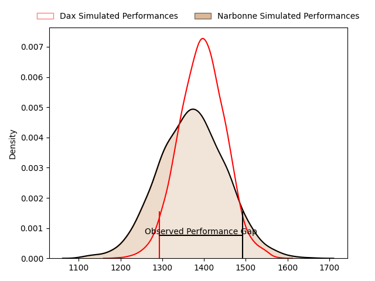
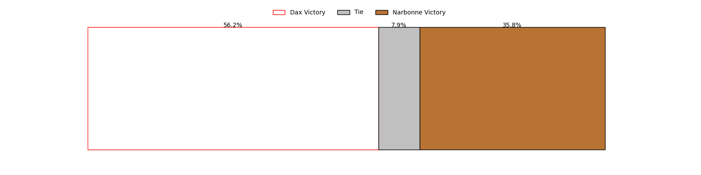

---  
layout: page  
title: Dax at Narbonne; 6-15  
date: 2023-04-29 16:00:00 18:00:00 -0500  
categories: match review  
---
# Dax at Narbonne; 6-15

# Club Level Predictions

The first set of predictions treats a club as the smallest object, as the club develops its members, organizes a gameplan, and deploys its players as needed for each match. This club model has a prediction of 0.467, which translates to predicting Dax to win by 1.2.

Each club has a rating and a rating deviation (simiar to a Glicko system), and expected performances can be generated. This allows for simulated matches and spreads like the ones below.
## Projected Performances

## Projected Spreads

## Projected Results

# Player Level Predictions

Treating teams instead as an entity made up of the currently active players, I have ratings for each player in an altogether different system. These can be combined to form team ratings once teamsheets are announced, weighting starters a bit higher than the reserves. After the match is played, players can be weighted by their minutes on the field, allowing for an accurate measure of the team's composition. With these compiled team ratings, we can make predictions, measure inaccuracy, and update the individual player ratings.
## Prediction with Player Minutes: Dax by 6.5

Dax by 10.5 on a neutral field

There were 12 large changes in win probability in this match
## Prediction without Player Minutes: Dax by 4.7

Dax by 8.7 on a neutral pitch

|   Away Minutes | Away Player          |   Away elo |   Away Percentile |   Number |   Home Percentile |   Home elo | Home Player           |   Home Minutes |
|---------------:|:---------------------|-----------:|------------------:|---------:|------------------:|-----------:|:----------------------|---------------:|
|             54 | Raphaël Laboille     |      74.15 |               nan |        1 |                23 |      71.27 | Geoffrey Moise        |             49 |
|             54 | Elvis Levi           |     111.2  |                95 |        2 |                89 |      99.77 | Jordan Rochier        |             67 |
|             57 | Anthony Pelmard      |      57.74 |                21 |        3 |                83 |      97.08 | Théo Castinel         |             49 |
|             80 | Mattieu Bidau        |      67.75 |                28 |        4 |                 5 |      45.25 | Valentin Sese         |             80 |
|             57 | Yoan Gaune           |      87.58 |                71 |        5 |                70 |      86.76 | Mauro Rebussone       |             49 |
|             80 | Diaby Doucouré       |      81.83 |                58 |        6 |                48 |      76.14 | Arthur Christienne    |             80 |
|             57 | Théo Tremeau         |      40.7  |                 2 |        7 |                22 |      62.49 | Guillem Montagne      |             80 |
|             80 | Jean Despiau         |      79.3  |                54 |        8 |                33 |      73.94 | Flavien Nouhaillaguet |             60 |
|             40 | Jules Bousquet       |      86.33 |               nan |        9 |                52 |      82.32 | Christopher Kaiser    |             52 |
|             57 | Gaëtan Robert        |      46.11 |                 6 |       10 |                62 |      84.61 | Paul Auradou          |             80 |
|             80 | Julien Dechavanne    |      72.21 |                41 |       11 |                 1 |      27.15 | Save Totovosau        |             80 |
|             80 | Jules Lartigau       |      74.58 |               nan |       12 |                19 |      61.27 | Théo Mias             |             54 |
|             25 | Hugo Fourquet        |      95.05 |                75 |       13 |                48 |      76.72 | Pierre Nueno          |             80 |
|             80 | Flavien Laforie      |      74.49 |               nan |       14 |                31 |      67.44 | Étienne Ducom         |             40 |
|             80 | Guillaume Bouche     |     116.87 |                96 |       15 |                24 |      68.97 | James Kane            |             80 |
|             26 | Joaquin Rodon        |      76.52 |                33 |       16 |                49 |      76.32 | Sylvain Abadie        |             31 |
|             26 | Louis Barrere        |      90.99 |                79 |       17 |                85 |      95.38 | Christophe David      |             13 |
|             23 | Diogo Hasse Ferreira |      81.57 |                59 |       18 |               nan |      71.31 | Avto Gogiashvili      |             31 |
|             23 | Matt Luamanu         |      81.06 |                59 |       19 |                 6 |      37.06 | Manuel Plaza          |             31 |
|             23 | Alexis Duprouilh     |      74.68 |               nan |       20 |                46 |      74.75 | Paul Belzons          |             20 |
|             40 | Adrien Ayestaran     |      68.42 |                32 |       21 |                24 |      63.8  | Pierrick Nova         |             28 |
|             23 | Matteo Issert        |      74.32 |               nan |       22 |               nan |      68.36 | Lucas Lebraud         |             26 |
|             55 | Sylvère Reteau       |      77.77 |                47 |       23 |                64 |      83.35 | Pierre-Hugo Ducom     |             40 |

