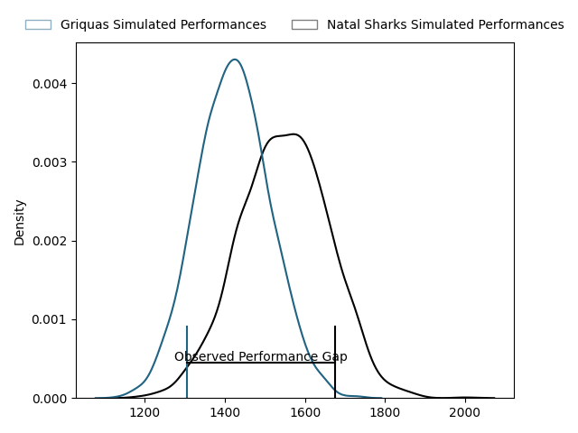

---  
layout: page  
title: Griquas at Natal Sharks; 6-24  
date: 2023-04-29 15:00:00 18:00:00 -0500  
categories: match review  
---
# Griquas at Natal Sharks; 6-24

# Club Level Predictions

The first set of predictions treats a club as the smallest object, as the club develops its members, organizes a gameplan, and deploys its players as needed for each match. This club model has a prediction of 0.671, which translates to predicting Natal Sharks to win by 6.4.

Each club has a rating and a rating deviation (simiar to a Glicko system), and expected performances can be generated. This allows for simulated matches and spreads like the ones below.
## Projected Performances

## Projected Spreads

## Projected Results

# Player Level Predictions

Treating teams instead as an entity made up of the currently active players, I have ratings for each player in an altogether different system. These can be combined to form team ratings once teamsheets are announced, weighting starters a bit higher than the reserves. After the match is played, players can be weighted by their minutes on the field, allowing for an accurate measure of the team's composition. With these compiled team ratings, we can make predictions, measure inaccuracy, and update the individual player ratings.
## Prediction with Player Minutes: Natal Sharks by 10.6

Natal Sharks by 6.6 on a neutral field

There were 1 large changes in win probability in this match
## Prediction without Player Minutes: Natal Sharks by 10.2

Natal Sharks by 6.2 on a neutral pitch

|   Away Minutes | Away Player                |   Away elo |   Away Percentile |   Number |   Home Percentile |   Home elo | Home Player                   |   Home Minutes |
|---------------:|:---------------------------|-----------:|------------------:|---------:|------------------:|-----------:|:------------------------------|---------------:|
|             60 | Cebolenkosi Dlamini        |      72.63 |                42 |        1 |                34 |      69.91 | Khwezi Jongamazizi Mona       |             65 |
|             56 | Janco Uys                  |      72.75 |                43 |        2 |               nan |      72.7  | Kerron van Vuuren             |             56 |
|             69 | Janu Botha                 |      79.29 |                57 |        3 |                68 |      84.75 | Khuthuzani Kingdom Mchunu     |             56 |
|             80 | Johan Retief               |      71.92 |                40 |        4 |                73 |      88.41 | Ockie Barnard                 |             60 |
|             51 | Albert Liebenberg          |      76.43 |                49 |        5 |                45 |      73.55 | Daniel Pieter (Reniel) Hugo   |             80 |
|             80 | Stephan Smit               |      63.81 |                24 |        6 |                38 |      71.22 | Tinotenda Blithe Mavesere     |             80 |
|             80 | Hanru Sirgel               |      86.83 |                71 |        7 |                42 |      72.83 | Thembelani Bholi              |             69 |
|             64 | Carl Els                   |      61.65 |                20 |        8 |                85 |      98.88 | Hendrik Petrus (Henco) Venter |             80 |
|             61 | Johan Mulder               |      64.54 |                25 |        9 |                64 |      84.35 | Bradley Davids                |             61 |
|             56 | Eduard (Eddie) Fouche      |      93.95 |                77 |       10 |                32 |      68.59 | Lionel Cronje                 |             80 |
|             80 | Luther Obi                 |      66.35 |                30 |       11 |                76 |      91.07 | Marnus Potgieter              |             78 |
|             80 | Tertius Kruger             |      70.66 |                35 |       12 |                93 |     110.31 | Alwayno Visagie               |             80 |
|             44 | Sango (Saida) Xamlashe     |      72.9  |                43 |       13 |                38 |      72.21 | Josh Jonas                    |             47 |
|             80 | Sakoyisa Makata            |      70.65 |               nan |       14 |                27 |      64.82 | Yaw Osei Penxe                |             80 |
|             80 | Jay Cee Nel                |      97.02 |                80 |       15 |                44 |      77.25 | Thaakir Abrahams              |             80 |
|             36 | George Alexander Whitehead |      76.21 |                51 |       16 |                36 |      72.04 | Murray Koster                 |             33 |
|             29 | Dylan Sjoblom              |      68.71 |               nan |       17 |                76 |      91.8  | Daniel Viljoen Jooste         |             24 |
|             24 | Sean Swart                 |      74.12 |               nan |       18 |                31 |      71.19 | Hanro Jacobs                  |             24 |
|             24 | Ashlon Davids              |      95.06 |                79 |       19 |               nan |      75.46 | Marco De Witt                 |             20 |
|             20 | Edward Davids              |      79.28 |                57 |       20 |                65 |      83.21 | Tiaan Fourie                  |             19 |
|             19 | Raegan Oranje              |      85.92 |                72 |       21 |                53 |      79.6  | Dian Bleuler                  |             15 |
|             16 | Niel Otto                  |      97.85 |                85 |       22 |               nan |      69.96 | Damon Royle                   |             11 |
|             11 | Junior Banda               |      70.68 |                40 |       23 |                38 |      71.57 | Frederik Johannes Zeilinga    |              2 |

