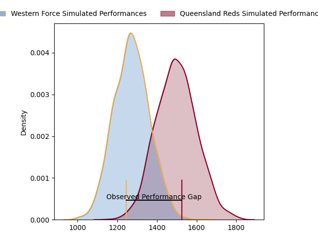
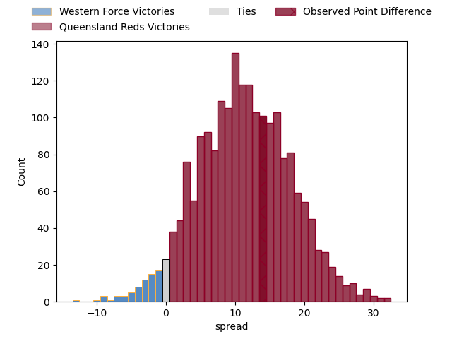

---  
layout: page  
title: Western Force at Queensland Reds; 17.0-31.0  
date: 2023-04-29 05:35:00 18:00:00 -0500  
categories: match review  
---
# Western Force at Queensland Reds; 17.0-31.0

# Club Level Predictions

The first set of predictions treats a club as the smallest object, as the club develops its members, organizes a gameplan, and deploys its players as needed for each match. This club model has a prediction of 0.779, which translates to predicting Queensland Reds to win by 11.4.

Each club has a rating and a rating deviation (simiar to a Glicko system), and expected performances can be generated. This allows for simulated matches and spreads like the ones below.
## Projected Performances

## Projected Spreads

## Projected Results

# Player Level Predictions

Treating teams instead as an entity made up of the currently active players, I have ratings for each player in an altogether different system. These can be combined to form team ratings once teamsheets are announced, weighting starters a bit higher than the reserves. After the match is played, players can be weighted by their minutes on the field, allowing for an accurate measure of the team's composition. With these compiled team ratings, we can make predictions, measure inaccuracy, and update the individual player ratings.
## Prediction with Player Minutes: Western Force by 1.2

Western Force by 5.2 on a neutral field

There were 19 large changes in win probability in this match
## Prediction without Player Minutes: Queensland Reds by 4.4

Queensland Reds by 0.4 on a neutral pitch

|   Away Minutes | Away Player           |   Away elo |   Away Percentile |   Number |   Home Percentile |   Home elo | Home Player      |   Home Minutes |
|---------------:|:----------------------|-----------:|------------------:|---------:|------------------:|-----------:|:-----------------|---------------:|
|             49 | Charlie Hancock       |      82.26 |               nan |        1 |                67 |      84.38 | Sef Fa'agase     |             56 |
|             67 | Tom Horton            |     102.37 |                91 |        2 |                48 |      75.16 | Matt Faessler    |             61 |
|             80 | Santiago Medrano      |      90.35 |                79 |        3 |                69 |      85.28 | Zane Nonggorr    |             56 |
|             58 | Felix Kalapu          |      36.53 |                 2 |        4 |                39 |      71.49 | Connor Vest      |             56 |
|             80 | Jeremy Williams       |      75.12 |                46 |        5 |                30 |      68.05 | Seru Uru         |             71 |
|             41 | Tim Anstee            |      69.93 |                34 |        6 |                94 |     111.39 | Liam Wright      |             80 |
|             80 | Carlo Tizzano         |      89.38 |                74 |        7 |                44 |      74.03 | Fraser McReight  |             80 |
|             80 | Michael Wells         |      90.71 |                75 |        8 |                85 |      97.97 | Harry Wilson     |             80 |
|             58 | Issak Fines-Leleiwasa |      93.74 |                78 |        9 |                81 |      96.81 | Tate McDermott   |             71 |
|             58 | Bryce Hegarty         |      95.32 |                78 |       10 |                70 |      89.59 | Lawson Creighton |             80 |
|             80 | Zach Kibirige         |      75.73 |                48 |       11 |                67 |      87.25 | Jock Campbell    |             80 |
|             80 | Hamish Stewart        |     124.44 |                98 |       12 |                81 |      97    | James O'Connor   |             41 |
|             80 | Sam Spink             |     100.95 |                84 |       13 |                47 |      76.42 | Josh Flook       |             80 |
|             80 | Manasa Mataele        |     106.07 |                91 |       14 |                81 |      94.99 | Suliasi Vunivalu |             80 |
|             49 | Chase Tiatia          |      88.01 |                69 |       15 |                85 |      99.03 | Jordan Petaia    |             70 |
|             13 | Feleti Kaitu'u        |      71.36 |                35 |       16 |                92 |     104.82 | Richie Asiata    |             19 |
|             31 | Marley Pearce         |      83.96 |               nan |       17 |               nan |      84.32 | George Blake     |             24 |
|             39 | Bo Abra               |      77.58 |               nan |       18 |                58 |      82.85 | Peni Ravai       |             24 |
|             22 | Ryan McCauley         |      91.05 |                68 |       19 |                67 |      85.51 | Ryan Smith       |             24 |
|             39 | Jackson Pugh          |      74.84 |                46 |       20 |                79 |      91.4  | Jake Upfield     |              9 |
|             22 | Ian Prior             |      94.18 |                79 |       21 |                70 |      86.66 | Kalani Thomas    |              9 |
|             22 | Bayley Kuenzle        |      84.78 |                65 |       22 |                70 |      88.87 | Tom Lynagh       |             39 |
|             31 | George Poolman        |      88.52 |               nan |       23 |                89 |     103.72 | Filipo Daugunu   |             10 |

