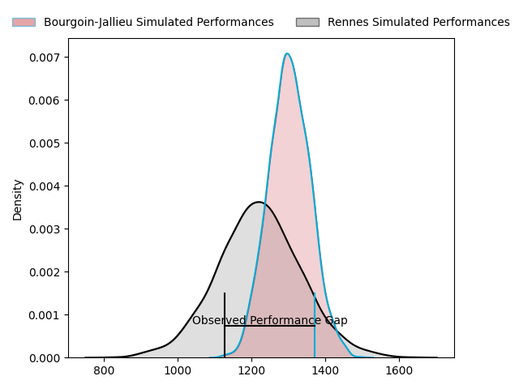
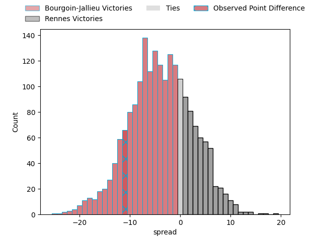
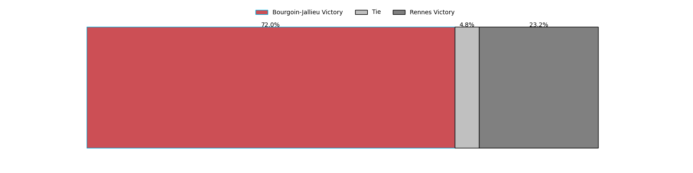

---  
layout: page  
title: Bourgoin-Jallieu at Rennes; 24-13  
date: 2023-04-29 16:00:00 18:00:00 -0500  
categories: match review  
---
# Bourgoin-Jallieu at Rennes; 24-13

# Club Level Predictions

The first set of predictions treats a club as the smallest object, as the club develops its members, organizes a gameplan, and deploys its players as needed for each match. This club model has a prediction of 0.389, which translates to predicting Bourgoin-Jallieu to win by 4.0.

Each club has a rating and a rating deviation (simiar to a Glicko system), and expected performances can be generated. This allows for simulated matches and spreads like the ones below.
## Projected Performances

## Projected Spreads

## Projected Results

# Player Level Predictions

Treating teams instead as an entity made up of the currently active players, I have ratings for each player in an altogether different system. These can be combined to form team ratings once teamsheets are announced, weighting starters a bit higher than the reserves. After the match is played, players can be weighted by their minutes on the field, allowing for an accurate measure of the team's composition. With these compiled team ratings, we can make predictions, measure inaccuracy, and update the individual player ratings.
## Prediction with Player Minutes: Bourgoin-Jallieu by 14.1

Bourgoin-Jallieu by 18.1 on a neutral field

There were 3 large changes in win probability in this match
## Prediction without Player Minutes: Bourgoin-Jallieu by 11.6

Bourgoin-Jallieu by 15.6 on a neutral pitch

|   Away Minutes | Away Player       |   Away elo |   Away Percentile |   Number |   Home Percentile |   Home elo | Home Player            |   Home Minutes |
|---------------:|:------------------|-----------:|------------------:|---------:|------------------:|-----------:|:-----------------------|---------------:|
|             49 | Romain Favaretto  |      59.59 |                 8 |        1 |                23 |      64.99 | Carlos Muzzio          |             50 |
|             52 | Maxime Castant    |      70.74 |                38 |        2 |                17 |      58.75 | Alexandre Fau          |             80 |
|             80 | Mickaël Simutoga  |      66.05 |                26 |        3 |                15 |      58.58 | Luvuyo Pupuma          |             68 |
|             59 | Robin Gascou      |      97.33 |                85 |        4 |                39 |      71.33 | Gabriel Quesmel        |             54 |
|             80 | Jonathan Kpoku    |      81.42 |                59 |        5 |                37 |      72.81 | Alexandre Gueroult     |             80 |
|             80 | Kevin Rivoire     |      89.42 |                76 |        6 |                38 |      71.87 | Vincent Wenger         |             57 |
|             48 | Théophile Cotte   |      70.72 |                35 |        7 |                14 |      56.5  | Pedro Ortega           |             19 |
|              9 | Théo Lepage       |      79.23 |                40 |        8 |                 7 |      48.93 | Gaétan Béraud          |             80 |
|             80 | Tomas Munilla     |      77.54 |                50 |        9 |                63 |      84.03 | Lucas Ollion           |             33 |
|             80 | Benjamin Noble    |      77.73 |                50 |       10 |                71 |      90.22 | Joaquin Diaz Luzzi     |             80 |
|             54 | Remi Bouet        |      96.78 |                76 |       11 |                11 |      52.41 | Romuald François       |             80 |
|             49 | Isaiah Leota      |      82.39 |                59 |       12 |                10 |      54.14 | Ryan Dubois            |             80 |
|             80 | Pablo Patilla     |      54.41 |                11 |       13 |                 9 |      51.4  | Clément Lepresle       |             80 |
|             57 | Naibuka Rokua     |      63.41 |                24 |       14 |                72 |      88.32 | Alexis François        |             18 |
|             80 | Nicolas Cachet    |      81.37 |                55 |       15 |                27 |      68.78 | Théo Platon            |             69 |
|             71 | Lakisipone Lee    |      64.36 |                21 |       16 |                14 |      57.12 | Gonzalo Lopez Bontempo |             62 |
|             32 | Bynjamin Rabatel  |      90.76 |                78 |       17 |                13 |      55.85 | Victor Danielli        |             61 |
|             31 | Rémy Gaborit      |      86.25 |                71 |       18 |                37 |      71.2  | Yvan Leroyer           |             47 |
|             31 | Christopher Bosch |      74.26 |                43 |       19 |                36 |      71.06 | Baptiste Le Jallé      |             30 |
|             28 | Killian Tripier   |      89.59 |                75 |       20 |                37 |      70.98 | Clément Fontaine       |             26 |
|             21 | Matteo Broeders   |      64.16 |                21 |       21 |               nan |      73.66 | Ewann Puarai           |             12 |
|             23 | Maxime Caillet    |      67.15 |                30 |       22 |               nan |      62.62 | Jimy Collet            |             11 |
|             26 | Romain Sola       |      71.4  |               nan |       23 |                14 |      57.19 | Pierre Strippoli       |             23 |

