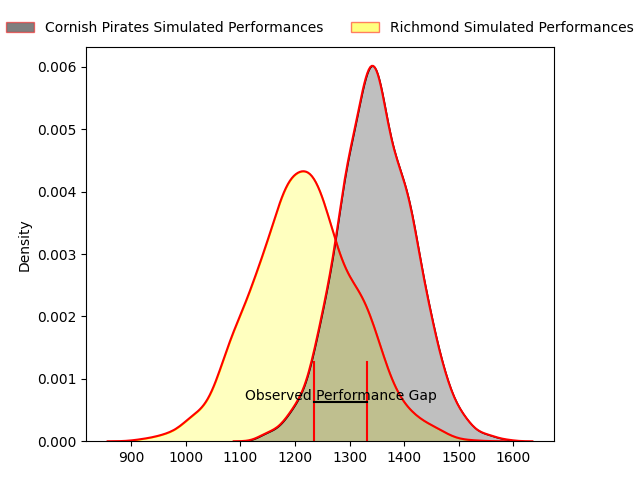
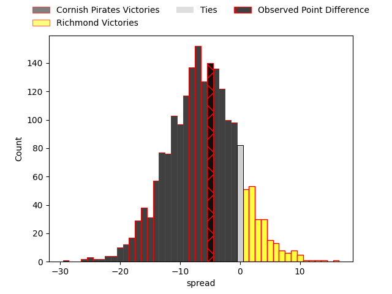

---  
layout: page  
title: Cornish Pirates at Richmond; 34-29  
date: 2023-04-29 16:00:00 18:00:00 -0500  
categories: match review  
---
# Cornish Pirates at Richmond; 34-29

# Club Level Predictions

The first set of predictions treats a club as the smallest object, as the club develops its members, organizes a gameplan, and deploys its players as needed for each match. This club model has a prediction of 0.331, which translates to predicting Cornish Pirates to win by 6.3.

Each club has a rating and a rating deviation (simiar to a Glicko system), and expected performances can be generated. This allows for simulated matches and spreads like the ones below.
## Projected Performances

## Projected Spreads

## Projected Results

# Player Level Predictions

Treating teams instead as an entity made up of the currently active players, I have ratings for each player in an altogether different system. These can be combined to form team ratings once teamsheets are announced, weighting starters a bit higher than the reserves. After the match is played, players can be weighted by their minutes on the field, allowing for an accurate measure of the team's composition. With these compiled team ratings, we can make predictions, measure inaccuracy, and update the individual player ratings.
## Prediction with Player Minutes: Richmond by 1.0

Cornish Pirates by 3.0 on a neutral field

There were 9 large changes in win probability in this match
## Prediction without Player Minutes: Richmond by 2.5

Cornish Pirates by 1.5 on a neutral pitch

|   Away Minutes | Away Player       |   Away elo |   Away Percentile |   Number |   Home Percentile |   Home elo | Home Player            |   Home Minutes |
|---------------:|:------------------|-----------:|------------------:|---------:|------------------:|-----------:|:-----------------------|---------------:|
|             62 | Jack Andrew       |      90.31 |                79 |        1 |                45 |      75.36 | Conor Maguire          |             51 |
|             51 | Morgan Nelson     |      70.28 |                36 |        2 |                21 |      54.4  | Joseph Vajner          |             60 |
|             41 | Matt Johnson      |      72.81 |                40 |        3 |                26 |      63.21 | Ntinga Mpiko           |             57 |
|             80 | Steele Barker     |      55.79 |                16 |        4 |                48 |      75.78 | Rhys Anstey            |             68 |
|             41 | Will Britton      |      65.89 |                27 |        5 |                39 |      71.76 | Tevita Cavubati        |             62 |
|             51 | Cory Teague       |      36    |                 2 |        6 |                21 |      61.45 | David Massey           |             80 |
|             80 | John Stevens      |      94.63 |                81 |        7 |                16 |      52.91 | Lucas Brooke           |             80 |
|             80 | Ben Grubb         |      63.45 |                20 |        8 |                10 |      52.73 | Jake Monson            |             51 |
|             80 | Tom Kessell       |      66.99 |               nan |        9 |                76 |      90.5  | James Lennon           |             51 |
|             51 | Harry Bazalgette  |      78.55 |                57 |       10 |                23 |      64.81 | Alex Burrage           |             80 |
|             80 | Will Trewin       |      58.37 |                18 |       11 |                19 |      57.46 | Raz Patel              |             80 |
|             80 | Joe Elderkin      |      68.36 |                30 |       12 |                35 |      71.31 | Craig Duncan           |             80 |
|             41 | Shae Tucker       |      61.26 |                19 |       13 |                15 |      57.49 | Paddy Case             |             80 |
|             51 | Robin Wedlake     |      49.21 |                 8 |       14 |                55 |      76.34 | Zuriel Makele          |             62 |
|             80 | Alexander AJ Cant |      84.96 |                62 |       15 |                43 |      73.1  | Alexander O'Meara      |             80 |
|             39 | Hayden King       |      81.06 |                65 |       16 |                46 |      75.05 | George Cave            |             29 |
|             39 | Garyn Smith       |      73.1  |                39 |       17 |                29 |      68.5  | Mark Bright            |             29 |
|             39 | James Fender      |      57.63 |                13 |       18 |                49 |      76.8  | Jack Stafford          |             29 |
|             29 | Alex Schwarz      |      55.4  |                12 |       19 |                24 |      64.97 | Jimmy Litchfield       |             23 |
|             29 | Carwyn Penny      |      81.86 |                63 |       20 |                35 |      69.78 | Alexander Post         |             20 |
|             29 | Max Norey         |      64.73 |               nan |       21 |               nan |      56.12 | George Nugent          |             18 |
|             29 | Will Gibson       |      48.96 |                 7 |       22 |                15 |      53.94 | Jack Walsh             |             18 |
|             18 | Jacob Morris      |      66.38 |               nan |       23 |               nan |      66.57 | Bailey Marshall-Telfer |             12 |

