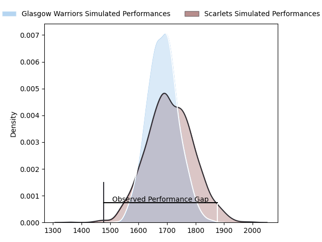
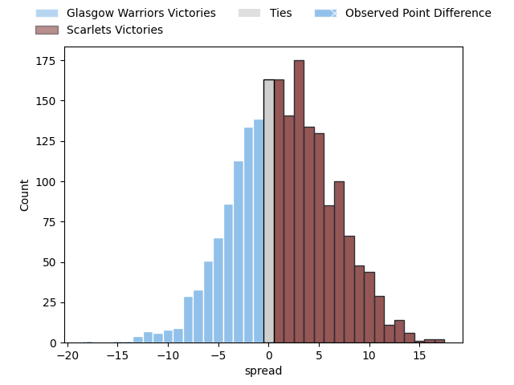

---  
layout: page  
title: Glasgow Warriors at Scarlets; 35-17  
date: 2023-04-29 18:30:00 18:00:00 -0500  
categories: match review  
---
# Glasgow Warriors at Scarlets; 35-17

# Club Level Predictions

The first set of predictions treats a club as the smallest object, as the club develops its members, organizes a gameplan, and deploys its players as needed for each match. This club model has a prediction of 0.542, which translates to predicting Scarlets to win by 1.5.

Each club has a rating and a rating deviation (simiar to a Glicko system), and expected performances can be generated. This allows for simulated matches and spreads like the ones below.
## Projected Performances

## Projected Spreads

## Projected Results

# Player Level Predictions

Treating teams instead as an entity made up of the currently active players, I have ratings for each player in an altogether different system. These can be combined to form team ratings once teamsheets are announced, weighting starters a bit higher than the reserves. After the match is played, players can be weighted by their minutes on the field, allowing for an accurate measure of the team's composition. With these compiled team ratings, we can make predictions, measure inaccuracy, and update the individual player ratings.
## Prediction with Player Minutes: Scarlets by 6.2

Scarlets by 2.2 on a neutral field

There were 9 large changes in win probability in this match
## Prediction without Player Minutes: Glasgow Warriors by 0.0

Glasgow Warriors by 4.0 on a neutral pitch

|   Away Minutes | Away Player           |   Away elo |   Away Percentile |   Number |   Home Percentile |   Home elo | Home Player         |   Home Minutes |
|---------------:|:----------------------|-----------:|------------------:|---------:|------------------:|-----------:|:--------------------|---------------:|
|             46 | Jamie Bhatti          |      68.11 |                34 |        1 |               nan |      76.06 | Will Griff John     |             53 |
|             46 | George Turner         |     110.17 |                95 |        2 |                83 |      93.73 | Ken Owens           |             72 |
|             72 | Zander Fagerson       |     100.86 |                92 |        3 |                41 |      73.28 | Javan Sebastian     |              4 |
|             79 | Scott Cummings        |      75.87 |                48 |        4 |                54 |      78.76 | Morgan Jones        |             34 |
|             80 | Richie Gray           |     103.11 |                89 |        5 |                57 |      80.19 | Sam Lousi           |             80 |
|             80 | Rory Darge            |      77.84 |                52 |        6 |                40 |      72.3  | Joshua McLeod       |             80 |
|             52 | Sione Vailanu         |      73.61 |                43 |        7 |                80 |      91.87 | Daniel Fabian Davis |             80 |
|             72 | Jack Dempsey          |      65.91 |                24 |        8 |                52 |      77.68 | Vaea Fifita         |             48 |
|             80 | George Horne          |      73.38 |                49 |        9 |                49 |      74.49 | Gareth Davies       |             54 |
|             79 | Tom Jordan            |      78.54 |                51 |       10 |                44 |      75.02 | Sam Costelow        |             80 |
|             80 | Kyle Steyn            |      91.81 |                77 |       11 |                38 |      71.02 | Ryan Conbeer        |             80 |
|             80 | Stafford McDowall     |      72.71 |                39 |       12 |                28 |      67.48 | Johnny Williams     |              7 |
|             80 | Sione Tuipulotu       |      52.65 |                 9 |       13 |                45 |      75.34 | Joe Roberts         |             80 |
|             72 | Sebastian Cancelliere |      75.92 |               nan |       14 |                47 |      75.01 | Steffan Evans       |             80 |
|             80 | Ollie Smith           |      77.4  |                47 |       15 |                62 |      80.72 | Johnny McNicholl    |             80 |
|             34 | Nathan McBeth         |      81.72 |                62 |       16 |                46 |      75.4  | Kemsley Mathias     |             27 |
|             34 | Johnny Matthews       |      73.76 |                48 |       17 |                58 |      80.31 | Shaun Evans         |              8 |
|              8 | Simon Berghan         |      77.01 |                50 |       18 |                91 |      96.68 | Sam Wainwright      |             76 |
|              1 | Ryan Wilson           |      76.84 |                49 |       19 |                63 |      84.04 | Carwyn Tuipulotu    |             46 |
|             28 | Matt Fagerson         |      98.99 |                87 |       20 |                58 |      81.14 | Kieran Hardy        |             26 |
|              8 | Lewis Bean            |      69.01 |                32 |       21 |               nan |      78.24 | Iestyn Rees         |             32 |
|              1 | Duncan Weir           |      83.74 |               nan |       22 |                82 |      98.64 | Ioan Nicholas       |             73 |
|              8 | Ali Price             |      75.01 |                44 |       23 |               nan |     nan    | nan                 |            nan |

