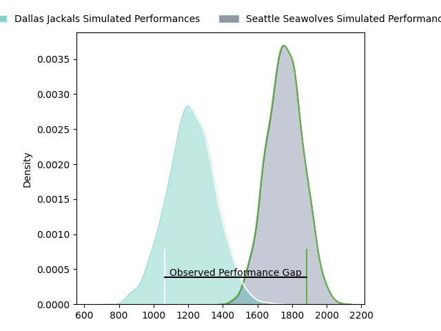
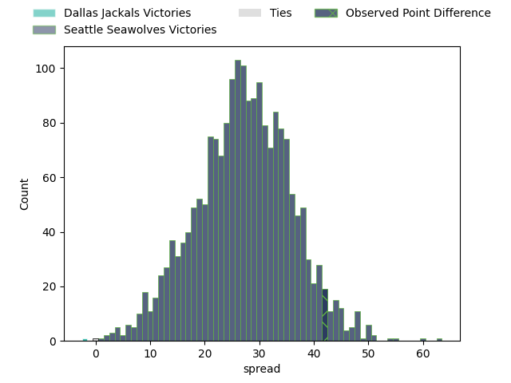

---  
layout: page  
title: Dallas Jackals at Seattle Seawolves; 19-61  
date: 2023-04-29 04:00:00 18:00:00 -0500  
categories: match review  
---
# Dallas Jackals at Seattle Seawolves; 19-61

# Club Level Predictions

The first set of predictions treats a club as the smallest object, as the club develops its members, organizes a gameplan, and deploys its players as needed for each match. This club model has a prediction of 0.947, which translates to predicting Seattle Seawolves to win by 27.3.

Each club has a rating and a rating deviation (simiar to a Glicko system), and expected performances can be generated. This allows for simulated matches and spreads like the ones below.
## Projected Performances

## Projected Spreads

## Projected Results

# Player Level Predictions

Treating teams instead as an entity made up of the currently active players, I have ratings for each player in an altogether different system. These can be combined to form team ratings once teamsheets are announced, weighting starters a bit higher than the reserves. After the match is played, players can be weighted by their minutes on the field, allowing for an accurate measure of the team's composition. With these compiled team ratings, we can make predictions, measure inaccuracy, and update the individual player ratings.
## Prediction with Player Minutes: Seattle Seawolves by 12.8

Seattle Seawolves by 8.8 on a neutral field

There were 3 large changes in win probability in this match
## Prediction without Player Minutes: Seattle Seawolves by 13.0

Seattle Seawolves by 9.0 on a neutral pitch

|   Away Minutes | Away Player         |   Away elo |   Away Percentile |   Number |   Home Percentile |   Home elo | Home Player          |   Home Minutes |
|---------------:|:--------------------|-----------:|------------------:|---------:|------------------:|-----------:|:---------------------|---------------:|
|             48 | Nicolas Revol       |      61.79 |                26 |        1 |                56 |      79.33 | Jake Turnbull        |             51 |
|             68 | Dewald Kotze        |      34.28 |                 2 |        2 |                20 |      59.05 | Peter Malcolm        |             55 |
|             68 | Juan Pablo Zeiss    |      53.11 |                 9 |        3 |                 7 |      51.49 | Sam Matenga          |             51 |
|             80 | Sam Golla           |      50.59 |                 8 |        4 |                15 |      57.55 | Ben Landry           |             66 |
|             80 | Lucas Bur           |      54.54 |                12 |        5 |                46 |      73.21 | Taylor Krumrei       |             51 |
|             48 | Jeronimo Gomez Vara |      54.91 |                12 |        6 |                11 |      54.44 | Charles Elton        |             80 |
|             48 | Conrado Roura       |      30.88 |                 0 |        7 |                 7 |      48.38 | Ronan Foley          |             80 |
|             80 | Jan Adriaan Booysen |      48.89 |                 7 |        8 |                12 |      54.96 | Riekert Hattingh     |             48 |
|             60 | Pedro Imhoff        |      58.85 |                17 |        9 |                49 |      76.99 | JP Smith             |             60 |
|             80 | Martin Elias        |     115.35 |                95 |       10 |                20 |      62.34 | Jordan Chait         |             80 |
|             80 | Campbell Johnstone  |      24.62 |                 0 |       11 |                 9 |      50.64 | Martin Iosefo        |             80 |
|             80 | Lui Sitama          |      66.65 |                25 |       12 |                10 |      52.63 | AJ Alatimu           |             80 |
|             80 | Tomas Malanos       |      86.4  |                66 |       13 |                 9 |      52.98 | Daniel David Kriel   |             60 |
|             48 | James Vaifale       |      87.91 |                68 |       14 |                95 |     114.97 | Lauina Futi          |             80 |
|             55 | Marcos Moroni       |      54.28 |                13 |       15 |                40 |      72.63 | Adriaan John Carelse |             80 |
|             32 | Liam Murray         |      49.58 |                 6 |       16 |                22 |      61.85 | Mzamo Majola         |             29 |
|             12 | Connor Robinson     |      53.86 |               nan |       17 |                20 |      60.11 | James Malcolm        |             25 |
|             12 | Kyle Steeves        |      49.46 |                 6 |       18 |                52 |      73.08 | Mason Pedersen       |             29 |
|             32 | Carson Shoemaker    |      51.51 |               nan |       19 |               nan |      59.76 | Isaia Lotawa         |             14 |
|             32 | Maikeli Naromaitoga |      62.41 |               nan |       20 |                 9 |      52.37 | Nakai Penny          |             29 |
|             20 | Danny Christensen   |      40.17 |                 4 |       21 |               nan |      61.09 | Andrew Durutalo      |             32 |
|             25 | Juan Pablo Aguirre  |      47.3  |                 6 |       22 |               nan |      68    | Karl Keane           |             20 |
|             32 | Patrick Medina      |      53.22 |               nan |       23 |                18 |      62.18 | Tevita Lopeti        |             20 |

