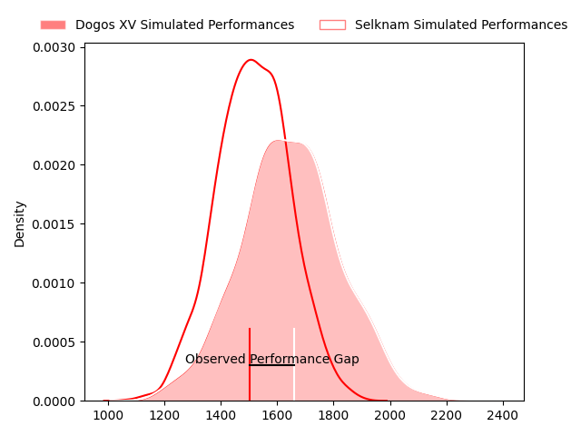
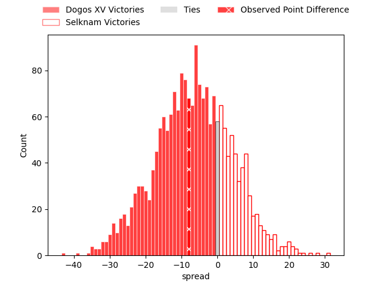

---  
layout: page  
title: Dogos XV at Selknam; 19-11  
date: 2023-04-29 22:00:00 18:00:00 -0500  
categories: match review  
---
# Dogos XV at Selknam; 19-11

# Club Level Predictions

The first set of predictions treats a club as the smallest object, as the club develops its members, organizes a gameplan, and deploys its players as needed for each match. This club model has a prediction of 0.347, which translates to predicting Dogos XV to win by 6.3.

Each club has a rating and a rating deviation (simiar to a Glicko system), and expected performances can be generated. This allows for simulated matches and spreads like the ones below.
## Projected Performances

## Projected Spreads

## Projected Results

# Player Level Predictions

Treating teams instead as an entity made up of the currently active players, I have ratings for each player in an altogether different system. These can be combined to form team ratings once teamsheets are announced, weighting starters a bit higher than the reserves. After the match is played, players can be weighted by their minutes on the field, allowing for an accurate measure of the team's composition. With these compiled team ratings, we can make predictions, measure inaccuracy, and update the individual player ratings.
## Prediction with Player Minutes: Dogos XV by 3.9

Dogos XV by 7.9 on a neutral field

There were 6 large changes in win probability in this match
## Prediction without Player Minutes: Dogos XV by 7.7

Dogos XV by 11.7 on a neutral pitch

|   Away Minutes | Away Player               |   Away elo |   Away Percentile |   Number |   Home Percentile |   Home elo | Home Player             |   Home Minutes |
|---------------:|:--------------------------|-----------:|------------------:|---------:|------------------:|-----------:|:------------------------|---------------:|
|             76 | Tomas Bartolini           |      53.76 |                10 |        1 |                 9 |      47.47 | Salvador Lues           |             62 |
|             73 | Boris Wenger              |      50.94 |                10 |        2 |                 3 |      42.44 | Diego Escobar           |             80 |
|             57 | Octavio Filippa           |      61.22 |                18 |        3 |               nan |      53.98 | Esteban Inostroza       |             49 |
|             80 | Lautaro Simes             |      55.16 |                12 |        4 |                17 |      60.93 | Pablo Huete             |             80 |
|             61 | Franco Molina             |      60.84 |                20 |        5 |                 4 |      44.2  | Javier Eissmann         |             43 |
|             68 | Aitor Bildosola           |      56.23 |                14 |        6 |                17 |      58.75 | Clemente Saavedra       |             80 |
|             80 | Efrain Elias              |      59.07 |                18 |        7 |                20 |      55.37 | Ignacio Silva           |             49 |
|             80 | Ignacio Jose Gandini      |      65.74 |                23 |        8 |                 3 |      42.49 | Raimundo Martinez       |             80 |
|             73 | Agustin Moyano            |      59.93 |                18 |        9 |                 4 |      47.02 | Marcelo Torrealba       |             49 |
|             80 | Julian Ignacio Hernandez  |      57.02 |                16 |       10 |                12 |      54.97 | Rodrigo Fernandez       |             80 |
|             80 | Ernesto Giudice           |      66.33 |                29 |       11 |                13 |      52.5  | Santiago Videla         |             80 |
|             80 | Leonardo Gea Salim        |      59.29 |                16 |       12 |                 2 |      40.84 | Pablo Casas             |             80 |
|             61 | Agustin Segura            |      44.89 |                 6 |       13 |                36 |      71.29 | Domingo Saavedra        |             80 |
|             56 | Lautaro Cipriani          |      51.08 |                10 |       14 |                10 |      48.64 | Gaspar Moltedo          |             80 |
|             80 | Mateo Soler               |      50.3  |                 9 |       15 |                14 |      55.53 | Francisco Urroz         |             80 |
|             24 | Juan Baronio              |      53.03 |                10 |       16 |                10 |      53.48 | Santiago Pedrero        |             37 |
|             23 | Ramiro Valdes Iribarren   |      55.34 |                 8 |       17 |                 4 |      46.33 | Nicolas Herreros        |             31 |
|             19 | Faustino Sánchez Valarolo |      66.53 |                26 |       18 |                 6 |      47.47 | Alfonso Escobar Alvarez |             31 |
|             19 | Gregorio Hernandez        |      60.41 |                 9 |       19 |                 7 |      50.88 | Inaki Gurruchaga        |             31 |
|             12 | Manuel Todaro             |      61.38 |                28 |       20 |               nan |      53.67 | Vittorio Lastra         |             18 |
|              7 | Roman Pretz               |      52.66 |                 8 |       21 |               nan |     nan    | nan                     |            nan |
|              7 | Juan Cruz Strada          |      57.07 |                11 |       22 |               nan |     nan    | nan                     |            nan |
|              4 | Octavio Barbatti          |      61.49 |               nan |       23 |               nan |     nan    | nan                     |            nan |

