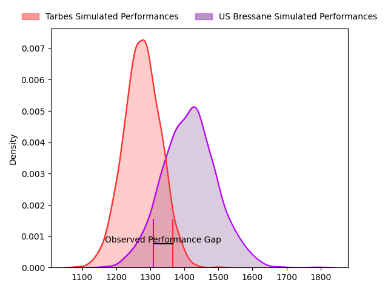
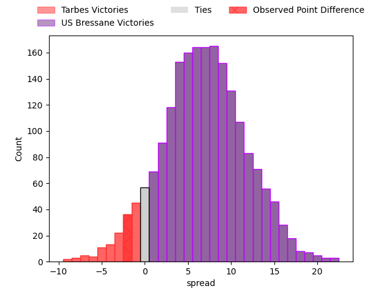
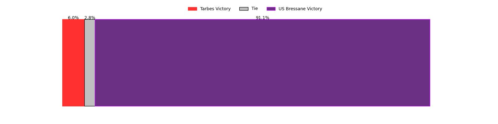

---  
layout: page  
title: Tarbes at US Bressane; 21-19  
date: 2023-04-29 16:00:00 18:00:00 -0500  
categories: match review  
---
# Tarbes at US Bressane; 21-19

# Club Level Predictions

The first set of predictions treats a club as the smallest object, as the club develops its members, organizes a gameplan, and deploys its players as needed for each match. This club model has a prediction of 0.684, which translates to predicting US Bressane to win by 6.8.

Each club has a rating and a rating deviation (simiar to a Glicko system), and expected performances can be generated. This allows for simulated matches and spreads like the ones below.
## Projected Performances

## Projected Spreads

## Projected Results

# Player Level Predictions

Treating teams instead as an entity made up of the currently active players, I have ratings for each player in an altogether different system. These can be combined to form team ratings once teamsheets are announced, weighting starters a bit higher than the reserves. After the match is played, players can be weighted by their minutes on the field, allowing for an accurate measure of the team's composition. With these compiled team ratings, we can make predictions, measure inaccuracy, and update the individual player ratings.
## Prediction with Player Minutes: US Bressane by 6.3

US Bressane by 2.3 on a neutral field

There were 2 large changes in win probability in this match
## Prediction without Player Minutes: US Bressane by 11.9

US Bressane by 7.9 on a neutral pitch

|   Away Minutes | Away Player            |   Away elo |   Away Percentile |   Number |   Home Percentile |   Home elo | Home Player                 |   Home Minutes |
|---------------:|:-----------------------|-----------:|------------------:|---------:|------------------:|-----------:|:----------------------------|---------------:|
|             41 | Antoine Palisse        |      61.54 |                18 |        1 |                40 |      71.52 | Vazha Kapanadze             |             48 |
|             58 | Enzo Mondon            |      90    |                77 |        2 |               nan |      66.34 | Louis Dasalmartini          |             57 |
|             53 | Aleksi Tchitchiashvili |      61.13 |                18 |        3 |                85 |      92.7  | Willem Johannes Harmse      |             53 |
|             48 | Paul Sajous            |      54.2  |                13 |        4 |                21 |      61.53 | Koen Bloemen                |             80 |
|             80 | Jason Nel              |      68.84 |                32 |        5 |                23 |      62.81 | Marius Constantin Antonescu |             60 |
|             41 | Léo Saint-Guilhem      |      81.92 |                61 |        6 |                97 |     123.3  | Lucas Lyons                 |             48 |
|             80 | Aurelien Ricart        |      59.17 |                21 |        7 |               nan |      69.86 | Loic Baradel                |             80 |
|             53 | Willem Leon Massyn     |      54.19 |                10 |        8 |                61 |      83.56 | Wael May                    |              4 |
|             62 | Thibaut Dulucq         |      73.84 |                42 |        9 |                56 |      80.1  | Robin Graulle               |             65 |
|             80 | Mathieu Berbizier      |      82.25 |                65 |       10 |                53 |      79.91 | Christian Lacombe           |             27 |
|             80 | Jonathan Duffau        |      89.26 |                73 |       11 |                47 |      77.21 | Audric Sanlaville           |             80 |
|             50 | Julien Cantan          |      60.54 |                18 |       12 |                 1 |      38.03 | Maile Mamao                 |             80 |
|             80 | Alofa Alofa            |      54.98 |                14 |       13 |                22 |      63.15 | Alexandre Badet             |             80 |
|             80 | Johan Paulet           |      75.77 |                49 |       14 |                87 |     101    | Élie De Fleurian            |             80 |
|             80 | Thibaut Trotta         |      89.87 |                70 |       15 |                29 |      68.05 | Pierre Bérard               |             80 |
|             39 | Alexandre Combier      |      63.58 |                23 |       16 |                20 |      63.61 | Teo Bordenave               |             32 |
|             22 | Johan Mees Erasmus     |      70.72 |                39 |       17 |                48 |      74.75 | Clément Jullien             |             23 |
|             27 | Alexandre Duny         |      51.14 |                 7 |       18 |                 0 |      32.14 | Erich de Jager              |             27 |
|             32 | Gigi Leshkasheli       |      65.62 |                23 |       19 |                47 |      75.64 | Bence Roth                  |             20 |
|             39 | Mattéo Coustalat       |      67.65 |                30 |       20 |                 7 |      49.72 | Dimitri Jean Etienne        |             32 |
|             27 | Florian Mansieux       |      70.34 |               nan |       21 |                36 |      70.2  | Nicolas Tachat              |             76 |
|             18 | Thomas Millet          |      73.49 |                41 |       22 |                98 |     124.01 | Nicolas Faure               |             15 |
|             30 | Josaia Vakacegu        |      52.37 |                 9 |       23 |                17 |      58.63 | Thibaut Perrette            |             53 |

