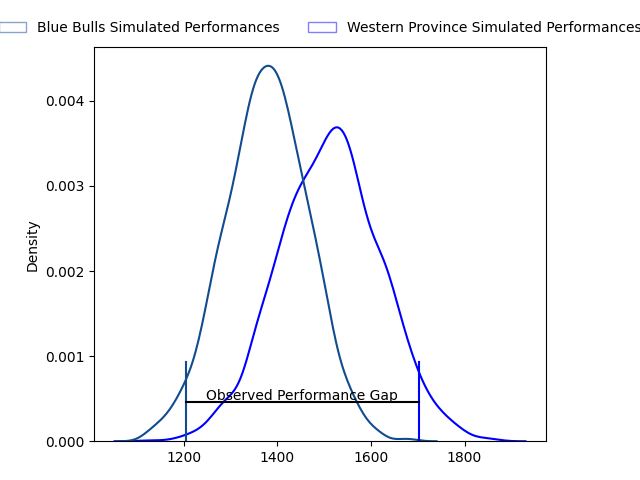
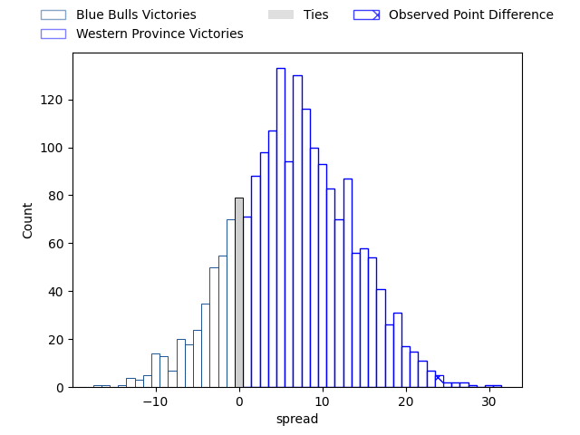
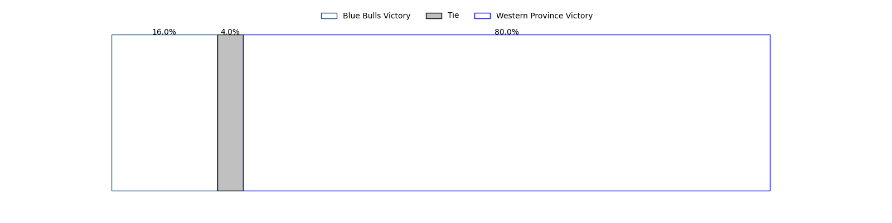

---  
layout: page  
title: Blue Bulls at Western Province; 7-31  
date: 2023-04-29 17:00:00 18:00:00 -0500  
categories: match review  
---
# Blue Bulls at Western Province; 7-31

# Club Level Predictions

The first set of predictions treats a club as the smallest object, as the club develops its members, organizes a gameplan, and deploys its players as needed for each match. This club model has a prediction of 0.679, which translates to predicting Western Province to win by 6.8.

Each club has a rating and a rating deviation (simiar to a Glicko system), and expected performances can be generated. This allows for simulated matches and spreads like the ones below.
## Projected Performances

## Projected Spreads

## Projected Results

# Player Level Predictions

Treating teams instead as an entity made up of the currently active players, I have ratings for each player in an altogether different system. These can be combined to form team ratings once teamsheets are announced, weighting starters a bit higher than the reserves. After the match is played, players can be weighted by their minutes on the field, allowing for an accurate measure of the team's composition. With these compiled team ratings, we can make predictions, measure inaccuracy, and update the individual player ratings.
## Prediction with Player Minutes: Blue Bulls by 0.7

Blue Bulls by 4.7 on a neutral field

There were 5 large changes in win probability in this match
## Prediction without Player Minutes: Western Province by 2.0

Blue Bulls by 2.0 on a neutral pitch

|   Away Minutes | Away Player                  |   Away elo |   Away Percentile |   Number |   Home Percentile |   Home elo | Home Player                       |   Home Minutes |
|---------------:|:-----------------------------|-----------:|------------------:|---------:|------------------:|-----------:|:----------------------------------|---------------:|
|             80 | Gerhardus Cornelis Steenkamp |      91.31 |                80 |        1 |                25 |      62.23 | Alistair Fernando Vermaak         |             59 |
|             80 | Jan Hendrik Wessels          |      72.09 |                41 |        2 |                38 |      70.72 | Siyabonga Ntubeni                 |             49 |
|             74 | Francois Klopper             |      77.32 |                24 |        3 |                93 |     105.16 | Lee-Marvin Lofty Siyanda Mazibuko |             80 |
|             80 | Charlie Ewels                |      72.18 |                39 |        4 |               nan |      78.39 | Dylan De Leeuw                    |             59 |
|             66 | Janko Swanepoel              |      81.77 |                56 |        5 |                41 |      72.66 | Connor Evans                      |             80 |
|             80 | Marco Gerhardt van Staden    |      97.24 |                85 |        6 |                26 |      65.17 | Willem Gerhardus Engelbrecht      |             49 |
|             80 | Reinhardt Ludwig             |      71.87 |                38 |        7 |                35 |      70.41 | Marcel Theunissen                 |             80 |
|             80 | WJ Steenkamp                 |      85.08 |                64 |        8 |                90 |     103.01 | Keke Morabe                       |             80 |
|             74 | Keagan Johannes              |     100.26 |                80 |        9 |                64 |      84.67 | Godlen Herschelle Derrick Masimla |             80 |
|             80 | Johannes Lodewikus Goosen    |      74.24 |                43 |       10 |                48 |      76.75 | Jean-Luc du Plessis               |             80 |
|             80 | David Kriel                  |      90.12 |                75 |       11 |                85 |      99.09 | Angelo Davids                     |             80 |
|             80 | Cornal Hendricks             |      84.51 |                52 |       12 |                51 |      78.7  | Sacha Mngomezulu                  |             80 |
|             80 | Stedman-Gee Rivett Gans      |     101.07 |                84 |       13 |                68 |      88.27 | Cornel Smit                       |             80 |
|             80 | Wandisile Simelane           |      69.39 |                35 |       14 |               nan |      76.5  | Luke John Burger                  |             71 |
|             80 | Kurt-Lee Arendse             |      95.85 |                77 |       15 |                47 |      77.4  | Clayton Blommetjies               |             80 |
|            nan | nan                          |     nan    |               nan |       16 |                34 |      69.52 | Junior Sipato Pokomela            |             31 |
|            nan | nan                          |     nan    |               nan |       17 |                57 |      79.98 | Andre-Hugo Venter                 |             31 |
|            nan | nan                          |     nan    |               nan |       18 |                49 |      76.25 | Kwenzokuhle Ndumiso Blose         |             21 |
|            nan | nan                          |     nan    |               nan |       19 |                50 |      76.76 | Gary Porter                       |             21 |
|            nan | nan                          |     nan    |               nan |       20 |               nan |      69.67 | Damian Markus                     |              9 |
|             14 | Chris Smit                   |      86.68 |                66 |       21 |               nan |     nan    | nan                               |            nan |
|              6 | Corne Weilbach               |      80.29 |               nan |       22 |               nan |     nan    | nan                               |            nan |
|              6 | Thomas Bursey                |      85.78 |                65 |       23 |               nan |     nan    | nan                               |            nan |

