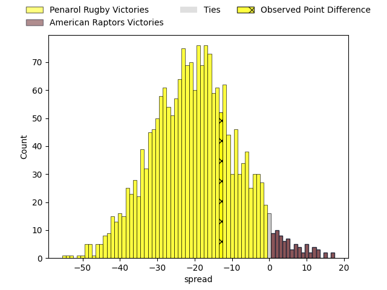
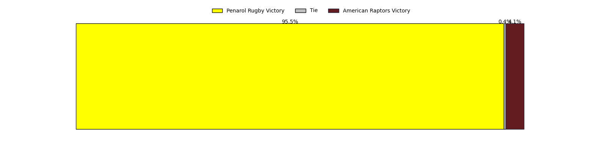

---  
layout: page  
title: Penarol Rugby at American Raptors; 50-37  
date: 2023-04-30 22:00:00 18:00:00 -0500  
categories: match review  
---
# Penarol Rugby at American Raptors; 50-37

# Club Level Predictions

The first set of predictions treats a club as the smallest object, as the club develops its members, organizes a gameplan, and deploys its players as needed for each match. This club model has a prediction of 0.101, which translates to predicting Penarol Rugby to win by 20.2.

Each club has a rating and a rating deviation (simiar to a Glicko system), and expected performances can be generated. This allows for simulated matches and spreads like the ones below.
## Projected Performances

## Projected Spreads

## Projected Results

# Player Level Predictions

Treating teams instead as an entity made up of the currently active players, I have ratings for each player in an altogether different system. These can be combined to form team ratings once teamsheets are announced, weighting starters a bit higher than the reserves. After the match is played, players can be weighted by their minutes on the field, allowing for an accurate measure of the team's composition. With these compiled team ratings, we can make predictions, measure inaccuracy, and update the individual player ratings.
## Prediction with Player Minutes: Penarol Rugby by 26.2

Penarol Rugby by 30.2 on a neutral field

There were 5 large changes in win probability in this match
## Prediction without Player Minutes: Penarol Rugby by 25.2

Penarol Rugby by 29.2 on a neutral pitch

|   Away Minutes | Away Player                        |   Away elo |   Away Percentile |   Number |   Home Percentile |   Home elo | Home Player              |   Home Minutes |
|---------------:|:-----------------------------------|-----------:|------------------:|---------:|------------------:|-----------:|:-------------------------|---------------:|
|             54 | Matteo Sanguinetti                 |      61.82 |               nan |        1 |                21 |      62.07 | Payton Telea-Ilalio      |             44 |
|             54 | Emiliano Faccennini                |      62.95 |                18 |        2 |                29 |      65.33 | Diego Fortuny            |             80 |
|             60 | Diego Arbelo                       |      66.48 |                24 |        3 |                 4 |      46.46 | Ma'ake Muti              |             66 |
|             80 | Juan Manuel Rodriguez              |      71.55 |                40 |        4 |                 2 |      38.28 | Diego Magno              |             80 |
|             40 | Agustin Morales                    |      54.11 |                 9 |        5 |                 3 |      40.85 | Mikey Grandy             |             17 |
|             80 | Manuel Ardao                       |      63.77 |                24 |        6 |                 3 |      40.7  | Shawn Clark              |             80 |
|             80 | Carlos Manuel Deus Lopes de Amorin |      51.94 |                10 |        7 |                12 |      55.03 | Ronan Murphy             |             80 |
|             50 | Manuel Diana                       |      71.31 |                36 |        8 |                 6 |      40.05 | Siaki Lolohea Vikilani   |             52 |
|             80 | Santiago Álvarez Viera Da Cunha    |      81.58 |                59 |        9 |                29 |      66.4  | Ethan McVeigh            |             52 |
|             55 | Felipe Etcheverry                  |      69.05 |                33 |       10 |                 5 |      42.86 | Lucas Gonzalez Amorosino |             76 |
|             60 | Juan Manuel Alonso                 |      76.57 |                51 |       11 |                 8 |      49.03 | Daytwon Sheridan         |             80 |
|             80 | Juan Zuccarino                     |      76.17 |                46 |       12 |                 8 |      49.75 | Aki Pulu                 |             76 |
|             80 | Tomas Inciarte Rachetti            |      70.9  |                35 |       13 |                 2 |      39.83 | Watson Filikitonga       |             80 |
|             80 | Alfonso Silva                      |      61.81 |                21 |       14 |                 3 |      39.76 | Ryan James               |             80 |
|             23 | Rodrigo Silva                      |      64.3  |                23 |       15 |                 9 |      47.44 | Line Latu                |             80 |
|             57 | Icaro Amarillo                     |      57.51 |               nan |       16 |                 0 |      21.33 | Will Crawford            |             63 |
|             26 | Edgardo Matias Benitez Santin      |      67.32 |                29 |       17 |                 2 |      43.74 | Juan Echeverria          |             36 |
|             30 | Lucas Bianchi                      |      59.25 |                19 |       18 |                 1 |      35.87 | Martin Landajo           |             28 |
|             26 | Guillermo Pujadas Leon             |      68.45 |                34 |       19 |                29 |      66.61 | Tommy Clark              |             28 |
|             25 | Gaston Mieres Valente              |      69.95 |                36 |       20 |               nan |      52.51 | Sebastian Otero          |             14 |
|             20 | Reinaldo Piussi Mendoza            |      58.82 |               nan |       21 |               nan |      44.96 | Jerome Nale              |              4 |
|             20 | Juan Francisco Torres Burwood      |      62.11 |               nan |       22 |                 8 |      50.02 | Patrick Madden           |              4 |
|             40 | Felipe Aliaga                      |      70.78 |                38 |       23 |               nan |     nan    | nan                      |            nan |

