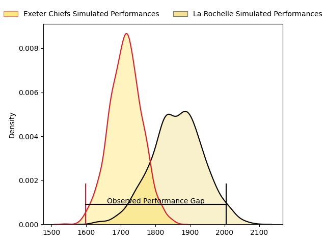
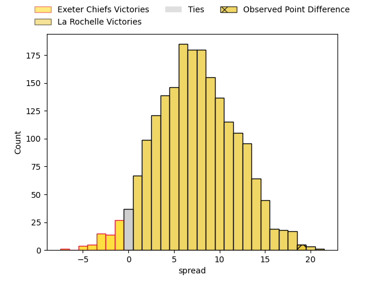
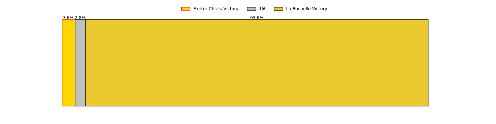

---  
layout: page  
title: Exeter Chiefs at La Rochelle; 28-47  
date: 2023-04-30 16:00:00 18:00:00 -0500  
categories: match review  
---
# Exeter Chiefs at La Rochelle; 28-47

# Club Level Predictions

The first set of predictions treats a club as the smallest object, as the club develops its members, organizes a gameplan, and deploys its players as needed for each match. This club model has a prediction of 0.696, which translates to predicting La Rochelle to win by 7.3.

Each club has a rating and a rating deviation (simiar to a Glicko system), and expected performances can be generated. This allows for simulated matches and spreads like the ones below.
## Projected Performances

## Projected Spreads

## Projected Results

# Player Level Predictions

Treating teams instead as an entity made up of the currently active players, I have ratings for each player in an altogether different system. These can be combined to form team ratings once teamsheets are announced, weighting starters a bit higher than the reserves. After the match is played, players can be weighted by their minutes on the field, allowing for an accurate measure of the team's composition. With these compiled team ratings, we can make predictions, measure inaccuracy, and update the individual player ratings.
## Prediction with Player Minutes: La Rochelle by 5.5

La Rochelle by 1.5 on a neutral field

There were 6 large changes in win probability in this match
## Prediction without Player Minutes: La Rochelle by 7.5

La Rochelle by 3.5 on a neutral pitch

|   Away Minutes | Away Player       |   Away elo |   Away Percentile |   Number |   Home Percentile |   Home elo | Home Player               |   Home Minutes |
|---------------:|:------------------|-----------:|------------------:|---------:|------------------:|-----------:|:--------------------------|---------------:|
|             49 | Scott Sio         |      94.34 |                85 |        1 |                68 |      84.83 | Reda Wardi                |             53 |
|             49 | Dan Frost         |      90.16 |                77 |        2 |                83 |      93.8  | Pierre Bourgarit          |             55 |
|             49 | Marcus Street     |      72.57 |                41 |        3 |                84 |      92.94 | Uini Atonio               |             53 |
|             80 | Jannes Kirsten    |      99    |                86 |        4 |                68 |      85.56 | Romain Sazy               |             45 |
|             30 | Jonny Gray        |      83.79 |                65 |        5 |                72 |      88.12 | William Skelton           |             65 |
|             49 | Jacques Vermeulen |      89.18 |                75 |        6 |                83 |      93.5  | Ultan Dillane             |             80 |
|             80 | Christ Tshiunza   |      84.23 |                67 |        7 |                77 |      87.86 | Levani Botia              |             19 |
|             80 | Sam Simmonds      |     107.42 |                93 |        8 |                95 |     112.97 | Gregory Alldritt          |             80 |
|             45 | Will Becconsall   |      80.43 |                57 |        9 |                94 |     109.1  | Tawera Kerr-Barlow        |             69 |
|             80 | Joe Simmonds      |      93.91 |                77 |       10 |                64 |      86.26 | Antoine Hastoy            |             80 |
|             80 | Olly Woodburn     |     112.97 |                94 |       11 |                87 |     101.55 | Raymond Rhule             |             63 |
|             61 | Sean O'Brien      |      55.15 |                13 |       12 |                65 |      85.75 | Jules Favre               |             80 |
|             80 | Henry Slade       |     101.8  |                86 |       13 |                79 |      95.35 | UJ Seuteni                |             80 |
|             80 | Jack Nowell       |      78.45 |                56 |       14 |                22 |      61.22 | Dillyn Leyds              |             80 |
|             51 | Tom Wyatt         |      74.3  |                46 |       15 |                70 |      90.08 | Brice Dulin               |             80 |
|             50 | Aidon Davis       |      64.82 |                28 |       16 |                57 |      80.11 | Paul Boudehent            |             61 |
|             31 | Dave Ewers        |     124.03 |                97 |       17 |                84 |      96.64 | Thomas Lavault            |             35 |
|             35 | Stu Townsend      |      99.02 |                89 |       18 |                69 |      90.45 | Georges-Henri Colombe     |             27 |
|             31 | Nika Abuladze     |      81.14 |                61 |       19 |                52 |      77.33 | Joel Sclavi               |             27 |
|             31 | Josh Iosefa-Scott |      83.25 |                69 |       20 |                58 |      79.93 | Quentin Lespiaucq-Brettes |             25 |
|             31 | Jack Yeandle      |      99.56 |                91 |       21 |                60 |      81.33 | Teddy Thomas              |             17 |
|             29 | Stuart Hogg       |      76.59 |                47 |       22 |                51 |      76.91 | Rémi Bourdeau             |             15 |
|             19 | Harvey Skinner    |      68.13 |                33 |       23 |                42 |      73.49 | Thomas Berjon             |             11 |

