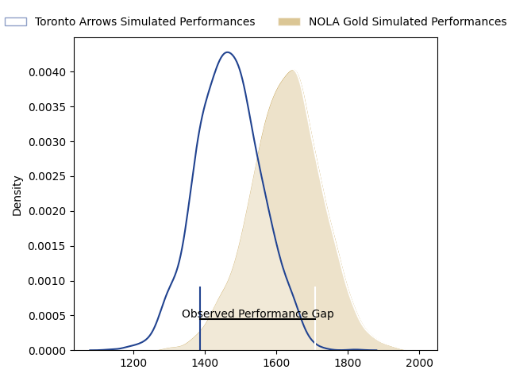
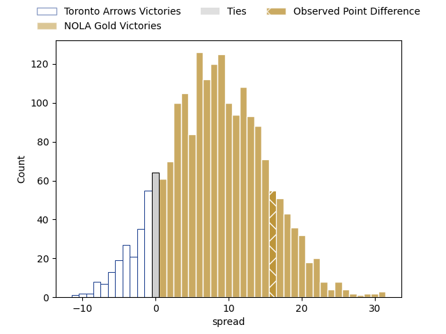
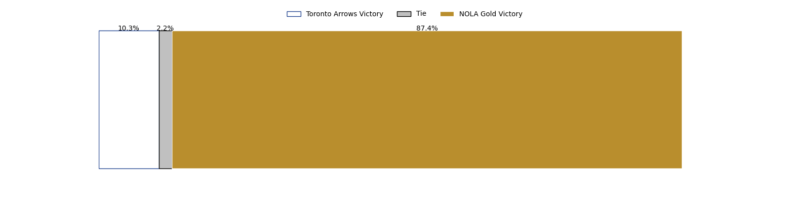

---  
layout: page  
title: Toronto Arrows at NOLA Gold; 24-40  
date: 2023-04-30 21:00:00 18:00:00 -0500  
categories: match review  
---
# Toronto Arrows at NOLA Gold; 24-40

# Club Level Predictions

The first set of predictions treats a club as the smallest object, as the club develops its members, organizes a gameplan, and deploys its players as needed for each match. This club model has a prediction of 0.713, which translates to predicting NOLA Gold to win by 8.2.

Each club has a rating and a rating deviation (simiar to a Glicko system), and expected performances can be generated. This allows for simulated matches and spreads like the ones below.
## Projected Performances

## Projected Spreads

## Projected Results

# Player Level Predictions

Treating teams instead as an entity made up of the currently active players, I have ratings for each player in an altogether different system. These can be combined to form team ratings once teamsheets are announced, weighting starters a bit higher than the reserves. After the match is played, players can be weighted by their minutes on the field, allowing for an accurate measure of the team's composition. With these compiled team ratings, we can make predictions, measure inaccuracy, and update the individual player ratings.
## Prediction with Player Minutes: NOLA Gold by 15.4

NOLA Gold by 11.4 on a neutral field

There were 10 large changes in win probability in this match
## Prediction without Player Minutes: NOLA Gold by 9.7

NOLA Gold by 5.7 on a neutral pitch

|   Away Minutes | Away Player      |   Away elo |   Away Percentile |   Number |   Home Percentile |   Home elo | Home Player                              |   Home Minutes |
|---------------:|:-----------------|-----------:|------------------:|---------:|------------------:|-----------:|:-----------------------------------------|---------------:|
|             62 | Lolani Faleiva   |      28.24 |                 0 |        1 |                14 |      56.11 | Matt Harmon                              |             56 |
|             49 | Gene Syminton    |      60.24 |                21 |        2 |               nan |      57.58 | Eric Howard                              |             51 |
|             62 | Isaac Salmon     |      60.08 |                18 |        3 |                18 |      60.15 | Jarred Adams                             |             56 |
|             80 | Adrian Wadden    |      32.44 |                 1 |        4 |               nan |      64.3  | Will Waguespack                          |             80 |
|             68 | Shay Kerry       |      52.57 |                10 |        5 |                 6 |      47.62 | Liam Hallam-Eames                        |             33 |
|             55 | Mason Flesch     |      42.73 |                 4 |        6 |                 0 |      25.14 | Moni Tonga'uiha                          |             58 |
|             80 | Lucas Rumball    |      61.26 |                21 |        7 |                36 |      70.33 | Devin Short                              |             56 |
|             26 | Mitch Eadie      |      60.34 |                19 |        8 |               nan |      68.31 | Maciu Koroi                              |             80 |
|             62 | Ross Braude      |      64.75 |                25 |        9 |                40 |      71.87 | Luke Campbell                            |             80 |
|             80 | Shane O'Leary    |      45.76 |                 7 |       10 |                27 |      65.72 | Rodney Iona                              |             68 |
|             26 | Fabian Goodall   |      93.86 |                77 |       11 |                 0 |       5.42 | Aaron Matthews                           |             56 |
|             80 | Noel Reid        |      58.8  |                16 |       12 |                26 |      65.4  | Jordan Jackson-Hope                      |             80 |
|             80 | Mitch Richardson |      20.84 |                 0 |       13 |                29 |      67.14 | Philippus Jacobus Snyman (JP) du Plessis |             80 |
|             80 | D'Shawn Bowen    |      59.8  |                20 |       14 |                11 |      52.81 | Ross Depperschmidt                       |             80 |
|             80 | Kobe Faust       |      69.94 |                34 |       15 |                36 |      70.32 | Dougie Fife                              |             80 |
|             18 | Tyler Wong       |      44.69 |               nan |       16 |                72 |      99.47 | Kevin Sullivan                           |             24 |
|             31 | Ramon Ayarza     |      92.13 |                82 |       17 |                46 |      73.96 | Pat O'Toole                              |             29 |
|             18 | Tyler Rowland    |      34.92 |                 1 |       18 |                12 |      58.02 | Dino Waldren                             |             24 |
|             12 | Michael Sheppard |      45.34 |                 4 |       19 |                99 |     138.53 | Billy Stewart                            |             47 |
|             25 | James O'Neill    |      88.11 |                78 |       20 |                25 |      65.27 | Cameron Dolan                            |             22 |
|             54 | Travis Larsen    |      96.45 |                84 |       21 |                19 |      59.19 | Malcolm May                              |             24 |
|             18 | Will Grant       |      52.94 |               nan |       22 |                 8 |      49.16 | Damian Leothon Stevens                   |             12 |
|             54 | Dawson Fatoric   |      55.59 |                15 |       23 |                40 |      72.48 | Harley Wheeler                           |             24 |

