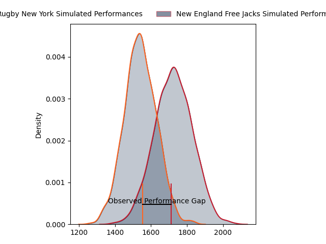
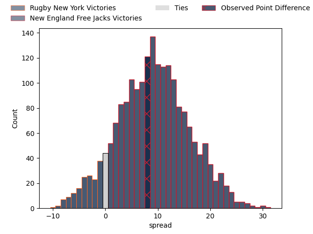
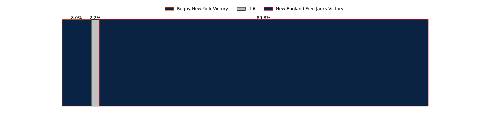

---  
layout: page  
title: Rugby New York at New England Free Jacks; 0-8  
date: 2023-04-30 21:00:00 18:00:00 -0500  
categories: match review  
---
# Rugby New York at New England Free Jacks; 0-8

# Club Level Predictions

The first set of predictions treats a club as the smallest object, as the club develops its members, organizes a gameplan, and deploys its players as needed for each match. This club model has a prediction of 0.732, which translates to predicting New England Free Jacks to win by 9.1.

Each club has a rating and a rating deviation (simiar to a Glicko system), and expected performances can be generated. This allows for simulated matches and spreads like the ones below.
## Projected Performances

## Projected Spreads

## Projected Results

# Player Level Predictions

Treating teams instead as an entity made up of the currently active players, I have ratings for each player in an altogether different system. These can be combined to form team ratings once teamsheets are announced, weighting starters a bit higher than the reserves. After the match is played, players can be weighted by their minutes on the field, allowing for an accurate measure of the team's composition. With these compiled team ratings, we can make predictions, measure inaccuracy, and update the individual player ratings.
## Prediction with Player Minutes: New England Free Jacks by 31.1

New England Free Jacks by 27.1 on a neutral field

There were 7 large changes in win probability in this match
## Prediction without Player Minutes: New England Free Jacks by 29.6

New England Free Jacks by 25.6 on a neutral pitch

|   Away Minutes | Away Player       |   Away elo |   Away Percentile |   Number |   Home Percentile |   Home elo | Home Player        |   Home Minutes |
|---------------:|:------------------|-----------:|------------------:|---------:|------------------:|-----------:|:-------------------|---------------:|
|             60 | Chance Wenglewski |      45.14 |                 4 |        1 |                63 |      97.43 | Tevita Sole        |             50 |
|             80 | Dylan Fawsitt     |      42.29 |                 4 |        2 |                14 |      65.72 | Millenium Sanerivi |             64 |
|             60 | Kaleb Geiger      |      95.85 |                87 |        3 |                52 |      77.32 | Cole Keith         |             64 |
|             59 | Nate Brakeley     |      32.95 |                 1 |        4 |                14 |      56.04 | Semisi Paea        |             11 |
|             80 | Hamish Dalzell    |      45.66 |                 6 |        5 |                55 |      79.3  | Conor Keys         |             80 |
|             80 | Kara Pryor        |      48.33 |                 7 |        6 |                21 |      61.2  | Mitchell Jacobson  |             80 |
|             80 | Akuei Monate      |      60.04 |                19 |        7 |                23 |      63.12 | Slade McDowall     |             50 |
|             40 | Pago Haini        |      57.73 |                16 |        8 |                80 |      94.22 | Wian Conradie      |             77 |
|             16 | Connor McManus    |     102.42 |                87 |        9 |                 4 |      43.93 | Kieran McClea      |             64 |
|             80 | Samuel Windsor    |      45.26 |                 7 |       10 |                78 |      94.3  | Jayson Potroz      |             80 |
|             80 | Teofilo Ed Fidow  |      42.61 |                 5 |       11 |                79 |      93.34 | Paul Balekana      |             71 |
|             80 | Teihorangi Walden |      50.64 |                 9 |       12 |                27 |      66.29 | Le Roux Malan      |             80 |
|             80 | Fa'asiu Fuatai    |      39.84 |                 2 |       13 |                38 |      74.09 | Ben Lesage         |             80 |
|             80 | Andrew Coe        |      46.34 |                 6 |       14 |                47 |      74.8  | Mitchell Wilson    |             80 |
|             80 | Nick Feakes       |      52.31 |                12 |       15 |                14 |      56.23 | Reece MacDonald    |             80 |
|             20 | Tevita Langi      |      67.32 |                29 |       16 |                49 |      76.32 | Kyle Ciquera       |             30 |
|             20 | Sam Davies        |      63.13 |                22 |       17 |                 5 |      49.16 | Kianu Kereru-Symes |             16 |
|             21 | Charlie Hewitt    |     109.77 |                94 |       18 |               nan |      54.67 | Conor Young        |             16 |
|             40 | Joseph Basser     |      80.3  |                58 |       19 |               nan |      62.5  | Reegan O'Gorman    |             69 |
|             64 | Connor Buckley    |      38.72 |                 2 |       20 |                 0 |       6.36 | Joe Johnston       |             30 |
|            nan | nan               |     nan    |               nan |       21 |                 1 |      29.26 | Cam Davidowicz     |              3 |
|            nan | nan               |     nan    |               nan |       22 |                 0 |      19.05 | Holden Yungert     |             16 |
|            nan | nan               |     nan    |               nan |       23 |               nan |      69.99 | Isaac Olson        |              9 |

