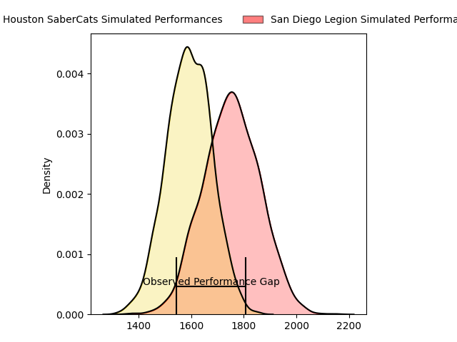
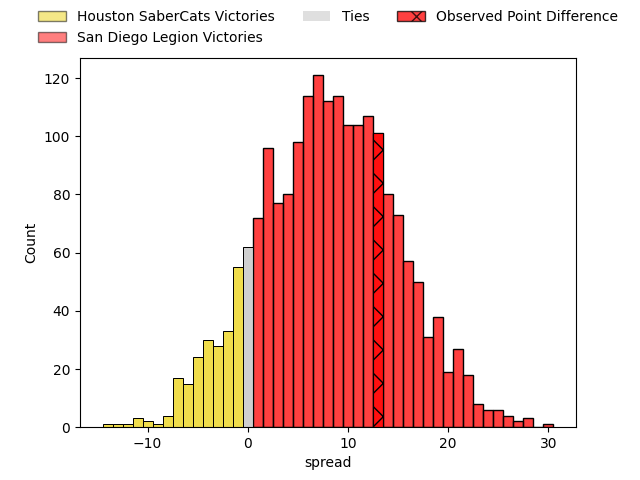
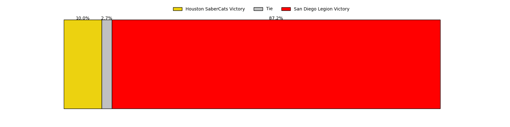

---  
layout: page  
title: Houston SaberCats at San Diego Legion; 16-29  
date: 2023-04-30 22:00:00 18:00:00 -0500  
categories: match review  
---
# Houston SaberCats at San Diego Legion; 16-29

# Club Level Predictions

The first set of predictions treats a club as the smallest object, as the club develops its members, organizes a gameplan, and deploys its players as needed for each match. This club model has a prediction of 0.711, which translates to predicting San Diego Legion to win by 8.1.

Each club has a rating and a rating deviation (simiar to a Glicko system), and expected performances can be generated. This allows for simulated matches and spreads like the ones below.
## Projected Performances

## Projected Spreads

## Projected Results

# Player Level Predictions

Treating teams instead as an entity made up of the currently active players, I have ratings for each player in an altogether different system. These can be combined to form team ratings once teamsheets are announced, weighting starters a bit higher than the reserves. After the match is played, players can be weighted by their minutes on the field, allowing for an accurate measure of the team's composition. With these compiled team ratings, we can make predictions, measure inaccuracy, and update the individual player ratings.
## Prediction with Player Minutes: San Diego Legion by 18.3

San Diego Legion by 14.3 on a neutral field

There were 4 large changes in win probability in this match
## Prediction without Player Minutes: San Diego Legion by 14.2

San Diego Legion by 10.2 on a neutral pitch

|   Away Minutes | Away Player                   |   Away elo |   Away Percentile |   Number |   Home Percentile |   Home elo | Home Player             |   Home Minutes |
|---------------:|:------------------------------|-----------:|------------------:|---------:|------------------:|-----------:|:------------------------|---------------:|
|             43 | Rob Cobb                      |      60.34 |                18 |        1 |                 3 |      41.68 | Faka'osi Pifeleti       |             50 |
|             71 | Joseph Taufete'e              |      55.03 |               nan |        2 |                81 |      90.65 | Sama Malolo             |             68 |
|             62 | Morgan Mitchell               |      52.56 |                 9 |        3 |                33 |      69.21 | Luke Green              |             62 |
|             46 | Siaosi Mahoni                 |      83.56 |                64 |        4 |                88 |     100.95 | Ben Grant               |             80 |
|             80 | Nathan Den Hoedt              |      58.72 |                16 |        5 |               nan |      82.95 | Chris Turori            |             50 |
|             80 | Marno Redelinghuys            |      83.81 |                65 |        6 |                38 |      71.15 | Tupou Afungia           |             62 |
|             50 | Danny Barrett                 |      54.06 |                13 |        7 |                23 |      62.54 | Blair Cowan             |             80 |
|             62 | Wynand Grassmann              |      72.96 |                42 |        8 |                19 |      60.6  | David Tameilau          |             80 |
|             66 | Carlo de Nysschen             |      61.25 |                20 |        9 |                39 |      71.19 | Richard Judd            |             80 |
|             80 | David Coetzer                 |      45.07 |                 7 |       10 |                21 |      61.71 | Josh Henderson          |             62 |
|             68 | Vereniki Tikoisolomone        |      68.34 |                33 |       11 |                38 |      63.09 | Nathaniel Augspurger    |             80 |
|             80 | Louritz van der Schyff        |      63.28 |                23 |       12 |                37 |      71.82 | Ma'a Nonu               |             80 |
|             80 | Dominic Akina                 |      45.95 |                 4 |       13 |                35 |      70.6  | Marcel Brache           |             80 |
|             80 | Christian Dyer                |      50.92 |                10 |       14 |                26 |      63.98 | Tomas Aoake             |             80 |
|             80 | Kian Meadon                   |      81.55 |                57 |       15 |                30 |      67.61 | Mike Te'o               |             80 |
|             37 | Alec McDonnell                |      57.98 |                18 |       16 |                25 |      62.95 | Nathan Sylvia           |             30 |
|              9 | Will Vakalahi                 |      55.16 |               nan |       17 |                45 |      73.25 | Shilo Klein             |             12 |
|             18 | Pono Davis                    |      62    |               nan |       18 |                21 |      62.06 | Chris Baumann           |             18 |
|             34 | Emmanuel Albert               |      52.39 |                13 |       19 |                33 |      68.65 | Jale Railala Vakaloloma |             30 |
|             30 | Malon Maurice Al-Jiboori      |      56.36 |                14 |       20 |                46 |      74.23 | Will Hooley             |             18 |
|             18 | Keni Nasoqeqe                 |      28.99 |                 1 |       21 |               nan |      66.07 | Michael Smith           |             18 |
|             14 | Devereaux Ferris              |       5.63 |                 0 |       22 |               nan |     nan    | nan                     |            nan |
|             12 | Gherardus Jacobus Labuschagne |      73.51 |                45 |       23 |               nan |     nan    | nan                     |            nan |

