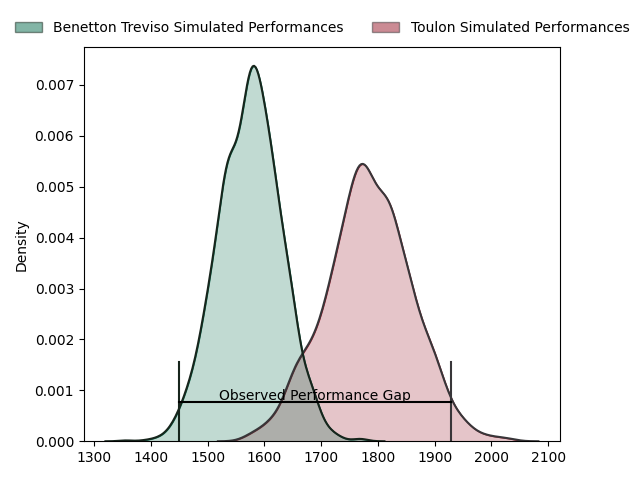
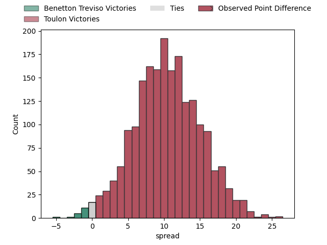
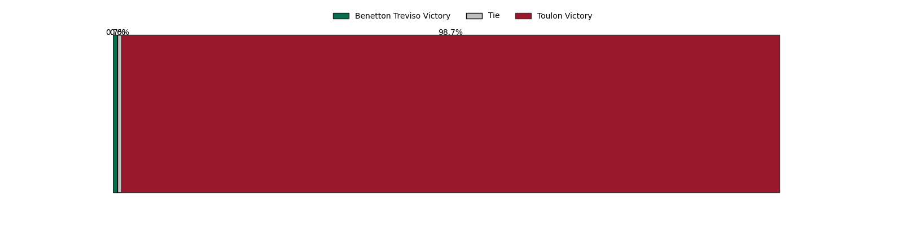

---  
layout: page  
title: Benetton Treviso at Toulon; 0-23  
date: 2023-04-30 13:30:00 18:00:00 -0500  
categories: match review  
---
# Benetton Treviso at Toulon; 0-23

# Club Level Predictions

The first set of predictions treats a club as the smallest object, as the club develops its members, organizes a gameplan, and deploys its players as needed for each match. This club model has a prediction of 0.763, which translates to predicting Toulon to win by 10.3.

Each club has a rating and a rating deviation (simiar to a Glicko system), and expected performances can be generated. This allows for simulated matches and spreads like the ones below.
## Projected Performances

## Projected Spreads

## Projected Results

# Player Level Predictions

Treating teams instead as an entity made up of the currently active players, I have ratings for each player in an altogether different system. These can be combined to form team ratings once teamsheets are announced, weighting starters a bit higher than the reserves. After the match is played, players can be weighted by their minutes on the field, allowing for an accurate measure of the team's composition. With these compiled team ratings, we can make predictions, measure inaccuracy, and update the individual player ratings.
## Prediction with Player Minutes: Benetton Treviso by 6.6

Benetton Treviso by 10.6 on a neutral field

There were 2 large changes in win probability in this match
## Prediction without Player Minutes: Benetton Treviso by 5.0

Benetton Treviso by 9.0 on a neutral pitch

|   Away Minutes | Away Player                     |   Away elo |   Away Percentile |   Number |   Home Percentile |   Home elo | Home Player         |   Home Minutes |
|---------------:|:--------------------------------|-----------:|------------------:|---------:|------------------:|-----------:|:--------------------|---------------:|
|             47 | Francisco Nahuel Tetaz Chaparro |      66.59 |                27 |        1 |                18 |      59.95 | Dany Priso          |             54 |
|             53 | Siua Maile                      |      58.63 |                17 |        2 |                32 |      67.05 | Teddy Baubigny      |             54 |
|             60 | Simone Ferrari                  |      76.41 |                50 |        3 |                59 |      80.11 | Beka Gigashvili     |             54 |
|             60 | Niccolo Cannone                 |      57.19 |                15 |        4 |                34 |      70.45 | Mathieu Tanguy      |             80 |
|             80 | Federico Ruzza                  |      98.54 |                85 |        5 |                 5 |      44.2  | Brian Alainu'uese   |             66 |
|             41 | Sebastian Negri                 |      86.97 |                71 |        6 |                 7 |      49.19 | Cornell du Preez    |             58 |
|             80 | Michele Lamaro                  |     111.16 |                94 |        7 |                97 |     122.14 | Charles Ollivon     |             80 |
|             71 | Lorenzo Cannone                 |      81.96 |                59 |        8 |                86 |      99.63 | Sergio Parisse      |             80 |
|             46 | Dewald Otto Duvenage            |      62.33 |                21 |        9 |                21 |      62.67 | Baptiste Serin      |             63 |
|             80 | Tomas Albornoz                  |      63.78 |                24 |       10 |                97 |     127.61 | Dan Biggar          |             54 |
|             80 | Marcus Watson                   |      56.62 |                15 |       11 |               nan |      67.46 | Gabin Villière      |             80 |
|             80 | Tommaso Menoncello              |      99.21 |                84 |       12 |                 2 |      41.62 | Duncan Paia'aua     |             80 |
|             80 | Juan Ignacio Brex               |     104.33 |                88 |       13 |                 4 |      43.71 | Waisea Nayacavelu   |             58 |
|             80 | Rhyno Christo Smith             |      73.97 |                42 |       14 |                10 |      51.1  | Jiuta Wainiqolo     |             80 |
|             53 | Matteo Minozzi                  |      62.3  |                21 |       15 |                48 |      75.2  | Cheslin Kolbe       |             80 |
|             39 | Manuel Zuliani                  |      61.57 |                21 |       16 |                54 |      68.9  | Kieran Brookes      |             26 |
|             34 | Alessandro Garbisi              |      66.65 |               nan |       17 |                 8 |      48.74 | Ihaia West          |             26 |
|             33 | Thomas Gallo                    |      62    |                20 |       18 |                37 |      70.57 | Christopher Tolofua |             26 |
|             27 | Jacob Umaga                     |      64.11 |                29 |       19 |                50 |      78.1  | Jérémy Sinzelle     |             22 |
|             27 | Giacomo Nicotera                |     117.34 |                98 |       20 |                19 |      59.92 | Facundo Isa         |             22 |
|             20 | Filipo Alongi                   |      65.16 |                25 |       21 |                40 |      72.76 | Benoit Paillaugue   |             17 |
|             20 | Henry Stowers                   |      70.84 |                35 |       22 |                79 |      93.45 | Adrien Warion       |             14 |
|              9 | Marco Lazzaroni                 |      80.39 |                57 |       23 |                45 |      75.22 | Bruce Devaux        |             26 |

