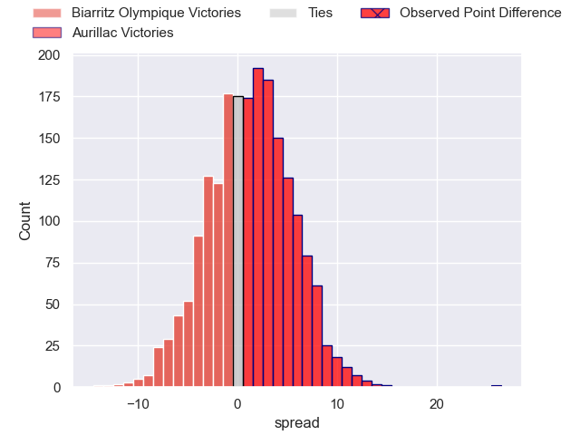
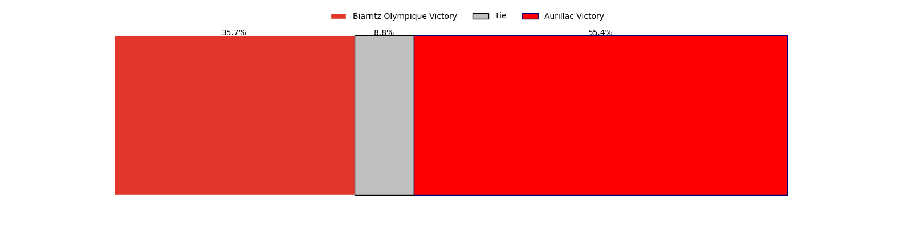

---  
layout: page  
title: Biarritz Olympique at Aurillac; 12-38  
date: 2023-05-05 21:00:00 18:00:00 -0500  
categories: match review  
---
# Biarritz Olympique at Aurillac; 12-38

# Club Level Predictions

The first set of predictions treats a club as the smallest object, as the club develops its members, organizes a gameplan, and deploys its players as needed for each match. This club model has a prediction of 0.534, which translates to predicting Aurillac to win by 1.2.

Each club has a rating and a rating deviation (simiar to a Glicko system), and expected performances can be generated. This allows for simulated matches and spreads like the ones below.
## Projected Performances

## Projected Spreads

## Projected Results

# Player Level Predictions

Treating teams instead as an entity made up of the currently active players, I have ratings for each player in an altogether different system. These can be combined to form team ratings once teamsheets are announced, weighting starters a bit higher than the reserves. After the match is played, players can be weighted by their minutes on the field, allowing for an accurate measure of the team's composition. With these compiled team ratings, we can make predictions, measure inaccuracy, and update the individual player ratings.
## Prediction with Player Minutes: Aurillac by 1.0

Biarritz Olympique by 3.0 on a neutral field

There were 3 large changes in win probability in this match
## Prediction without Player Minutes: Aurillac by 1.9

Biarritz Olympique by 2.1 on a neutral pitch

|   Away Minutes | Away Player        |   Away elo |   Away Percentile |   Number |   Home Percentile |   Home elo | Home Player                           |   Home Minutes |
|---------------:|:-------------------|-----------:|------------------:|---------:|------------------:|-----------:|:--------------------------------------|---------------:|
|             80 | Baptiste Erdocio   |      74.59 |                46 |        1 |                40 |      70.75 | Alexandre Plantier                    |             59 |
|             58 | Clément Renaud     |      75.34 |                49 |        2 |                68 |      85.07 | Adrian Smith                          |             59 |
|             41 | Guy Millar         |      66.79 |                28 |        3 |                14 |      52.74 | Henzo Kiteau                          |             55 |
|             80 | Adrian Motoc       |      63.04 |                23 |        4 |                76 |      91.16 | Georgi Javakhia                       |             55 |
|             55 | Josh Tyrell        |      77.11 |                51 |        5 |                35 |      69.43 | Jean-Baptiste Singer                  |             66 |
|             72 | Charlie Francoz    |      73.14 |               nan |        6 |                48 |      75.77 | Didier Tison                          |             80 |
|             80 | Thomas Hebert      |      82.1  |                61 |        7 |                33 |      68.3  | Beka Shvangiradze                     |             80 |
|             80 | Temo Matiu         |      96.9  |                83 |        8 |                 1 |      34.76 | Latuka Maituku                        |             55 |
|             55 | Barnabé Couilloud  |      79.77 |                57 |        9 |                45 |      74.88 | Mikheil Alania                        |             56 |
|             80 | Gilles Bosch       |      65.9  |               nan |       10 |                60 |      83.08 | Marc Palmier                          |             80 |
|             80 | Tyler Morgan       |      83.35 |                61 |       11 |                67 |      85.12 | Adriaan Jocobus van der Berg Coertzen |             80 |
|             80 | Francois Vergnaud  |      69.62 |                33 |       12 |                46 |      75.44 | Christa Powell                        |             80 |
|             80 | Auguste Cadot      |      75.34 |                51 |       13 |                33 |      69.65 | Jimmy Yobo                            |             80 |
|             63 | Henry Speight      |      75.67 |                48 |       14 |                47 |      75.2  | Albert Valentin                       |             63 |
|             55 | Ilian Perraux      |      76.4  |                48 |       15 |                90 |     104.83 | Anderson Neisen                       |             80 |
|             39 | Quentin Samaran    |      76.02 |                52 |       16 |                58 |      80.74 | Martial Rolland                       |             25 |
|             25 | Vincent Martin     |      73.26 |                44 |       17 |                34 |      68.73 | Hugo Huurman                          |             25 |
|             25 | Kerman Aurrekoetea |      79.11 |                56 |       18 |                37 |      71.01 | Tim Daniel-Meissen                    |             25 |
|             25 | Simon Augry        |      70.32 |                37 |       19 |                 8 |      46.57 | Hugo Bouyssou                         |             24 |
|             22 | Leo Carella        |      84.97 |               nan |       20 |                38 |      71.65 | Robert Rodgers                        |             21 |
|             17 | Ewan Bertheau      |      81.74 |                60 |       21 |                54 |      77.45 | Luka Nioradze                         |             21 |
|              8 | Johan Aliouat      |      71.47 |                36 |       22 |                 1 |      33.27 | Simeli Yabaki                         |             17 |
|            nan | nan                |     nan    |               nan |       23 |               nan |      68.63 | Mehdi Slamani                         |             14 |

