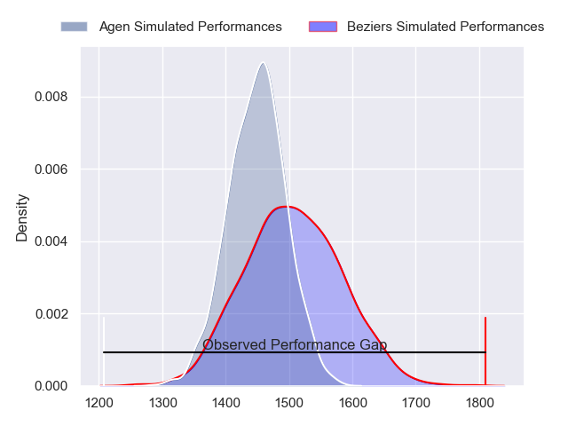
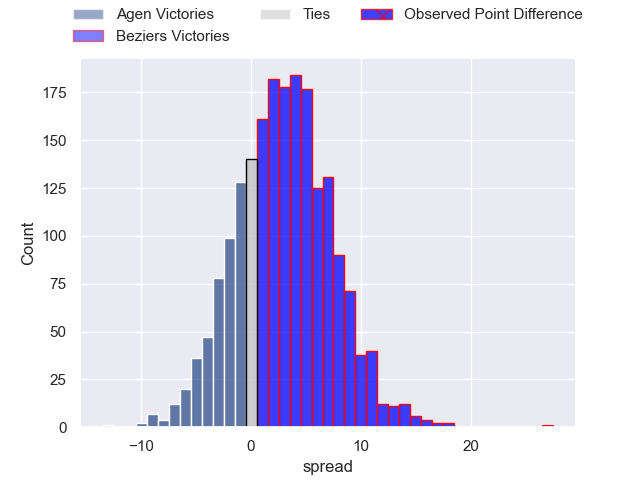
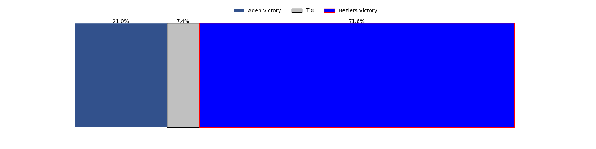

---  
layout: page  
title: Agen at Beziers; 14-41  
date: 2023-05-05 21:00:00 18:00:00 -0500  
categories: match review  
---
# Agen at Beziers; 14-41

# Club Level Predictions

The first set of predictions treats a club as the smallest object, as the club develops its members, organizes a gameplan, and deploys its players as needed for each match. This club model has a prediction of 0.585, which translates to predicting Beziers to win by 3.0.

Each club has a rating and a rating deviation (simiar to a Glicko system), and expected performances can be generated. This allows for simulated matches and spreads like the ones below.
## Projected Performances

## Projected Spreads

## Projected Results

# Player Level Predictions

Treating teams instead as an entity made up of the currently active players, I have ratings for each player in an altogether different system. These can be combined to form team ratings once teamsheets are announced, weighting starters a bit higher than the reserves. After the match is played, players can be weighted by their minutes on the field, allowing for an accurate measure of the team's composition. With these compiled team ratings, we can make predictions, measure inaccuracy, and update the individual player ratings.
## Prediction with Player Minutes: Agen by 4.1

Agen by 8.1 on a neutral field

There were 3 large changes in win probability in this match
## Prediction without Player Minutes: Agen by 3.2

Agen by 7.2 on a neutral pitch

|   Away Minutes | Away Player           |   Away elo |   Away Percentile |   Number |   Home Percentile |   Home elo | Home Player                 |   Home Minutes |
|---------------:|:----------------------|-----------:|------------------:|---------:|------------------:|-----------:|:----------------------------|---------------:|
|             54 | Richard Barrington    |      77.32 |                47 |        1 |                19 |      61.06 | Francisco Fernandes         |             46 |
|             54 | Mike Sosene-Feagai    |      75.79 |                46 |        2 |                17 |      57.55 | Marco Pinto Ferrer          |             46 |
|             46 | Walter Desmaison      |      57.99 |                 9 |        3 |                37 |      70.32 | Jamie Hagan                 |             52 |
|             65 | Joe Maksymiw          |      76.18 |                49 |        4 |                18 |      60.62 | Gillian Benoy               |             80 |
|             80 | Zak Farrance          |      88.99 |                70 |        5 |                31 |      67.32 | John Madigan                |             62 |
|             46 | Antoine Erbani        |      71.28 |                47 |        6 |                16 |      56.28 | Jean-Baptiste Barrère       |             55 |
|             80 | Evan Olmstead         |      59.96 |                21 |        7 |                21 |      61.77 | Éloi Massot                 |             80 |
|             80 | Martin Devergie       |      74.51 |                42 |        8 |                35 |      71.61 | Thomas Hoarau               |             80 |
|             54 | Dorian Bellot         |      92.79 |                77 |        9 |                28 |      66.65 | Josh Valentine              |             55 |
|             80 | Elton Thomas Jantjies |      80.15 |                53 |       10 |               nan |      68.02 | Adrien Latorre              |             52 |
|             80 | Jefferson Joseph      |      98.39 |                81 |       11 |                72 |      89.54 | Gabin Lorre                 |             80 |
|              4 | Harry Sloan           |      65.48 |                26 |       12 |                32 |      68.99 | Watisoni Votu               |             80 |
|             80 | Baptiste Lafond       |      76.77 |                48 |       13 |                95 |     115.12 | Maxime Espeut               |             57 |
|             54 | Timilai Rokoduru      |      72.17 |                33 |       14 |                47 |      74.52 | Paul Reau                   |             80 |
|             80 | Jean-Marcellin Buttin |      86.92 |                65 |       15 |                37 |      71.85 | Charly Malié                |             80 |
|             76 | Loris Tolot           |      84.33 |                66 |       16 |                62 |      79.86 | Giorgi Akhaladze            |             34 |
|             34 | Beau Farrance         |      73.76 |                51 |       17 |                60 |      80.72 | Clément Esteriola           |             34 |
|             34 | Julien Lebian         |      68.22 |                32 |       18 |               nan |      68.56 | John-Hubert Meyer           |             28 |
|             26 | Raphaël Lagarde       |      70.88 |               nan |       19 |                53 |      80.46 | Victor Dreuille             |             28 |
|             26 | Theo Idjellidaine     |      66.29 |                36 |       20 |                31 |      68.46 | Mitchell Short              |             25 |
|             26 | Clément Martinez      |      66    |                28 |       21 |                36 |      70.13 | Maxence Lemardelet          |             25 |
|             26 | Florent Guion         |      56.27 |                 9 |       22 |                28 |      67    | Andries Ebenaezer Swanepoel |             23 |
|             15 | Corentin Vernet       |      71.82 |                39 |       23 |               nan |      82.79 | Steyl Barnard               |             18 |

