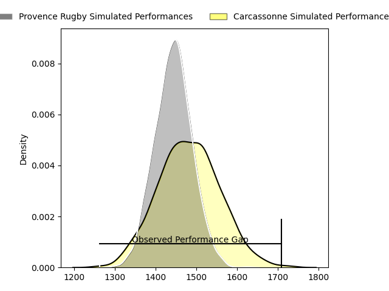
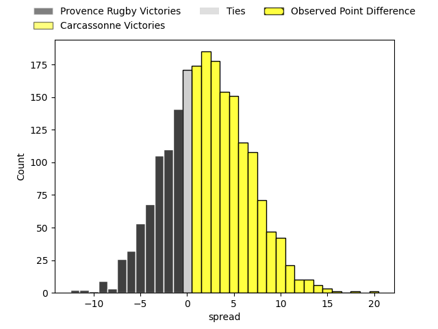
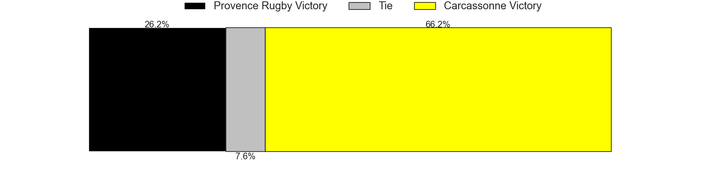

---  
layout: page  
title: Provence Rugby at Carcassonne; 14-34  
date: 2023-05-05 21:00:00 18:00:00 -0500  
categories: match review  
---
# Provence Rugby at Carcassonne; 14-34

# Club Level Predictions

The first set of predictions treats a club as the smallest object, as the club develops its members, organizes a gameplan, and deploys its players as needed for each match. This club model has a prediction of 0.559, which translates to predicting Carcassonne to win by 2.1.

Each club has a rating and a rating deviation (simiar to a Glicko system), and expected performances can be generated. This allows for simulated matches and spreads like the ones below.
## Projected Performances

## Projected Spreads

## Projected Results

# Player Level Predictions

Treating teams instead as an entity made up of the currently active players, I have ratings for each player in an altogether different system. These can be combined to form team ratings once teamsheets are announced, weighting starters a bit higher than the reserves. After the match is played, players can be weighted by their minutes on the field, allowing for an accurate measure of the team's composition. With these compiled team ratings, we can make predictions, measure inaccuracy, and update the individual player ratings.
## Prediction with Player Minutes: Carcassonne by 4.5

Carcassonne by 0.5 on a neutral field

There were 3 large changes in win probability in this match
## Prediction without Player Minutes: Carcassonne by 10.3

Carcassonne by 6.3 on a neutral pitch

|   Away Minutes | Away Player           |   Away elo |   Away Percentile |   Number |   Home Percentile |   Home elo | Home Player              |   Home Minutes |
|---------------:|:----------------------|-----------:|------------------:|---------:|------------------:|-----------:|:-------------------------|---------------:|
|             44 | Jean-Pierre Maugateau |      73.18 |               nan |        1 |                43 |      73.88 | Sami Mavinga             |             54 |
|             80 | Tom Marino            |      72.84 |               nan |        2 |                71 |      85.99 | Raphaël Carbou           |             44 |
|             36 | Mohammed Loukia       |      71.29 |                37 |        3 |                90 |      98.57 | Jérémy Boyadjis          |             41 |
|             80 | Jérôme Dufour         |      84.78 |                64 |        4 |                75 |      90.3  | Romain Manchia           |             42 |
|             41 | Hans Nkinsi           |      69.99 |                35 |        5 |                52 |      77.08 | Rynard Ligtoring Landman |             80 |
|             80 | Joseph Laget          |      86.86 |                59 |        6 |                55 |      80.01 | Étienne Herjean          |             80 |
|             80 | Charly Gambini        |      77.05 |                54 |        7 |                28 |      66.01 | Aaron Carroll            |             66 |
|             44 | Dorian Bonnin         |      73.74 |               nan |        8 |                64 |      82.31 | Pierre Reynaud           |             54 |
|             44 | Simon Tarel           |      64.43 |                20 |        9 |                26 |      65.31 | Samuel Marques           |             80 |
|             80 | Dorian Lavernhe       |      78.38 |                49 |       10 |                77 |      94.69 | Baptiste Mouchous        |             50 |
|             80 | Adrien Lapègue        |      76.78 |                51 |       11 |                79 |      93.41 | Léo Darrelatour          |             56 |
|             44 | Louis Marrou          |      76.51 |                47 |       12 |                65 |      85.58 | Jordan Puletua           |             80 |
|             54 | Adrian Sanday         |     104.13 |                88 |       13 |                36 |      71.47 | Pierre Aguillon          |             80 |
|             80 | Jules Solinas         |      64.21 |               nan |       14 |                43 |      73.31 | Maxime Marty             |             80 |
|             80 | Nadir Bouhedjeur      |      71.05 |                31 |       15 |                68 |      83.9  | Clément Clavières        |             80 |
|             44 | Thomas Vernet         |      90.76 |                79 |       16 |                45 |      75    | Vakhtangi Akhobadze      |             39 |
|             39 | Jessy Jegerlhener     |      69.86 |                32 |       17 |                29 |      66.73 | Simon Meka               |             38 |
|             36 | Guillaume Piazzoli    |      84.79 |                67 |       18 |                57 |      76.26 | Luka Petriashvili        |             36 |
|             36 | Hugo Navizet          |      82.86 |                60 |       19 |                46 |      74.89 | Christopher Hilsenbeck   |             30 |
|             36 | Jeremie Martin        |      78.68 |                55 |       20 |                10 |      51.92 | Jules Martinez           |             26 |
|             36 | Remi Bouaffou         |      73.56 |               nan |       21 |                43 |      70.48 | Connor Sa                |             26 |
|             26 | Axel Jolet            |      73.92 |               nan |       22 |                10 |      52.89 | Damien Añon              |             24 |
|            nan | nan                   |     nan    |               nan |       23 |                36 |      70.98 | Brieuc Plessis Couillaud |             14 |

