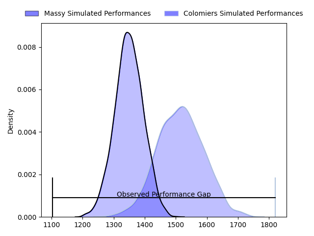
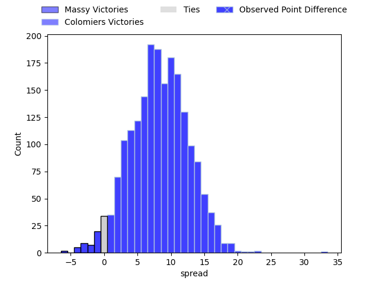
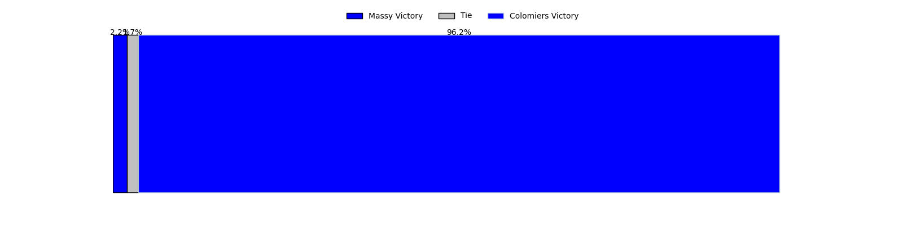

---  
layout: page  
title: Massy at Colomiers; 14-47  
date: 2023-05-05 21:00:00 18:00:00 -0500  
categories: match review  
---
# Massy at Colomiers; 14-47

# Club Level Predictions

The first set of predictions treats a club as the smallest object, as the club develops its members, organizes a gameplan, and deploys its players as needed for each match. This club model has a prediction of 0.721, which translates to predicting Colomiers to win by 8.4.

Each club has a rating and a rating deviation (simiar to a Glicko system), and expected performances can be generated. This allows for simulated matches and spreads like the ones below.
## Projected Performances

## Projected Spreads

## Projected Results

# Player Level Predictions

Treating teams instead as an entity made up of the currently active players, I have ratings for each player in an altogether different system. These can be combined to form team ratings once teamsheets are announced, weighting starters a bit higher than the reserves. After the match is played, players can be weighted by their minutes on the field, allowing for an accurate measure of the team's composition. With these compiled team ratings, we can make predictions, measure inaccuracy, and update the individual player ratings.
## Prediction with Player Minutes: Massy by 6.0

Massy by 10.0 on a neutral field

There were 5 large changes in win probability in this match
## Prediction without Player Minutes: Massy by 8.0

Massy by 12.0 on a neutral pitch

|   Away Minutes | Away Player              |   Away elo |   Away Percentile |   Number |   Home Percentile |   Home elo | Home Player           |   Home Minutes |
|---------------:|:-------------------------|-----------:|------------------:|---------:|------------------:|-----------:|:----------------------|---------------:|
|             48 | Ushangi Tcheishvili      |      73.59 |                49 |        1 |                18 |      63.05 | Thomas Dubois         |             50 |
|             48 | Pierre Trassoudaine      |     112.91 |                97 |        2 |                39 |      67.9  | Hikawera Elliot       |             50 |
|             48 | Nicolas Ferrer           |      87.99 |                74 |        3 |               nan |      68.22 | Beka Sheklashvili     |             46 |
|             80 | Clément Lanen            |      65.18 |                27 |        4 |                55 |      79.64 | Jean Thomas           |             80 |
|             80 | Andrew Chauveau          |      74.36 |                45 |        5 |                16 |      59.08 | Jack Whetton          |             48 |
|             55 | Jean Maurice Decubber    |      61.33 |                20 |        6 |                45 |      70.61 | Pierre-Samuel Pacheco |             80 |
|             80 | Mehdi Tlili              |      77.4  |                51 |        7 |                 7 |      51.05 | Waël Ponpon           |             50 |
|             35 | Yohann Gbizie            |      84.99 |                72 |        8 |                50 |      77.54 | Yann Peysson          |             80 |
|             50 | Gaëtan Pichon            |      76.8  |                56 |        9 |                45 |      74.93 | Edoardo Gori          |             60 |
|             41 | Tom Deleuze              |      83.17 |                60 |       10 |                87 |     102.17 | Romuald Séguy         |             80 |
|             80 | Thomas Rozière           |      64.37 |                23 |       11 |                18 |      56.48 | Alexis Palisson       |             80 |
|             55 | Tom Cusson               |      91.29 |                80 |       12 |                71 |      93.28 | Paul Pimienta         |             54 |
|             80 | Jamie-Jerry Taulagi      |      70.94 |                44 |       13 |                74 |      91.47 | Grégoire Maurino      |             59 |
|             80 | Alex Preira              |     105.65 |                91 |       14 |                 2 |      36.01 | Victor Moro           |             80 |
|             80 | Massimo Ortolan          |      64.36 |                24 |       15 |                44 |      73.75 | Max Auriac            |             80 |
|             45 | Samuel Nollet            |      72.93 |                27 |       16 |                16 |      68.53 | Hugo Pirlet           |             34 |
|             39 | Juan Kotze               |     101.26 |                83 |       17 |               nan |      81.83 | Louis Descoux         |             32 |
|             32 | Alexandre Candel         |      70.33 |                36 |       18 |                39 |      73.43 | Guillaume Tartas      |             30 |
|             32 | Guiterembi Vickos        |      81.34 |                50 |       19 |               nan |      68.45 | Elliott Maurel        |             30 |
|             32 | Pierre-Alexandre Duclieu |      89.25 |                69 |       20 |                30 |      66.28 | Andrew Ready          |             30 |
|             30 | Kilian Marion            |      82.75 |               nan |       21 |                49 |      77.25 | Michele Campagnaro    |             26 |
|             25 | Fernandez Correa         |      58.56 |                15 |       22 |                58 |      82.48 | Simon Delas           |             21 |
|             25 | Victorien Jacomme        |      58.07 |                15 |       23 |               nan |      64.72 | Arthur Diaz           |             20 |

