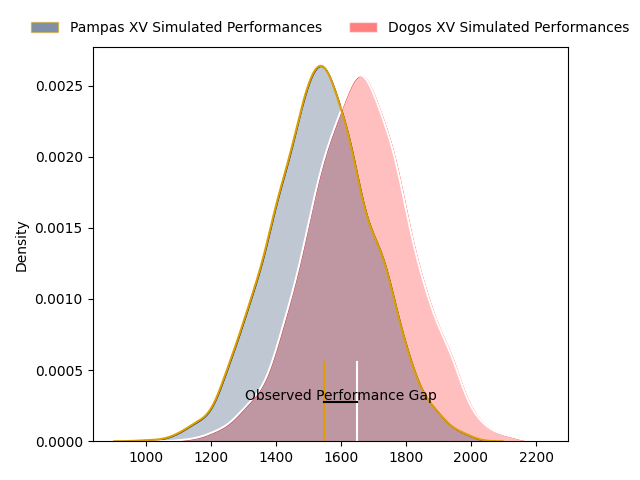
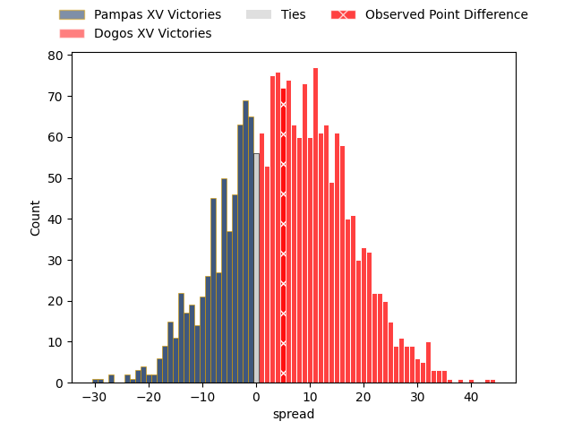

---  
layout: page  
title: Pampas XV at Dogos XV; 29-34  
date: 2023-05-05 22:00:00 18:00:00 -0500  
categories: match review  
---
# Pampas XV at Dogos XV; 29-34

# Club Level Predictions

The first set of predictions treats a club as the smallest object, as the club develops its members, organizes a gameplan, and deploys its players as needed for each match. This club model has a prediction of 0.654, which translates to predicting Dogos XV to win by 6.2.

Each club has a rating and a rating deviation (simiar to a Glicko system), and expected performances can be generated. This allows for simulated matches and spreads like the ones below.
## Projected Performances

## Projected Spreads

## Projected Results

# Player Level Predictions

Treating teams instead as an entity made up of the currently active players, I have ratings for each player in an altogether different system. These can be combined to form team ratings once teamsheets are announced, weighting starters a bit higher than the reserves. After the match is played, players can be weighted by their minutes on the field, allowing for an accurate measure of the team's composition. With these compiled team ratings, we can make predictions, measure inaccuracy, and update the individual player ratings.
## Prediction with Player Minutes: Pampas XV by 0.8

Pampas XV by 4.8 on a neutral field

There were 9 large changes in win probability in this match
## Prediction without Player Minutes: Pampas XV by 0.6

Pampas XV by 4.6 on a neutral pitch

|   Away Minutes | Away Player                    |   Away elo |   Away Percentile |   Number |   Home Percentile |   Home elo | Home Player               |   Home Minutes |
|---------------:|:-------------------------------|-----------:|------------------:|---------:|------------------:|-----------:|:--------------------------|---------------:|
|             53 | Rodrigo Martinez Manzano       |      81.73 |                62 |        1 |                14 |      57.32 | Tomas Bartolini           |             71 |
|             51 | Rodrigo Boulan                 |      59.21 |                19 |        2 |                14 |      54.55 | Boris Wenger              |             69 |
|             66 | Javier Corvalan                |      54.74 |                15 |        3 |                25 |      65.14 | Octavio Filippa           |             60 |
|             80 | Eliseo Fourcade                |      33.28 |                 1 |        4 |                17 |      59.27 | Lautaro Simes             |             80 |
|             49 | Lorenzo Colidio                |      73.8  |                46 |        5 |                 9 |      61.11 | Gregorio Hernandez        |             60 |
|             56 | Nicolas Damorim                |      70.81 |                38 |        6 |                19 |      59.67 | Aitor Bildosola           |             80 |
|             80 | Jeronimo Ureta                 |      47.9  |                 7 |        7 |                21 |      61.62 | Efrain Elias              |             80 |
|             80 | Santiago Ruiz                  |      71.61 |                38 |        8 |                32 |      69.62 | Ignacio Jose Gandini      |             69 |
|             60 | Eliseo Nicolas Morales Abraham |      58.38 |                17 |        9 |                21 |      62.18 | Agustin Moyano            |             69 |
|             80 | Joaquin de la Vega Mendia      |      43.05 |                 5 |       10 |                19 |      60.38 | Julian Ignacio Hernandez  |             80 |
|             80 | Lucio Auad                     |      62.29 |                23 |       11 |                38 |      70.43 | Ernesto Giudice           |             52 |
|             57 | Juan Pablo Castro Collado      |      78.18 |                49 |       12 |                27 |      65.98 | Leonardo Gea Salim        |             80 |
|             80 | Benjamin Elizalde              |      63.3  |                22 |       13 |                 5 |      46.78 | Agustin Segura            |             54 |
|             80 | Inaki Delguy                   |      80.84 |                60 |       14 |                12 |      53.83 | Lautaro Cipriani          |             80 |
|             80 | Juan Ignacio Lando             |      88.67 |                68 |       15 |                14 |      54.98 | Mateo Soler               |             80 |
|             27 | Javier Angel Coronel           |      58.96 |                16 |       16 |                11 |      54.18 | Juan Baronio              |             28 |
|             24 | Eliseo Chiavassa               |      57.36 |                16 |       17 |                26 |      66.18 | Faustino Sánchez Valarolo |             26 |
|             23 | Felipe de la Vega              |      58.83 |                16 |       18 |               nan |      65.69 | Federico Albrisi          |             20 |
|             31 | Manuel Bernstein               |      53.45 |                11 |       19 |                 8 |      56.37 | Ramiro Valdes Iribarren   |             20 |
|             20 | Mateo Albanese                 |      59.99 |                18 |       20 |                24 |      63.41 | Valentin Cabral           |             11 |
|             29 | Ramiro Gurovich                |      65.06 |                29 |       21 |                14 |      58.89 | Juan Cruz Strada          |             11 |
|             14 | Matias Medrano                 |      78.07 |                49 |       22 |                 8 |      53.04 | Roman Pretz               |             11 |
|            nan | nan                            |     nan    |               nan |       23 |               nan |      61.37 | Octavio Barbatti          |              9 |

