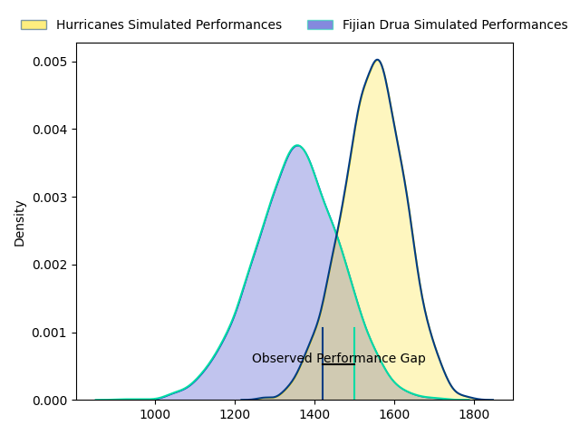
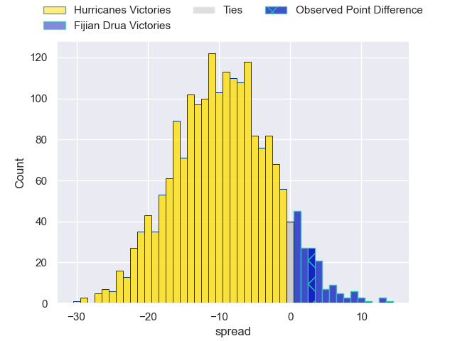
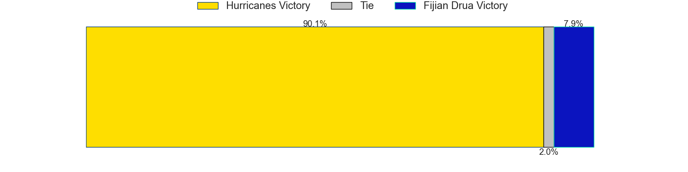

---  
layout: page  
title: Hurricanes at Fijian Drua; 24.0-27.0  
date: 2023-05-05 22:05:00 18:00:00 -0500  
categories: match review  
---
# Hurricanes at Fijian Drua; 24.0-27.0

# Club Level Predictions

The first set of predictions treats a club as the smallest object, as the club develops its members, organizes a gameplan, and deploys its players as needed for each match. This club model has a prediction of 0.257, which translates to predicting Hurricanes to win by 9.5.

Each club has a rating and a rating deviation (simiar to a Glicko system), and expected performances can be generated. This allows for simulated matches and spreads like the ones below.
## Projected Performances

## Projected Spreads

## Projected Results

# Player Level Predictions

Treating teams instead as an entity made up of the currently active players, I have ratings for each player in an altogether different system. These can be combined to form team ratings once teamsheets are announced, weighting starters a bit higher than the reserves. After the match is played, players can be weighted by their minutes on the field, allowing for an accurate measure of the team's composition. With these compiled team ratings, we can make predictions, measure inaccuracy, and update the individual player ratings.
## Prediction with Player Minutes: Hurricanes by 16.2

Hurricanes by 20.2 on a neutral field

There were 9 large changes in win probability in this match
## Prediction without Player Minutes: Hurricanes by 19.1

Hurricanes by 23.1 on a neutral pitch

|   Away Minutes | Away Player          |   Away elo |   Away Percentile |   Number |   Home Percentile |   Home elo | Home Player           |   Home Minutes |
|---------------:|:---------------------|-----------:|------------------:|---------:|------------------:|-----------:|:----------------------|---------------:|
|             57 | Xavier Numia         |     103.97 |                93 |        1 |                88 |      96.44 | Haereiti Hetet        |             53 |
|             67 | Asafo Aumua          |     111.24 |                96 |        2 |                96 |     111.03 | Tevita Ikanivere      |             74 |
|             57 | Tyrel Lomax          |     141.47 |               100 |        3 |                31 |      68.48 | Samuela Tawake        |             45 |
|             57 | Justin Sangster      |      90.52 |               nan |        4 |                92 |     108.64 | Isoa Nasilasila       |             80 |
|             80 | Isaia Walker-Leawere |     105.13 |                90 |        5 |                40 |      71.24 | Joseva Tamani         |             80 |
|             76 | Devan Flanders       |      79.76 |                57 |        6 |                46 |      74.79 | Vilive Miramira       |             80 |
|             71 | Du'Plessis Kirifi    |      87.2  |                72 |        7 |                16 |      57.22 | Kitione Salawa        |             25 |
|             80 | Ardie Savea          |     123.94 |                98 |        8 |                41 |      73.29 | Elia Canakaivata      |             63 |
|             57 | Cam Roigard          |      95.3  |                80 |        9 |                33 |      68.56 | Frank Lomani          |             53 |
|             80 | Aidan Morgan         |      86.78 |                65 |       10 |                79 |      94.96 | Teti Tela             |             53 |
|             65 | Kini Naholo          |     110.16 |                94 |       11 |                50 |      76.65 | Taniela Rakuro        |             80 |
|             80 | Jordie Barrett       |     122.62 |                97 |       12 |                99 |     136.81 | Kalaveti Ravouvou     |             80 |
|             80 | Billy Proctor        |     107.9  |                91 |       13 |                60 |      82.58 | Iosefo Masi           |             80 |
|             80 | Julian Savea         |     118.29 |                97 |       14 |                46 |      74.05 | Selestino Ravutaumada |             61 |
|             80 | Joshua Moorby        |      84.8  |                62 |       15 |                71 |      91.32 | Ilaisa Droasese       |             80 |
|             13 | Jacob Devery         |      84.77 |               nan |       16 |               nan |      81.38 | Mesulame Dolokoto     |              6 |
|             23 | Tevita Mafileo       |      94.22 |                89 |       17 |                71 |      85.37 | Livai Natave          |             27 |
|             23 | Owen Franks          |      96.41 |                88 |       18 |                73 |      86.77 | Jone Koroiduadua      |             35 |
|             23 | TK Howden            |      87.16 |                73 |       19 |               nan |      85.47 | Etonia Waqa           |             17 |
|             13 | Brayden Iose         |      57.17 |                16 |       20 |                85 |      97.7  | Ratu Meli Derenalagi  |             55 |
|             23 | Jamie Booth          |      50.02 |                 7 |       21 |                68 |      87.13 | Peni Matawalu         |             27 |
|              0 | Harry Godfrey        |      69.57 |                33 |       22 |               nan |      83.82 | Kemu Valetini         |             27 |
|             15 | Salesi Rayasi        |      78.3  |                55 |       23 |                62 |      81.96 | Eroni Sau             |             19 |

