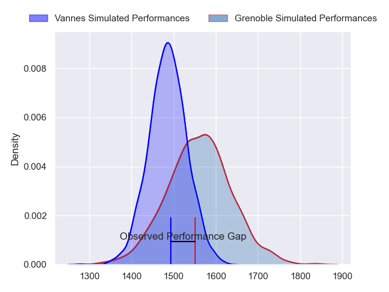
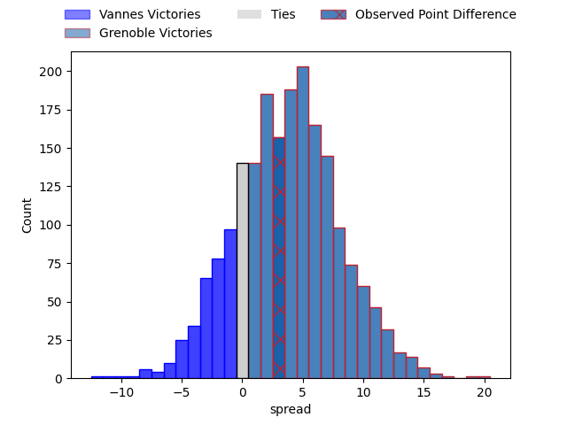
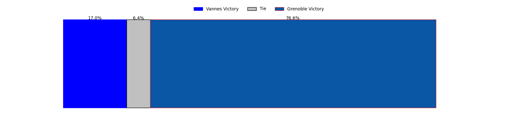

---  
layout: page  
title: Vannes at Grenoble; 24-27  
date: 2023-05-05 21:00:00 18:00:00 -0500  
categories: match review  
---
# Vannes at Grenoble; 24-27

# Club Level Predictions

The first set of predictions treats a club as the smallest object, as the club develops its members, organizes a gameplan, and deploys its players as needed for each match. This club model has a prediction of 0.604, which translates to predicting Grenoble to win by 3.7.

Each club has a rating and a rating deviation (simiar to a Glicko system), and expected performances can be generated. This allows for simulated matches and spreads like the ones below.
## Projected Performances

## Projected Spreads

## Projected Results

# Player Level Predictions

Treating teams instead as an entity made up of the currently active players, I have ratings for each player in an altogether different system. These can be combined to form team ratings once teamsheets are announced, weighting starters a bit higher than the reserves. After the match is played, players can be weighted by their minutes on the field, allowing for an accurate measure of the team's composition. With these compiled team ratings, we can make predictions, measure inaccuracy, and update the individual player ratings.
## Prediction with Player Minutes: Grenoble by 13.4

Grenoble by 9.4 on a neutral field

There were 5 large changes in win probability in this match
## Prediction without Player Minutes: Grenoble by 14.7

Grenoble by 10.7 on a neutral pitch

|   Away Minutes | Away Player           |   Away elo |   Away Percentile |   Number |   Home Percentile |   Home elo | Home Player         |   Home Minutes |
|---------------:|:----------------------|-----------:|------------------:|---------:|------------------:|-----------:|:--------------------|---------------:|
|             52 | Charles-Henri Berguet |      54.08 |                12 |        1 |                28 |      66.88 | Luka Goginava       |             49 |
|             52 | Théo Beziat           |      91.13 |                77 |        2 |                15 |      56.79 | Mathis Sarragallet  |             49 |
|             52 | John Afoa             |      77.69 |                62 |        3 |                46 |      74.72 | Irakli Aptsiauri    |             49 |
|             80 | Éric Marks            |      89.3  |                74 |        4 |                31 |      67.94 | José Duarte Madeira |             57 |
|             52 | Myles Edwards         |      52.68 |                12 |        5 |                84 |      97.08 | Tanginoa Halaifonua |             80 |
|             80 | Francisco Gorrisen    |      85.21 |                75 |        6 |                74 |      89.11 | Thibaut Martel      |             80 |
|             44 | Gregoire Bazin        |      44.22 |                 4 |        7 |                63 |      83.47 | Steeve Blanc-Mappaz |             80 |
|             80 | Léon Boulier          |      88.52 |                72 |        8 |                96 |     113.4  | Pio Muarua          |             56 |
|             68 | Michael Ruru          |      85.81 |                65 |        9 |                83 |      98.64 | Éric Escande        |             61 |
|             44 | Jean Chezeau          |      80.33 |                54 |       10 |                82 |      97.64 | Thomas Fortunel     |             61 |
|             80 | Théo Bastardie        |      87.91 |                72 |       11 |                69 |      85.89 | Lucas Dupont        |             68 |
|             80 | Andres Vilaseca       |      93.53 |                80 |       12 |                71 |      89.81 | Romain Trouilloud   |             80 |
|             52 | Sacha Valleau         |      81.99 |                59 |       13 |                56 |      80.6  | Terence Hepetema    |             80 |
|             80 | Nicolas Freitas       |      74.52 |                51 |       14 |                41 |      72.35 | Karim Qadiri        |             80 |
|             80 | Gwenaël Duplenne      |      88.11 |                67 |       15 |                81 |      98.76 | Julien Farnoux      |             80 |
|             36 | Joe Edwards           |      71.06 |                36 |       16 |                94 |     106.19 | Zack Gauthier       |             31 |
|             36 | Maxime Lafage         |      74.19 |                45 |       17 |               nan |      76.03 | Lilian Rossi        |             31 |
|             28 | Cyril Blanchard       |      72.28 |                42 |       18 |                72 |      86.43 | Regis Montagne      |             31 |
|             28 | Ewan Thomas Johnson   |      83.09 |                63 |       19 |                97 |     120.16 | Thomas Lainault     |             23 |
|             28 | Phil Kite             |      72.5  |                40 |       20 |                10 |      54.51 | Talalelei Gray      |             24 |
|             28 | Andy Bordelai         |      97.29 |                88 |       21 |                31 |      69.36 | Felipe Ezcurra      |             19 |
|             28 | Nathanael Hulleu      |      80.19 |                59 |       22 |                81 |      97.41 | Romain Barthélémy   |             19 |
|             12 | Erwan Nicolas         |      54.02 |                11 |       23 |                66 |      84.35 | Erwan Dridi         |             12 |

