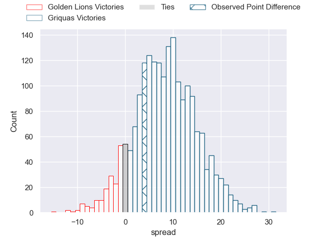
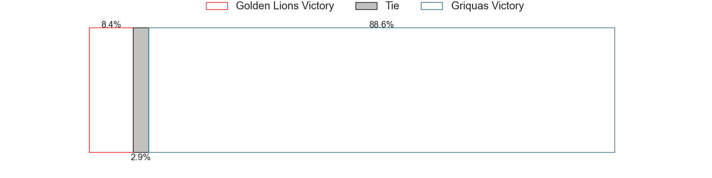

---  
layout: page  
title: Golden Lions at Griquas; 21-25  
date: 2023-05-05 15:30:00 18:00:00 -0500  
categories: match review  
---
# Golden Lions at Griquas; 21-25

# Club Level Predictions

The first set of predictions treats a club as the smallest object, as the club develops its members, organizes a gameplan, and deploys its players as needed for each match. This club model has a prediction of 0.721, which translates to predicting Griquas to win by 8.5.

Each club has a rating and a rating deviation (simiar to a Glicko system), and expected performances can be generated. This allows for simulated matches and spreads like the ones below.
## Projected Performances

## Projected Spreads

## Projected Results

# Player Level Predictions

Treating teams instead as an entity made up of the currently active players, I have ratings for each player in an altogether different system. These can be combined to form team ratings once teamsheets are announced, weighting starters a bit higher than the reserves. After the match is played, players can be weighted by their minutes on the field, allowing for an accurate measure of the team's composition. With these compiled team ratings, we can make predictions, measure inaccuracy, and update the individual player ratings.
## Prediction with Player Minutes: Golden Lions by 12.8

Golden Lions by 16.8 on a neutral field

There were 6 large changes in win probability in this match
## Prediction without Player Minutes: Golden Lions by 12.2

Golden Lions by 16.2 on a neutral pitch

|   Away Minutes | Away Player                 |   Away elo |   Away Percentile |   Number |   Home Percentile |   Home elo | Home Player                |   Home Minutes |
|---------------:|:----------------------------|-----------:|------------------:|---------:|------------------:|-----------:|:---------------------------|---------------:|
|             54 | Rhynardt Rijnsburger        |     101.25 |                91 |        1 |                34 |      69.95 | Cebolenkosi Dlamini        |             59 |
|             54 | Gerrit Jacobus Visagie      |      76.9  |                52 |        2 |                33 |      68.32 | Janco Uys                  |             59 |
|             62 | Asenathi Ntlabakanye        |      70.61 |                35 |        3 |                39 |      72.22 | Janu Botha                 |             59 |
|             80 | Ruben (Hobo) Schoeman       |      91.07 |                77 |        4 |                12 |      55.12 | Derrick Pretorius          |             80 |
|             80 | Darrien-Lane Landsberg      |     101.7  |                89 |        5 |                46 |      74.72 | Albert Liebenberg          |             59 |
|             80 | Johannes JC Pretorius       |      90.92 |                77 |        6 |               nan |      68.94 | Thabo Ndimande             |             80 |
|             80 | Emmanuel Tshituka           |      76.68 |                58 |        7 |                58 |      80.68 | Hanru Sirgel               |             63 |
|             40 | Travis Gordon               |      70.27 |                37 |        8 |                18 |      60.75 | Carl Els                   |             80 |
|             80 | Morne van der Berg          |      77.05 |                49 |        9 |                20 |      62.14 | Johan Mulder               |             80 |
|             27 | Gianni Dean Lombard         |      81.2  |                55 |       10 |                34 |      70.21 | Lubabalo Dobela            |             80 |
|             80 | Stean Pienaar               |      79.8  |                54 |       11 |                31 |      67.58 | Sakoyisa Makata            |             80 |
|             80 | Rynardt Jonker              |      92.29 |                74 |       12 |                27 |      66.21 | Tertius Kruger             |             80 |
|             80 | Manuel Johern (Mannie) Rass |      74.6  |                42 |       13 |                77 |      94.72 | Jay Cee Nel                |             59 |
|             80 | Prince Nkabinde             |      88.72 |                73 |       14 |                13 |      55.36 | Rosco Shane Specman        |             80 |
|             40 | Vaughen Isaacs              |      87.72 |                67 |       15 |                79 |      92.92 | Ashlon Davids              |             80 |
|             53 | Tiaan Henk Swanepoel        |      62.62 |                22 |       16 |               nan |      69.11 | Justin Forwood             |             21 |
|             40 | Ruhan Straeuli              |      77.1  |                47 |       17 |                62 |      80.78 | Edward Davids              |             21 |
|             40 | Tyler Bocks                 |      73.68 |                41 |       18 |                49 |      72.45 | George Alexander Whitehead |             21 |
|             26 | Morgan Naude                |      78.38 |                55 |       19 |               nan |      73.16 | Sean Swart                 |             21 |
|             26 | Morné Brandon               |      63.51 |                22 |       20 |               nan |      67.09 | Dylan Sjoblom              |             21 |
|             18 | Cal Smid                    |      44.97 |                 4 |       21 |                85 |      97.83 | Niel Otto                  |             17 |

