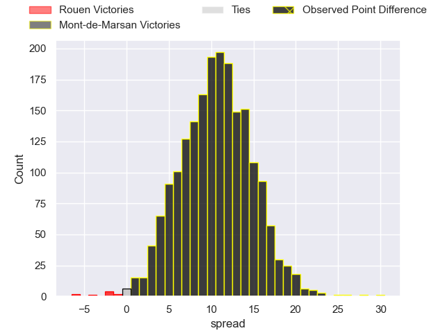

---  
layout: page  
title: Rouen at Mont-de-Marsan; 17-47  
date: 2023-05-05 21:00:00 18:00:00 -0500  
categories: match review  
---
# Rouen at Mont-de-Marsan; 17-47

# Club Level Predictions

The first set of predictions treats a club as the smallest object, as the club develops its members, organizes a gameplan, and deploys its players as needed for each match. This club model has a prediction of 0.769, which translates to predicting Mont-de-Marsan to win by 10.6.

Each club has a rating and a rating deviation (simiar to a Glicko system), and expected performances can be generated. This allows for simulated matches and spreads like the ones below.
## Projected Performances

## Projected Spreads

## Projected Results

# Player Level Predictions

Treating teams instead as an entity made up of the currently active players, I have ratings for each player in an altogether different system. These can be combined to form team ratings once teamsheets are announced, weighting starters a bit higher than the reserves. After the match is played, players can be weighted by their minutes on the field, allowing for an accurate measure of the team's composition. With these compiled team ratings, we can make predictions, measure inaccuracy, and update the individual player ratings.
## Prediction with Player Minutes: Mont-de-Marsan by 16.7

Mont-de-Marsan by 12.7 on a neutral field

There were 5 large changes in win probability in this match
## Prediction without Player Minutes: Mont-de-Marsan by 14.9

Mont-de-Marsan by 10.9 on a neutral pitch

|   Away Minutes | Away Player           |   Away elo |   Away Percentile |   Number |   Home Percentile |   Home elo | Home Player               |   Home Minutes |
|---------------:|:----------------------|-----------:|------------------:|---------:|------------------:|-----------:|:--------------------------|---------------:|
|             50 | Soulemane Camara      |      83.72 |                66 |        1 |                81 |      91.35 | Jean-Luc Innocente        |             41 |
|             31 | Mathieu Bonnot        |      83.81 |                61 |        2 |                60 |      81.11 | Jose Luis Gonzalez        |             50 |
|             61 | Cody Thomas           |      78.63 |                45 |        3 |                54 |      79.29 | Anthony Alves             |             50 |
|             50 | Raphaël Vieilledent   |     111.98 |                94 |        4 |                29 |      66.5  | Nicolas Garrault          |             80 |
|             80 | Jimi Maximin          |     100.18 |                87 |        5 |                89 |     102.4  | Romain Durand             |             41 |
|             80 | Samuel Maximin        |      38.05 |                 2 |        6 |                84 |      97.7  | Aurélien Lisena           |             80 |
|             50 | Lucas Costa           |      88.15 |                76 |        7 |                73 |      91.79 | Veresa Tuqovu Ramototabua |             80 |
|             80 | Willy N'Diaye         |      88.34 |                64 |        8 |                58 |      81.84 | Michael Faleafa           |             41 |
|             50 | Florent Campeggia     |      58.62 |                12 |        9 |                55 |      79.17 | Christophe Loustalot      |             50 |
|             50 | Franck Pourteau       |      73.15 |                43 |       10 |                61 |      83.77 | Willie du Plessis         |             80 |
|             80 | Kevin Milhorat        |      69.27 |                35 |       11 |                77 |      91.33 | Wame Naituvi              |             80 |
|             80 | John Thomas Jackson   |      63.09 |                17 |       12 |                47 |      75.65 | Lucas Mensa               |             80 |
|             80 | Alex Luatua           |      72.27 |                44 |       13 |                94 |     113.03 | Nacani Wakaya             |             61 |
|             80 | Malcolm Bertschy      |      88.96 |                73 |       14 |                81 |      94.64 | Julien Cabannes           |             60 |
|             41 | Paul Surano           |     101.99 |                88 |       15 |                34 |      72.43 | Alexandre de Nardi        |             80 |
|             49 | Jean-Étienne Lesueur  |      62.12 |                34 |       16 |               nan |      81.4  | Leandro Luis Cedaro       |             39 |
|             39 | Marius Marty          |      37.94 |                 2 |       17 |                27 |      68.45 | Max Curie                 |             39 |
|             30 | Joris Lezat           |      63.24 |                22 |       18 |                59 |      81.16 | Yann Brethous             |             39 |
|             30 | Thibault Olender      |     101.5  |                87 |       19 |                48 |      75.76 | Gheorge Gajion            |             30 |
|             30 | Jean Leleu            |      74.55 |                43 |       20 |               nan |      77.3  | Clément Darbo             |             30 |
|             30 | Fabien Vincent        |      81.19 |                59 |       21 |                59 |      82.35 | Simon Labouyrie           |             30 |
|             30 | Dylan Jacquot         |      75.41 |               nan |       22 |                74 |      89.6  | Kaminieli Rasaku          |             20 |
|             19 | Khvicha Tsopurashvili |      78.66 |               nan |       23 |                88 |     104.26 | Jules Even                |             19 |

