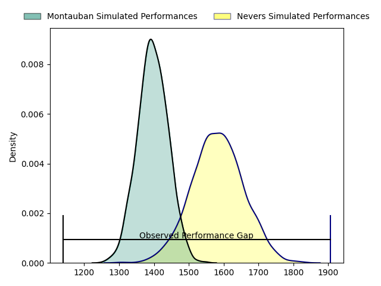
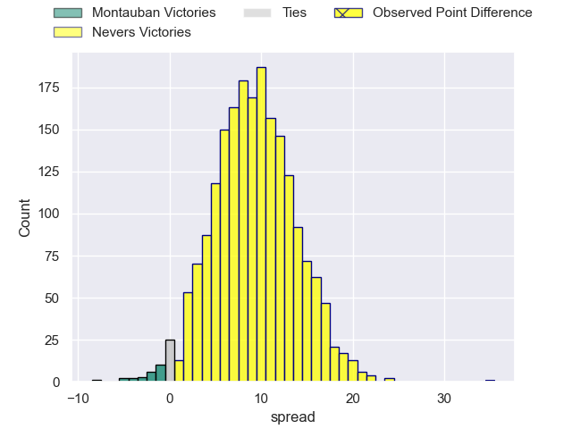
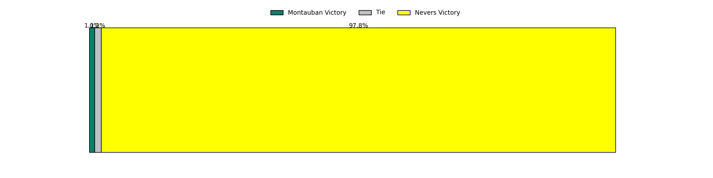

---  
layout: page  
title: Montauban at Nevers; 13-48  
date: 2023-05-05 21:00:00 18:00:00 -0500  
categories: match review  
---
# Montauban at Nevers; 13-48

# Club Level Predictions

The first set of predictions treats a club as the smallest object, as the club develops its members, organizes a gameplan, and deploys its players as needed for each match. This club model has a prediction of 0.741, which translates to predicting Nevers to win by 9.2.

Each club has a rating and a rating deviation (simiar to a Glicko system), and expected performances can be generated. This allows for simulated matches and spreads like the ones below.
## Projected Performances

## Projected Spreads

## Projected Results

# Player Level Predictions

Treating teams instead as an entity made up of the currently active players, I have ratings for each player in an altogether different system. These can be combined to form team ratings once teamsheets are announced, weighting starters a bit higher than the reserves. After the match is played, players can be weighted by their minutes on the field, allowing for an accurate measure of the team's composition. With these compiled team ratings, we can make predictions, measure inaccuracy, and update the individual player ratings.
## Prediction with Player Minutes: Nevers by 11.1

Nevers by 7.1 on a neutral field

There were 1 large changes in win probability in this match
## Prediction without Player Minutes: Nevers by 11.9

Nevers by 7.9 on a neutral pitch

|   Away Minutes | Away Player         |   Away elo |   Away Percentile |   Number |   Home Percentile |   Home elo | Home Player                 |   Home Minutes |
|---------------:|:--------------------|-----------:|------------------:|---------:|------------------:|-----------:|:----------------------------|---------------:|
|             47 | Malino Vanai        |      85.01 |                62 |        1 |               nan |      77.1  | Jordan Seneca               |             45 |
|             47 | Kevin Firmin        |      81.04 |                52 |        2 |                78 |      90.26 | Elia Elia                   |             45 |
|             47 | Mirian Burduli      |      63.84 |                19 |        3 |                30 |      67.63 | Cleopas Kundiona            |             45 |
|             51 | Tjiuee Uanivi       |      78.6  |                50 |        4 |                54 |      79.68 | Lasha Jaiani                |             80 |
|             80 | Dimitri Vaotoa      |      93.1  |                80 |        5 |                47 |      74.89 | Maka Polutele               |             47 |
|             80 | Tomas Lezana        |      75.45 |                48 |        6 |                34 |      71.54 | Shaun Adendorff             |             64 |
|             57 | Frédéric Quercy     |      62.22 |                22 |        7 |                36 |      77.33 | Julien Kazubek              |             80 |
|             80 | Otar Giorgadze      |      85.46 |                67 |        8 |                14 |      56.4  | Steven David                |             80 |
|             80 | Alexis Bernadet     |      93.66 |                78 |        9 |                70 |      92.51 | Yoan Cottin                 |             80 |
|             51 | Tedo Abzhandadze    |      85.07 |                63 |       10 |                76 |      93.51 | Yohan Le Bourhis            |             45 |
|             41 | Bastien Guillemin   |      75.03 |                48 |       11 |                52 |      80.85 | Benjamin Dumas              |             80 |
|             57 | Taleta Tupuola      |      65.6  |                42 |       12 |                69 |      88.32 | Rudy Derrieux               |             43 |
|             80 | Paul Bonnefond      |      65.08 |                26 |       13 |                92 |     108.31 | Alifereti Loaloa            |             80 |
|             80 | Julian Hauw         |      81.17 |               nan |       14 |                72 |      88.54 | Christian Guetang Ambadiang |             64 |
|             80 | Alexis Rey          |      76.03 |               nan |       15 |                73 |      91.82 | Kylian Jaminet              |             80 |
|             39 | Raphaël Grandmougin |      75.84 |               nan |       16 |                64 |      85.37 | Leonard Paris               |             37 |
|             33 | Thomas Bue          |      87.38 |                75 |       17 |                75 |      84.53 | Aitor Kitutu                |             35 |
|             33 | Arnaud Feltrin      |      77.86 |                57 |       18 |                59 |      82.67 | Tanguy Ménoret              |             35 |
|             33 | Kevin Yameogo       |      75.49 |               nan |       19 |                72 |      89.08 | Issam Hamel                 |             35 |
|             29 | Quentin Witt        |      93.11 |                79 |       20 |                44 |      73.08 | Aselo Ikahehegi             |             35 |
|             29 | Lucas Chaudanson    |      73.98 |               nan |       21 |                82 |      95.58 | Kevin Noah                  |             33 |
|             23 | Benjamin Puntous    |      98.03 |                82 |       22 |                96 |     115.98 | Hugues Bastide              |             16 |
|             23 | Inem Iskhakov       |      75.66 |               nan |       23 |                83 |      96.83 | Jason-Collin Fraser         |             16 |

