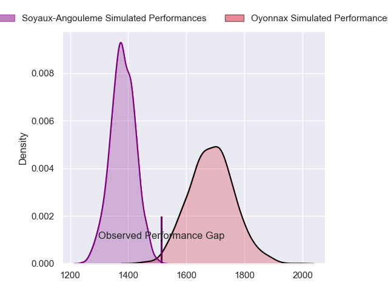
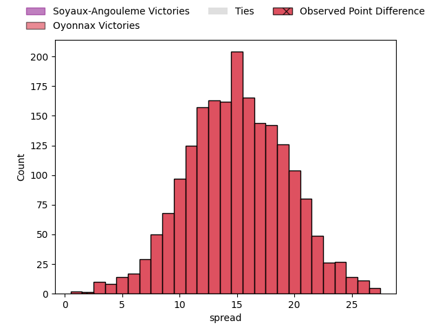
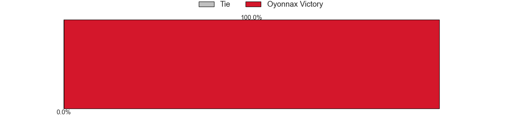

---  
layout: page  
title: Soyaux-Angouleme at Oyonnax; 31-33  
date: 2023-05-05 21:00:00 18:00:00 -0500  
categories: match review  
---
# Soyaux-Angouleme at Oyonnax; 31-33

# Club Level Predictions

The first set of predictions treats a club as the smallest object, as the club develops its members, organizes a gameplan, and deploys its players as needed for each match. This club model has a prediction of 0.848, which translates to predicting Oyonnax to win by 15.1.

Each club has a rating and a rating deviation (simiar to a Glicko system), and expected performances can be generated. This allows for simulated matches and spreads like the ones below.
## Projected Performances

## Projected Spreads

## Projected Results

# Player Level Predictions

Treating teams instead as an entity made up of the currently active players, I have ratings for each player in an altogether different system. These can be combined to form team ratings once teamsheets are announced, weighting starters a bit higher than the reserves. After the match is played, players can be weighted by their minutes on the field, allowing for an accurate measure of the team's composition. With these compiled team ratings, we can make predictions, measure inaccuracy, and update the individual player ratings.
## Prediction with Player Minutes: Oyonnax by 26.2

Oyonnax by 22.2 on a neutral field

There were 6 large changes in win probability in this match
## Prediction without Player Minutes: Oyonnax by 25.8

Oyonnax by 21.8 on a neutral pitch

|   Away Minutes | Away Player                      |   Away elo |   Away Percentile |   Number |   Home Percentile |   Home elo | Home Player         |   Home Minutes |
|---------------:|:---------------------------------|-----------:|------------------:|---------:|------------------:|-----------:|:--------------------|---------------:|
|             57 | Yassin Boutemani                 |      71.78 |                38 |        1 |                65 |      85.56 | Tommy Raynaud       |             52 |
|             53 | Ole Avei                         |      72.61 |                51 |        2 |                13 |      55.5  | Teddy Durand        |             57 |
|             53 | Michael Masimba Tingini Kumbirai |      99.36 |                90 |        3 |                68 |      84.43 | Thomas Laclayat     |             52 |
|             80 | Ian Kitwanga                     |      60.62 |                16 |        4 |                67 |      84.54 | Phoenix Battye      |             80 |
|             34 | Sikeli Nabou                     |      69.48 |                34 |        5 |                25 |      64.58 | Hugo Fabregue       |             57 |
|             80 | Nicolas Martins                  |      77.53 |                51 |        6 |                98 |     127.59 | Kevin Lebreton      |             80 |
|             58 | Germain Burgaud                  |      92.74 |                79 |        7 |                92 |     107.39 | Loïc Credoz         |             80 |
|             80 | Yassine Jarmouni                 |      77.78 |                56 |        8 |                49 |      77.31 | Filimo Taofifenua   |             49 |
|             58 | Adrien Bau                       |      66.76 |                31 |        9 |                66 |      85.76 | Charlie Cassang     |             63 |
|             80 | Benjamin Botica                  |      63.6  |                23 |       10 |                87 |     101.87 | Justin Bouraux      |             80 |
|             80 | Marvin Lestremau                 |      78    |                53 |       11 |                56 |      78.88 | Gavin Stark         |             80 |
|             80 | Inaki Ayarza Saporta             |      63.49 |                22 |       12 |                78 |      95.96 | Théo Millet         |             57 |
|             80 | Ledua Mau                        |      80.21 |                55 |       13 |                69 |      88.31 | Chris Farrell       |             80 |
|             58 | Maxime Laforgue                  |      79.58 |                57 |       14 |                86 |      99.84 | Joe Ravouvou        |             80 |
|             80 | Pierre Lafitte                   |      69.25 |                32 |       15 |                86 |     103.89 | Aurelien Callandret |             49 |
|             46 | Robin Copeland                   |      70.32 |                36 |       16 |                58 |      81.95 | Rory Grice          |             31 |
|             27 | Rayne Barka                      |      72.81 |                43 |       17 |               nan |      81.89 | Darren Sweetnam     |             31 |
|             27 | Omar Dahir                       |      93.31 |                83 |       18 |                45 |      74.97 | Adrien Bordenave    |             28 |
|             23 | Shota Gogisvanidze               |      79.57 |                46 |       19 |                62 |      85.34 | Thibault Berthaud   |             28 |
|             22 | Emmanuel Saubusse                |      75.39 |                46 |       20 |                80 |      95.08 | Steve Mafi          |             23 |
|             22 | Matthieu Ugalde                  |      78.81 |                53 |       21 |                38 |      73.39 | Florian Vialelle    |             23 |
|             22 | Gautier Gibouin                  |      51.68 |                 8 |       22 |                67 |      84.52 | Benjamin Geledan    |             23 |
|            nan | nan                              |     nan    |               nan |       23 |                14 |      59.82 | Ilan El Khattabi    |             17 |

