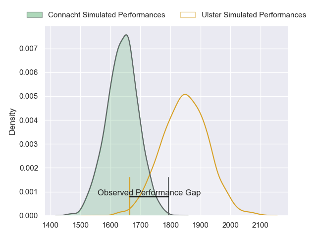
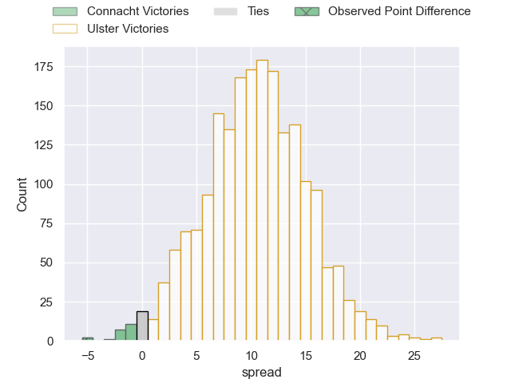

---  
layout: page  
title: Connacht at Ulster; 15-10  
date: 2023-05-05 20:35:00 18:00:00 -0500  
categories: match review  
---
# Connacht at Ulster; 15-10

# Club Level Predictions

The first set of predictions treats a club as the smallest object, as the club develops its members, organizes a gameplan, and deploys its players as needed for each match. This club model has a prediction of 0.769, which translates to predicting Ulster to win by 10.6.

Each club has a rating and a rating deviation (simiar to a Glicko system), and expected performances can be generated. This allows for simulated matches and spreads like the ones below.
## Projected Performances

## Projected Spreads

## Projected Results

# Player Level Predictions

Treating teams instead as an entity made up of the currently active players, I have ratings for each player in an altogether different system. These can be combined to form team ratings once teamsheets are announced, weighting starters a bit higher than the reserves. After the match is played, players can be weighted by their minutes on the field, allowing for an accurate measure of the team's composition. With these compiled team ratings, we can make predictions, measure inaccuracy, and update the individual player ratings.
## Prediction with Player Minutes: Ulster by 8.0

Ulster by 4.0 on a neutral field

There were 10 large changes in win probability in this match
## Prediction without Player Minutes: Ulster by 7.8

Ulster by 3.8 on a neutral pitch

|   Away Minutes | Away Player           |   Away elo |   Away Percentile |   Number |   Home Percentile |   Home elo | Home Player            |   Home Minutes |
|---------------:|:----------------------|-----------:|------------------:|---------:|------------------:|-----------:|:-----------------------|---------------:|
|             65 | Dennis Buckley        |      85.55 |                70 |        1 |                88 |      97.14 | Rory Sutherland        |             78 |
|             56 | David Heffernan       |      74.01 |                47 |        2 |                54 |      78.3  | Rob Herring            |             58 |
|             56 | Finlay Bealham        |      91.1  |                80 |        3 |                81 |      91.87 | Jeffery To'omaga-Allen |             40 |
|             80 | Joshua Daniel Murphy  |      82.9  |                63 |        4 |                78 |      92.33 | Alan O'Connor          |             80 |
|             56 | Niall Murray          |      82.28 |                61 |        5 |                76 |      91.28 | Kieran Treadwell       |             58 |
|             80 | Shamus Hurley-Langton |      81.31 |               nan |        6 |                49 |      76.38 | David McCann           |             80 |
|             80 | Conor Oliver          |      83.01 |                63 |        7 |                86 |      98.54 | Nick Timoney           |             58 |
|             62 | Cian Prendergast      |      83.79 |                64 |        8 |                53 |      79.12 | Duane Vermeulen        |             80 |
|             65 | Caolin Blade          |      85.44 |                65 |        9 |                74 |      91.35 | John Cooney            |             72 |
|             80 | Jack Carty            |      90.89 |                73 |       10 |                55 |      80.27 | Billy Burns            |             80 |
|             80 | Mack Hansen           |      74.02 |                46 |       11 |                74 |      89.73 | Jacob Stockdale        |             80 |
|             80 | Bundee Aki            |     121.57 |                97 |       12 |                93 |     110.66 | Stuart McCloskey       |             80 |
|             78 | Thomas Farrell        |      82.44 |                60 |       13 |                58 |      81.72 | James Hume             |             65 |
|             80 | John Porch            |      78.71 |                56 |       14 |                67 |      85.23 | Robert Baloucoune      |             80 |
|             68 | Tiernan O'Halloran    |      78.41 |                51 |       15 |                50 |      77.76 | Michael Lowry          |             18 |
|             24 | Dylan Tierney-Martin  |      84.42 |                67 |       16 |                76 |      93.17 | Stewart Moore          |             62 |
|             24 | Jack Aungier          |      82.43 |                64 |       17 |               nan |      69.7  | Gareth Milasinovich    |             40 |
|             24 | Oisin Dowling         |      83.56 |                64 |       18 |                61 |      86.24 | Tom Stewart            |             22 |
|             18 | Jarrad Butler         |      82.27 |                60 |       19 |                62 |      82.51 | Jordi Murphy           |             22 |
|             15 | Kieran Marmion        |      77.21 |               nan |       20 |                38 |      72.86 | Sam Carter             |             22 |
|             15 | Jordan Duggan         |      79.86 |               nan |       21 |                45 |      79.55 | Craig Gilroy           |             15 |
|             12 | Byron Ralston         |      81.23 |                60 |       22 |                63 |      86.78 | Nathan Doak            |              8 |
|              2 | Tom Daly              |      80.68 |               nan |       23 |                39 |      71.71 | Eric O'Sullivan        |              2 |

