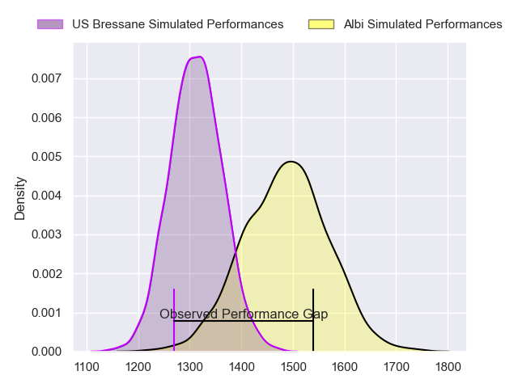
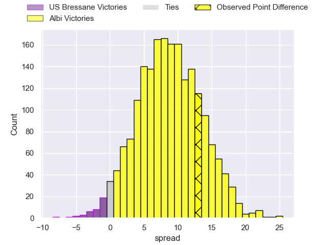
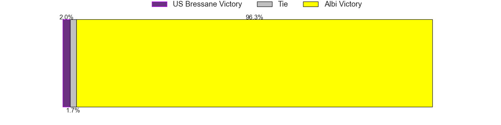

---  
layout: page  
title: US Bressane at Albi; 6-19  
date: 2023-05-06 19:30:00 18:00:00 -0500  
categories: match review  
---
# US Bressane at Albi; 6-19

# Club Level Predictions

The first set of predictions treats a club as the smallest object, as the club develops its members, organizes a gameplan, and deploys its players as needed for each match. This club model has a prediction of 0.729, which translates to predicting Albi to win by 8.7.

Each club has a rating and a rating deviation (simiar to a Glicko system), and expected performances can be generated. This allows for simulated matches and spreads like the ones below.
## Projected Performances

## Projected Spreads

## Projected Results

# Player Level Predictions

Treating teams instead as an entity made up of the currently active players, I have ratings for each player in an altogether different system. These can be combined to form team ratings once teamsheets are announced, weighting starters a bit higher than the reserves. After the match is played, players can be weighted by their minutes on the field, allowing for an accurate measure of the team's composition. With these compiled team ratings, we can make predictions, measure inaccuracy, and update the individual player ratings.
## Prediction with Player Minutes: Albi by 17.1

Albi by 13.1 on a neutral field

There were 9 large changes in win probability in this match
## Prediction without Player Minutes: Albi by 16.7

Albi by 12.7 on a neutral pitch

|   Away Minutes | Away Player                 |   Away elo |   Away Percentile |   Number |   Home Percentile |   Home elo | Home Player                 |   Home Minutes |
|---------------:|:----------------------------|-----------:|------------------:|---------:|------------------:|-----------:|:----------------------------|---------------:|
|             76 | Vazha Kapanadze             |      67.68 |                30 |        1 |                89 |     100.28 | Maxime Escur                |             40 |
|             53 | Louis Dasalmartini          |      62.58 |                26 |        2 |                68 |      86.89 | Reinach Venter              |             45 |
|             39 | Willem Johannes Harmse      |      89.98 |                79 |        3 |                35 |      72.02 | Dimitri Tchapnga            |             59 |
|             80 | Koen Bloemen                |      55.29 |                13 |        4 |                40 |      72.07 | Pierre Roussel              |             56 |
|             53 | Bence Roth                  |      68.35 |                36 |        5 |                33 |      68.63 | Jacques Jacobus Engelbrecht |             80 |
|             39 | Lucas Lyons                 |     118.22 |                96 |        6 |                47 |      75.21 | Vincent Calas               |             80 |
|             80 | Loic Baradel                |      63.36 |                24 |        7 |                81 |      93.28 | Lucas Guillaume             |             80 |
|             80 | Nicolas Tachat              |      65.83 |                41 |        8 |                69 |      86.78 | Sandrick Maciotta           |             59 |
|             63 | Robin Graulle               |      75.48 |                47 |        9 |                21 |      62.11 | Théo Vidal                  |             63 |
|             80 | Pierre Bérard               |      62.46 |                22 |       10 |                84 |      99.69 | Benjamin Pehau              |             80 |
|             80 | Thibaut Perrette            |      54.64 |                18 |       11 |                36 |      70.07 | Luca Sperandio              |             80 |
|             63 | Maile Mamao                 |      31.26 |                 1 |       12 |                28 |      66.49 | Simon Andreu                |             80 |
|             80 | Alexandre Badet             |      57.22 |                15 |       13 |                28 |      66.14 | James Haydn Tedder          |             56 |
|             80 | Élie De Fleurian            |      95.27 |                82 |       14 |                54 |      79.03 | Charly Vicenzo Trussardi    |             80 |
|             10 | Audric Sanlaville           |      69.76 |                36 |       15 |                51 |      78.93 | Enzo Marzocca               |             75 |
|              4 | Teo Bordenave               |      60.09 |                21 |       16 |                69 |      84.95 | Antoine Soave               |             40 |
|             27 | Clément Jullien             |      72.45 |                49 |       17 |                35 |      68.87 | Arthur Castant              |             35 |
|             41 | Zauri Tevdorashvili         |      63.09 |                17 |       18 |                55 |      78.56 | Jean-Baptiste De Clercq     |             21 |
|             27 | Marius Constantin Antonescu |      64.39 |                26 |       19 |                 5 |      46.99 | John Henry Heath Backhouse  |             24 |
|             41 | TJ Ioane                    |      85.87 |                67 |       20 |                37 |      71.57 | Camille Jarreau             |             21 |
|             17 | Nicolas Faure               |     123.19 |                99 |       21 |                66 |      86.04 | Titouan Pouzoullic          |             17 |
|             17 | Benjamin Doy                |      60.46 |                19 |       22 |                99 |     137.78 | Baptiste Couchinave         |             24 |
|             70 | Sebastian Poet              |      94.9  |                78 |       23 |                28 |      66.4  | Téo Dospital                |              5 |

