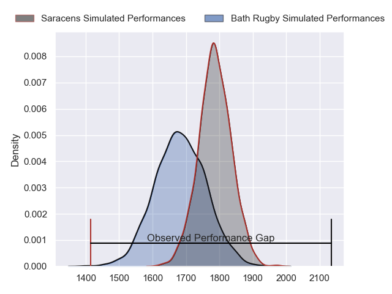
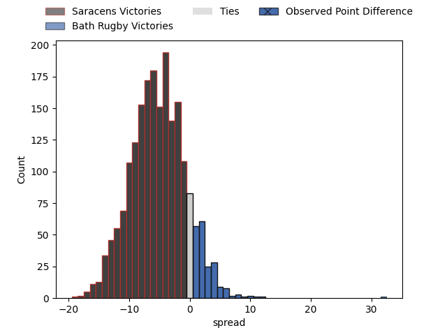

---  
layout: page  
title: Saracens at Bath Rugby; 29.0-61.0  
date: 2023-05-06 11:00:00 18:00:00 -0500  
categories: match review  
---
# Saracens at Bath Rugby; 29.0-61.0

# Club Level Predictions

The first set of predictions treats a club as the smallest object, as the club develops its members, organizes a gameplan, and deploys its players as needed for each match. This club model has a prediction of 0.358, which translates to predicting Saracens to win by 5.1.

Each club has a rating and a rating deviation (simiar to a Glicko system), and expected performances can be generated. This allows for simulated matches and spreads like the ones below.
## Projected Performances

## Projected Spreads

## Projected Results

# Player Level Predictions

Treating teams instead as an entity made up of the currently active players, I have ratings for each player in an altogether different system. These can be combined to form team ratings once teamsheets are announced, weighting starters a bit higher than the reserves. After the match is played, players can be weighted by their minutes on the field, allowing for an accurate measure of the team's composition. With these compiled team ratings, we can make predictions, measure inaccuracy, and update the individual player ratings.
## Prediction with Player Minutes: Bath Rugby by 30.6

Bath Rugby by 26.6 on a neutral field

There were 5 large changes in win probability in this match
## Prediction without Player Minutes: Bath Rugby by 31.1

Bath Rugby by 27.1 on a neutral pitch

|   Away Minutes | Away Player        |   Away elo |   Away Percentile |   Number |   Home Percentile |   Home elo | Home Player         |   Home Minutes |
|---------------:|:-------------------|-----------:|------------------:|---------:|------------------:|-----------:|:--------------------|---------------:|
|             50 | Eroni Mawi         |      42.4  |                 2 |        1 |                93 |     104.9  | Beno Obano          |             63 |
|             82 | Ethan Lewis        |      82.2  |               nan |        2 |                98 |     119.56 | Tom Dunn            |             63 |
|             60 | Christian Judge    |      82.41 |                61 |        3 |                30 |      68.1  | Will Stuart         |             63 |
|             69 | Alex Wardell       |      75.64 |               nan |        4 |                93 |     109.67 | Josh McNally        |             63 |
|             82 | Callum Hunter-Hill |      80.11 |                56 |        5 |                72 |      88.11 | GJ van Velze        |             82 |
|             74 | Nathan Michelow    |      81.08 |               nan |        6 |                78 |      92.07 | Ted Hill            |             82 |
|             82 | Toby Knight        |      79.72 |                55 |        7 |                97 |     121.89 | Chris Cloete        |             82 |
|             68 | Ollie Stonham      |      75.82 |               nan |        8 |                97 |     120.1  | Miles Reid          |             68 |
|             69 | Ruben de Haas      |      85.06 |                64 |        9 |                74 |      91.19 | Ben Spencer         |             76 |
|             82 | Manu Vunipola      |      85.35 |                63 |       10 |                34 |      70.1  | Orlando Bailey      |             74 |
|             61 | Ben Harris         |      71.06 |                33 |       11 |                93 |     107.62 | Ruaridh McConnochie |             59 |
|             82 | Olly Hartley       |      63.66 |                23 |       12 |                63 |      84.87 | Max Ojomoh          |             82 |
|             67 | Josh Hallett       |      82.67 |                55 |       13 |                56 |      80.76 | Ollie Lawrence      |             82 |
|             82 | Rotimi Segun       |     109.72 |                94 |       14 |                74 |      89.65 | Joe Cokanasiga      |             82 |
|             41 | Elliot Daly        |     105.42 |                87 |       15 |                98 |     135.17 | Matt Gallagher      |             82 |
|             14 | Samson Adejimi     |      77.15 |               nan |       16 |                56 |      80.38 | Niall Annett        |             19 |
|             39 | Robin Hislop       |      86.04 |                67 |       17 |                82 |      92.48 | Juan Schoeman       |             19 |
|             22 | Harvey Beaton      |      76.42 |               nan |       18 |                12 |      59.53 | D'Arcy Rae          |             19 |
|             13 | Kaden Pearce-Paul  |      76.89 |               nan |       19 |                98 |     128.11 | Dave Attwood        |             19 |
|              8 | Max Eke            |      76.65 |               nan |       20 |                44 |      74.71 | Josh Bayliss        |             14 |
|             13 | Charlie Bracken    |      75.47 |               nan |       21 |                31 |      68.5  | Max Green           |              6 |
|             29 | Dom Morris         |      76.01 |               nan |       22 |                95 |     117.15 | Piers Francis       |              8 |
|             41 | Tobias Elliott     |      76.21 |               nan |       23 |                90 |     106.44 | Jonathan Joseph     |             23 |

