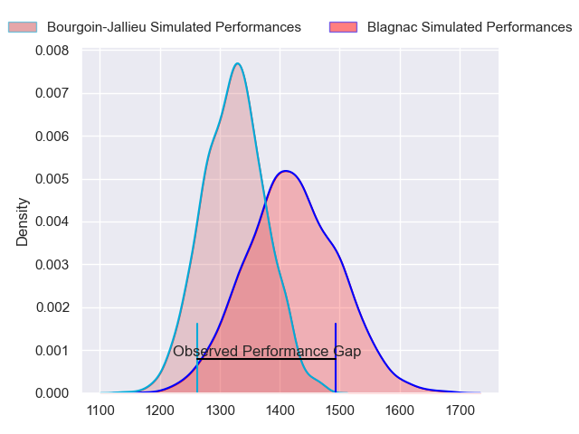
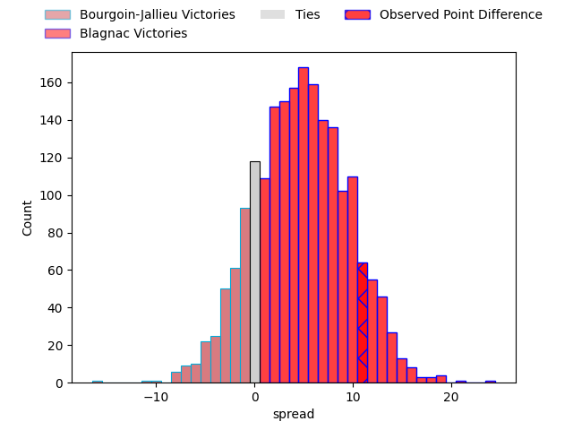
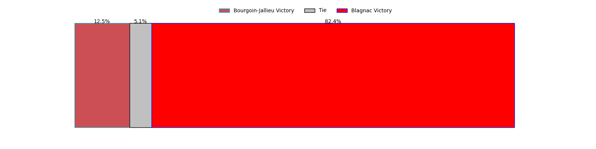

---  
layout: page  
title: Bourgoin-Jallieu at Blagnac; 16-27  
date: 2023-05-06 18:00:00 18:00:00 -0500  
categories: match review  
---
# Bourgoin-Jallieu at Blagnac; 16-27

# Club Level Predictions

The first set of predictions treats a club as the smallest object, as the club develops its members, organizes a gameplan, and deploys its players as needed for each match. This club model has a prediction of 0.635, which translates to predicting Blagnac to win by 4.9.

Each club has a rating and a rating deviation (simiar to a Glicko system), and expected performances can be generated. This allows for simulated matches and spreads like the ones below.
## Projected Performances

## Projected Spreads

## Projected Results

# Player Level Predictions

Treating teams instead as an entity made up of the currently active players, I have ratings for each player in an altogether different system. These can be combined to form team ratings once teamsheets are announced, weighting starters a bit higher than the reserves. After the match is played, players can be weighted by their minutes on the field, allowing for an accurate measure of the team's composition. With these compiled team ratings, we can make predictions, measure inaccuracy, and update the individual player ratings.
## Prediction with Player Minutes: Bourgoin-Jallieu by 3.5

Bourgoin-Jallieu by 7.5 on a neutral field

There were 11 large changes in win probability in this match
## Prediction without Player Minutes: Bourgoin-Jallieu by 3.9

Bourgoin-Jallieu by 7.9 on a neutral pitch

|   Away Minutes | Away Player           |   Away elo |   Away Percentile |   Number |   Home Percentile |   Home elo | Home Player          |   Home Minutes |
|---------------:|:----------------------|-----------:|------------------:|---------:|------------------:|-----------:|:---------------------|---------------:|
|             46 | Nugzar Somkhishvili   |      93.35 |                83 |        1 |                60 |      80.89 | Jean-Baptiste Martin |             50 |
|             56 | Maxime Castant        |      75.3  |                49 |        2 |                54 |      77.91 | Gabin Villerouge     |             50 |
|             65 | Oktay Yilmaz          |      95.98 |                81 |        3 |                44 |      71.95 | Fabien Lorenzon      |             50 |
|             40 | Robin Gascou          |      93.29 |                80 |        4 |                76 |      90.37 | Vincent Mutel        |             80 |
|             80 | Jonathan Kpoku        |      77.24 |                52 |        5 |                34 |      71.47 | Lilian Rousset       |             61 |
|             52 | Kevin Rivoire         |      85.06 |                67 |        6 |                75 |      89.94 | Nikita Bekov         |             80 |
|             80 | Bynjamin Rabatel      |      91.38 |                79 |        7 |                49 |      76.78 | Benjamin Collet      |             45 |
|             56 | Lakisipone Lee        |      62.58 |                25 |        8 |                80 |      94.52 | Mathieu Vachon       |             80 |
|             80 | Tomas Munilla         |      76.69 |                49 |        9 |                38 |      71.73 | Paul Ravier          |             78 |
|             48 | Nicolas Vuillemin     |      73.1  |                41 |       10 |                66 |      85.07 | Ugo Seunes           |             80 |
|             80 | Quentin Lefort        |      80.37 |                58 |       11 |                65 |      83.81 | Thibault Moleana     |             74 |
|             48 | Isaiah Leota          |      79.69 |                54 |       12 |                34 |      69.9  | Aurelien Labau       |             80 |
|             80 | Pablo Patilla         |      54.93 |                11 |       13 |                 3 |      44.09 | Clément Vareilles    |             80 |
|             80 | Remi Bouet            |      96.11 |                83 |       14 |                18 |      58.97 | Lukas Doyhenard      |             80 |
|             80 | Nicolas Cachet        |      74.79 |                42 |       15 |                43 |      75.67 | Antoine Renaud       |             79 |
|             34 | Romain Favaretto      |      54.29 |                 9 |       16 |                70 |      85.88 | Cesar Biscioni       |             30 |
|             24 | Killian Tripier       |      90.54 |                79 |       17 |                35 |      70.17 | Florian Bertrand     |             30 |
|             15 | Maxime Caillet        |      65.55 |                30 |       18 |                39 |      72.28 | Marco Trauth         |             30 |
|             40 | Kemueli Lavetanakoroi |     115.52 |                95 |       19 |                12 |      56.51 | Lucas Tolofua        |             19 |
|             28 | Kevin Chaudouard      |     113.95 |                94 |       20 |                60 |      81.91 | Ianis Ponsole        |             35 |
|             24 | Poutasi Luafutu       |      72.32 |                37 |       21 |                20 |      64.28 | Corentin Penc'hoat   |              2 |
|             32 | Christopher Bosch     |      73.75 |                45 |       22 |                25 |      63.47 | Francois Tardieu     |              6 |
|             32 | Benjamin Noble        |      73.78 |                43 |       23 |                52 |      78.72 | Gérald Augustin      |              1 |

