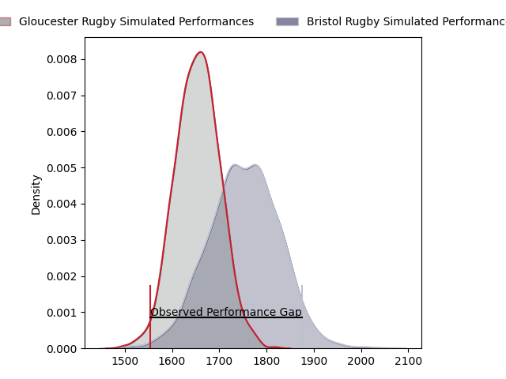
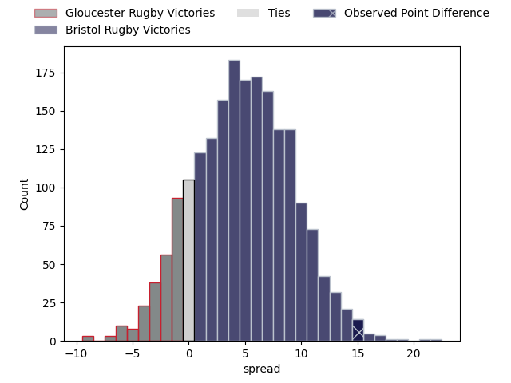

---  
layout: page  
title: Gloucester Rugby at Bristol Rugby; 21.0-36.0  
date: 2023-05-06 11:00:00 18:00:00 -0500  
categories: match review  
---
# Gloucester Rugby at Bristol Rugby; 21.0-36.0

# Club Level Predictions

The first set of predictions treats a club as the smallest object, as the club develops its members, organizes a gameplan, and deploys its players as needed for each match. This club model has a prediction of 0.637, which translates to predicting Bristol Rugby to win by 4.9.

Each club has a rating and a rating deviation (simiar to a Glicko system), and expected performances can be generated. This allows for simulated matches and spreads like the ones below.
## Projected Performances

## Projected Spreads

## Projected Results

# Player Level Predictions

Treating teams instead as an entity made up of the currently active players, I have ratings for each player in an altogether different system. These can be combined to form team ratings once teamsheets are announced, weighting starters a bit higher than the reserves. After the match is played, players can be weighted by their minutes on the field, allowing for an accurate measure of the team's composition. With these compiled team ratings, we can make predictions, measure inaccuracy, and update the individual player ratings.
## Prediction with Player Minutes: Bristol Rugby by 16.7

Bristol Rugby by 12.7 on a neutral field

There were 5 large changes in win probability in this match
## Prediction without Player Minutes: Bristol Rugby by 15.0

Bristol Rugby by 11.0 on a neutral pitch

|   Away Minutes | Away Player         |   Away elo |   Away Percentile |   Number |   Home Percentile |   Home elo | Home Player     |   Home Minutes |
|---------------:|:--------------------|-----------:|------------------:|---------:|------------------:|-----------:|:----------------|---------------:|
|             41 | Mayco Vivas         |      55.14 |                10 |        1 |                71 |      86.26 | Yann Thomas     |             60 |
|             61 | George McGuigan     |      90.42 |                78 |        2 |                48 |      75.15 | Harry Thacker   |             82 |
|             61 | Kirill Gotovtsev    |      99.88 |                90 |        3 |                91 |     100.6  | Kyle Sinckler   |             54 |
|             84 | Freddie Clarke      |      68.7  |                33 |        4 |                93 |     110.21 | Joe Batley      |             84 |
|             61 | Matias Alemanno     |     105.89 |                91 |        5 |                57 |      80.33 | Chris Vui       |             84 |
|             84 | Jack Clement        |      90.05 |                74 |        6 |                97 |     121.11 | Steven Luatua   |             72 |
|             84 | Lewis Ludlow        |      85.2  |                67 |        7 |                87 |     100.74 | Sam Jeffries    |             84 |
|             56 | Ben Morgan          |      99.06 |                86 |        8 |                76 |      91.41 | Fitz Harding    |             34 |
|             84 | Stephen Varney      |      60.01 |                18 |        9 |                85 |     100.19 | Harry Randall   |             64 |
|             84 | Adam Hastings       |     102.35 |                87 |       10 |                97 |     124.12 | AJ MacGinty     |             84 |
|             84 | Ollie Thorley       |      96.85 |                82 |       11 |                78 |      86.67 | Ioan Lloyd      |             69 |
|             84 | Sebastien Atkinson  |      48.7  |                 6 |       12 |                46 |      75.42 | James Williams  |             62 |
|             78 | Chris Harris        |      97.94 |                81 |       13 |                94 |     113.45 | Semi Radradra   |             84 |
|             84 | Jonny May           |     100.92 |                87 |       14 |                78 |      92.81 | Ratu Naulago    |             84 |
|             61 | Santiago Carreras   |     123.81 |                96 |       15 |                81 |     100.56 | Charles Piutau  |             84 |
|             23 | Sebastian Blake     |      67.9  |                32 |       16 |                55 |      78.1  | Will Capon      |              2 |
|             43 | Val Rapava-Ruskin   |      80.29 |                58 |       17 |                73 |      93.25 | Jake Woolmore   |             24 |
|             23 | Jamal Ford-Robinson |      67.65 |                28 |       18 |                87 |      96.7  | Max Lahiff      |             30 |
|             23 | Cameron Jordan      |     102.79 |                90 |       19 |                35 |      71.75 | Magnus Bradbury |             50 |
|             28 | Freddie Thomas      |      84.5  |               nan |       20 |                65 |      85.63 | Jake Heenan     |             12 |
|              0 | Ben Meehan          |      90.08 |                72 |       21 |                31 |      71.13 | Andy Uren       |             20 |
|             23 | Billy Twelvetrees   |     128.66 |                98 |       22 |                92 |     111.88 | Sam Bedlow      |             22 |
|              6 | Alex Hearle         |     108.03 |                93 |       23 |               nan |      89.28 | Piers O'Conor   |             15 |

