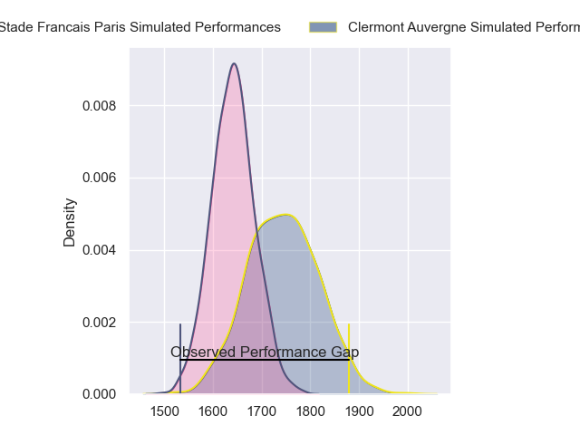
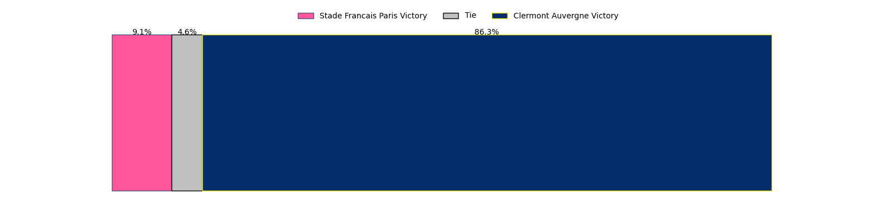

---  
layout: page  
title: Stade Francais Paris at Clermont Auvergne; 16-32  
date: 2023-05-06 15:00:00 18:00:00 -0500  
categories: match review  
---
# Stade Francais Paris at Clermont Auvergne; 16-32

# Club Level Predictions

The first set of predictions treats a club as the smallest object, as the club develops its members, organizes a gameplan, and deploys its players as needed for each match. This club model has a prediction of 0.64, which translates to predicting Clermont Auvergne to win by 5.1.

Each club has a rating and a rating deviation (simiar to a Glicko system), and expected performances can be generated. This allows for simulated matches and spreads like the ones below.
## Projected Performances

## Projected Spreads

## Projected Results

# Player Level Predictions

Treating teams instead as an entity made up of the currently active players, I have ratings for each player in an altogether different system. These can be combined to form team ratings once teamsheets are announced, weighting starters a bit higher than the reserves. After the match is played, players can be weighted by their minutes on the field, allowing for an accurate measure of the team's composition. With these compiled team ratings, we can make predictions, measure inaccuracy, and update the individual player ratings.
## Prediction with Player Minutes: Clermont Auvergne by 32.2

Clermont Auvergne by 28.2 on a neutral field

There were 6 large changes in win probability in this match
## Prediction without Player Minutes: Clermont Auvergne by 30.5

Clermont Auvergne by 26.5 on a neutral pitch

|   Away Minutes | Away Player             |   Away elo |   Away Percentile |   Number |   Home Percentile |   Home elo | Home Player        |   Home Minutes |
|---------------:|:------------------------|-----------:|------------------:|---------:|------------------:|-----------:|:-------------------|---------------:|
|             55 | Moses Eneliko Alo-Emile |      73.27 |                43 |        1 |                55 |      78.83 | Etienne Falgoux    |             61 |
|             47 | Lucas Peyresblanques    |      73.58 |               nan |        2 |                77 |      88.93 | Étienne Fourcade   |             80 |
|             55 | Giorgi Melikidze        |      65.2  |                37 |        3 |                39 |      76.4  | Rabah Slimani      |             54 |
|             80 | Paul Gabrillagues       |      76.5  |                50 |        4 |                73 |      88.33 | Thibault Lanen     |             80 |
|             47 | Pierre-Henri Azagoh     |      49    |                 6 |        5 |                37 |      72.92 | Peceli Yato        |             61 |
|             80 | Mathieu Hirigoyen       |      61.74 |                15 |        6 |                48 |      76.5  | Arthur Iturria     |             80 |
|             80 | Sekou Macalou           |      71.68 |                35 |        7 |                59 |      80.86 | Jacobus van Tonder |             47 |
|             49 | Giovanni Habel Kuffner  |      43.12 |                 4 |        8 |                86 |      99.18 | Fritz Lee          |             80 |
|             61 | Arthur Coville          |      63.73 |                22 |        9 |                75 |      91.36 | Baptiste Jauneau   |             55 |
|             80 | Joris Segonds           |      52.54 |                10 |       10 |               nan |      72.4  | Jules Plisson      |             55 |
|             66 | Nadir Megdoud           |      62.73 |               nan |       11 |                55 |      78.42 | Alivereti Raka     |             80 |
|             54 | Alex Arrate             |      64.82 |               nan |       12 |                75 |      92.66 | George Moala       |             74 |
|             80 | Jeremy Charles Ward     |      70.93 |                36 |       13 |                54 |      80.12 | Irae Simone        |             80 |
|             80 | Peniasi Dakuwaqa        |      73.48 |                44 |       14 |                83 |      97.4  | Damian Penaud      |             80 |
|             80 | Léo Barré               |      66.8  |                25 |       15 |                74 |      89.45 | Alex Newsome       |             80 |
|             25 | Vincent Philip Koch     |      54.96 |                 8 |       16 |                61 |      83.71 | Sebastien Bézy     |             25 |
|             25 | Sergo Abramishvili      |      80.83 |                49 |       17 |                80 |      96.18 | Anthony Belleau    |             25 |
|             14 | Paolo Odogwu            |      49.87 |                 5 |       18 |               nan |      76.29 | Davit Kubriashvili |             26 |
|             26 | Julien Delbouis         |      94.98 |                78 |       19 |                75 |      91.91 | Lucas Dessaigne    |             33 |
|             31 | Ryan Chapuis            |      57.93 |                15 |       20 |                46 |      75.01 | Judicael Cancoriet |             19 |
|             33 | Mickaël Ivaldi          |      83.63 |                67 |       21 |                60 |      80.88 | Giorgi Beria       |             19 |
|             33 | Baptiste Pesenti        |      64.77 |                27 |       22 |                42 |      75.03 | Julien Heriteau    |              6 |
|             19 | James Hall              |      59.35 |               nan |       23 |               nan |     nan    | nan                |            nan |

