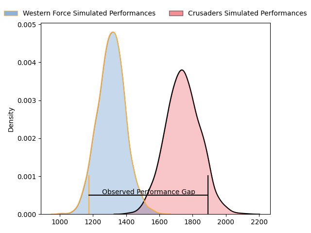
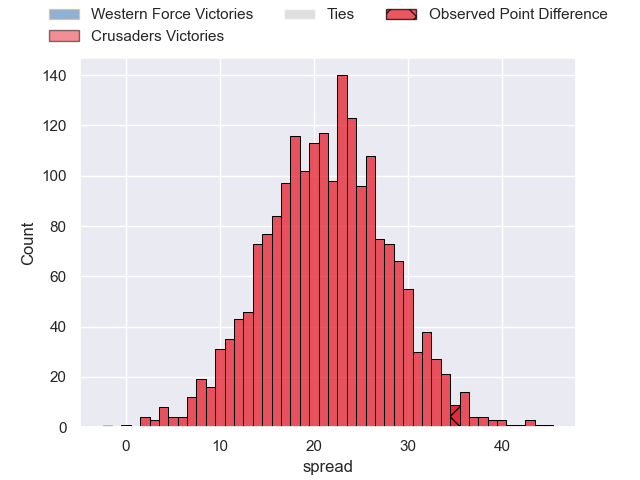

---  
layout: page  
title: Western Force at Crusaders; 13.0-48.0  
date: 2023-05-06 00:35:00 18:00:00 -0500  
categories: match review  
---
# Western Force at Crusaders; 13.0-48.0

# Club Level Predictions

The first set of predictions treats a club as the smallest object, as the club develops its members, organizes a gameplan, and deploys its players as needed for each match. This club model has a prediction of 0.915, which translates to predicting Crusaders to win by 21.4.

Each club has a rating and a rating deviation (simiar to a Glicko system), and expected performances can be generated. This allows for simulated matches and spreads like the ones below.
## Projected Performances

## Projected Spreads

## Projected Results

# Player Level Predictions

Treating teams instead as an entity made up of the currently active players, I have ratings for each player in an altogether different system. These can be combined to form team ratings once teamsheets are announced, weighting starters a bit higher than the reserves. After the match is played, players can be weighted by their minutes on the field, allowing for an accurate measure of the team's composition. With these compiled team ratings, we can make predictions, measure inaccuracy, and update the individual player ratings.
## Prediction with Player Minutes: Crusaders by 23.4

Crusaders by 19.4 on a neutral field

There were 4 large changes in win probability in this match
## Prediction without Player Minutes: Crusaders by 23.1

Crusaders by 19.1 on a neutral pitch

|   Away Minutes | Away Player           |   Away elo |   Away Percentile |   Number |   Home Percentile |   Home elo | Home Player            |   Home Minutes |
|---------------:|:----------------------|-----------:|------------------:|---------:|------------------:|-----------:|:-----------------------|---------------:|
|             28 | Charlie Hancock       |      78.6  |                55 |        1 |                68 |      84.55 | Joe Moody              |             52 |
|             54 | Tom Horton            |     100.01 |                89 |        2 |                89 |     101.26 | Brodie McAlister       |             52 |
|             44 | Santiago Medrano      |      88.56 |                75 |        3 |                78 |      89.55 | Tamaiti Williams       |             44 |
|             64 | Felix Kalapu          |      33.86 |                 1 |        4 |                96 |     117.74 | Scott Barrett          |             62 |
|             80 | Jeremy Williams       |      73.24 |                43 |        5 |                46 |      75    | Quinten Strange        |             80 |
|             80 | Michael Wells         |      86.06 |                68 |        6 |                67 |      84.96 | Dom Gardiner           |             54 |
|             80 | Carlo Tizzano         |      86.4  |                71 |        7 |                82 |      94.48 | Tom Christie           |             80 |
|             52 | Isi Naisarani         |      78.26 |               nan |        8 |                94 |     108.68 | Cullen Grace           |             80 |
|             69 | Issak Fines-Leleiwasa |      90.62 |                74 |        9 |                85 |     100.06 | Noah Hotham            |             62 |
|             69 | Max Burey             |      78.44 |               nan |       10 |                98 |     133.21 | Richie Mo'unga         |             80 |
|             58 | Manasa Mataele        |     104.52 |                90 |       11 |                52 |      77.07 | Leicester Fainga'anuku |             80 |
|             80 | Hamish Stewart        |     121.93 |                97 |       12 |                93 |     110.58 | David Havili           |             63 |
|             80 | Sam Spink             |      92.92 |                75 |       13 |                87 |     103.82 | Braydon Ennor          |             80 |
|             80 | Zach Kibirige         |      69.02 |                35 |       14 |                73 |      88.78 | Macca Springer         |             80 |
|             80 | Chase Tiatia          |      88.58 |                68 |       15 |               nan |      90.55 | Will Jordan            |             57 |
|             26 | Feleti Kaitu'u        |      70.69 |                36 |       16 |                86 |      97.71 | Codie Taylor           |             28 |
|             52 | Marley Pearce         |      81.56 |               nan |       17 |               nan |      95.52 | Andrew Turner          |             28 |
|             36 | Bo Abra               |      74.45 |               nan |       18 |                93 |     103.43 | Oli Jager              |             36 |
|             16 | Ryan McCauley         |      90.52 |                69 |       19 |                67 |      84.61 | Zach Gallagher         |             18 |
|             28 | Jackson Pugh          |      76.94 |                55 |       20 |                50 |      77.44 | Christian Lio-Willie   |             26 |
|             11 | Ian Prior             |      93.14 |                79 |       21 |                62 |      83.7  | Mitchell Drummond      |             18 |
|             11 | Nikolai Foliaki       |      46    |                 5 |       22 |                53 |      80.15 | Fergus Burke           |             17 |
|             22 | George Poolman        |      86.24 |               nan |       23 |                86 |     104.74 | Chay Fihaki            |             23 |

