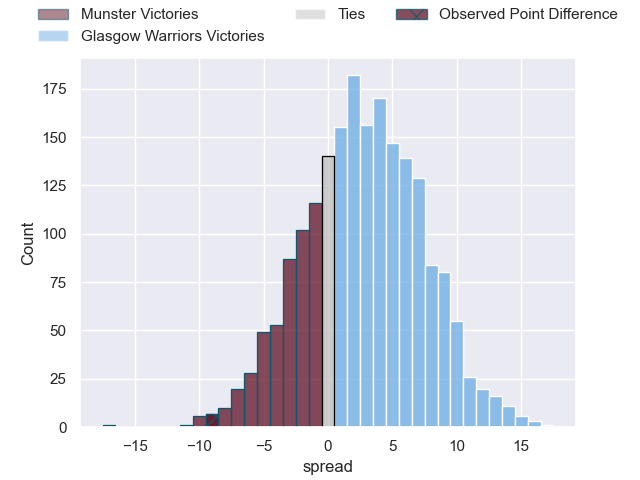
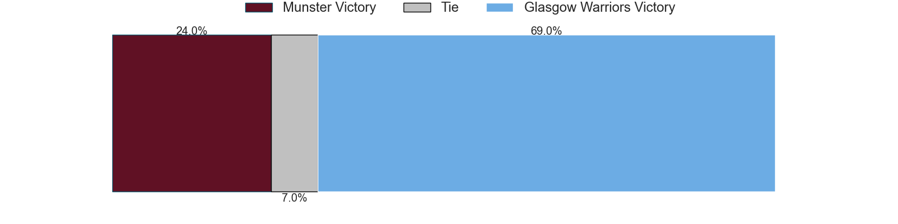

---  
layout: page  
title: Munster at Glasgow Warriors; 14-5  
date: 2023-05-06 20:30:00 18:00:00 -0500  
categories: match review  
---
# Munster at Glasgow Warriors; 14-5

# Club Level Predictions

The first set of predictions treats a club as the smallest object, as the club develops its members, organizes a gameplan, and deploys its players as needed for each match. This club model has a prediction of 0.573, which translates to predicting Glasgow Warriors to win by 2.6.

Each club has a rating and a rating deviation (simiar to a Glicko system), and expected performances can be generated. This allows for simulated matches and spreads like the ones below.
## Projected Performances

## Projected Spreads

## Projected Results

# Player Level Predictions

Treating teams instead as an entity made up of the currently active players, I have ratings for each player in an altogether different system. These can be combined to form team ratings once teamsheets are announced, weighting starters a bit higher than the reserves. After the match is played, players can be weighted by their minutes on the field, allowing for an accurate measure of the team's composition. With these compiled team ratings, we can make predictions, measure inaccuracy, and update the individual player ratings.
## Prediction with Player Minutes: Glasgow Warriors by 5.5

Glasgow Warriors by 1.5 on a neutral field

There were 8 large changes in win probability in this match
## Prediction without Player Minutes: Glasgow Warriors by 2.1

Munster by 1.9 on a neutral pitch

|   Away Minutes | Away Player              |   Away elo |   Away Percentile |   Number |   Home Percentile |   Home elo | Home Player           |   Home Minutes |
|---------------:|:-------------------------|-----------:|------------------:|---------:|------------------:|-----------:|:----------------------|---------------:|
|             59 | Jeremy Loughman          |      84.5  |                67 |        1 |                34 |      69.87 | Jamie Bhatti          |             54 |
|             41 | Diarmuid Barron          |      82.91 |                64 |        2 |                53 |      78.59 | Johnny Matthews       |             80 |
|             62 | Stephen Archer           |      96.84 |                87 |        3 |                95 |     107.48 | Zander Fagerson       |             62 |
|             71 | Jean Kleyn               |      83.44 |                64 |        4 |                61 |      82.01 | Scott Cummings        |             66 |
|             16 | Rudolph Gerhardus Snyman |      83.11 |                63 |        5 |                91 |     106.95 | Richie Gray           |             54 |
|             80 | Tadhg Beirne             |      79.89 |               nan |        6 |                85 |      98.89 | Matt Fagerson         |             80 |
|              4 | Peter O'Mahony           |      62.91 |                22 |        7 |                68 |      85.13 | Rory Darge            |             54 |
|             80 | Gavin Coombes            |      80.76 |                56 |        8 |                15 |      58.7  | Jack Dempsey          |             80 |
|             25 | Conor Murray             |     130.76 |                99 |        9 |                57 |      80.65 | George Horne          |             66 |
|             80 | Jack Crowley             |      75.02 |                46 |       10 |                71 |      89.95 | Tom Jordan            |             80 |
|             80 | Shane Daly               |      67.64 |                32 |       11 |                89 |     102.74 | Kyle Steyn            |             80 |
|             54 | Malakai Fekitoa          |      80.28 |                55 |       12 |                60 |      83.48 | Stafford McDowall     |             80 |
|             80 | Antoine Frisch           |      86.36 |                66 |       13 |                11 |      54.79 | Sione Tuipulotu       |             80 |
|             80 | Calvin Nash              |      74.34 |                46 |       14 |                65 |      83.35 | Sebastian Cancelliere |             80 |
|             80 | Michael Haley            |      77.64 |                46 |       15 |                63 |      85.16 | Ollie Smith           |             54 |
|             76 | John Hodnett             |      69.31 |                34 |       16 |                46 |      72.85 | Jean-Pierre du Preez  |             26 |
|             64 | Fineen Wycherley         |      77.19 |                51 |       17 |                22 |      63.35 | Huw Jones             |             26 |
|             55 | Craig Casey              |      96.18 |                81 |       18 |                58 |      82.01 | Nathan McBeth         |             26 |
|             39 | Niall Scannell           |      85.85 |                71 |       19 |                59 |      81.28 | Sione Vailanu         |             26 |
|             26 | Ben Healy                |      89.98 |               nan |       20 |                56 |      79.01 | Simon Berghan         |             18 |
|             21 | Josh Wycherley           |      81.91 |                72 |       21 |                43 |      73.79 | Lewis Bean            |             14 |
|             18 | Roman Salanoa            |      95.85 |                86 |       22 |                37 |      71.61 | Ali Price             |             14 |
|              9 | Alex Kendellen           |      87.27 |                71 |       23 |               nan |     nan    | nan                   |            nan |

