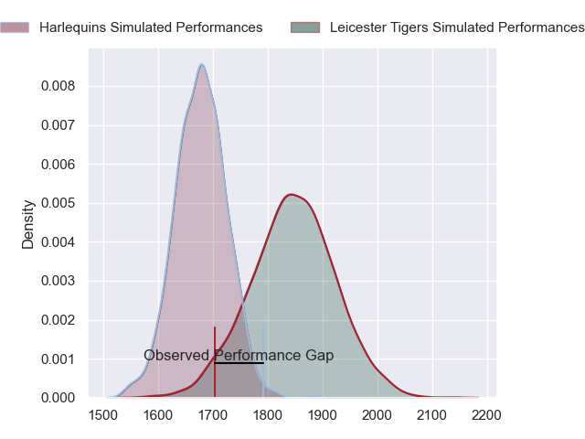
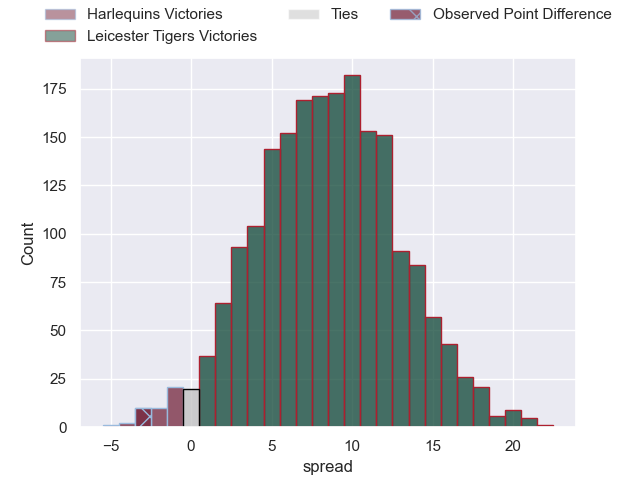
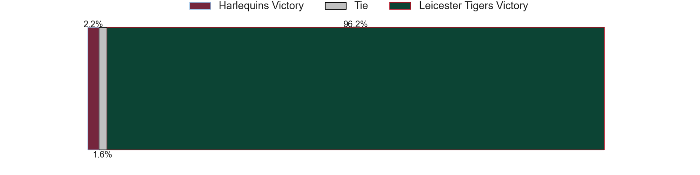

---  
layout: page  
title: Harlequins at Leicester Tigers; 20.0-17.0  
date: 2023-05-06 11:00:00 18:00:00 -0500  
categories: match review  
---
# Harlequins at Leicester Tigers; 20.0-17.0

# Club Level Predictions

The first set of predictions treats a club as the smallest object, as the club develops its members, organizes a gameplan, and deploys its players as needed for each match. This club model has a prediction of 0.723, which translates to predicting Leicester Tigers to win by 8.4.

Each club has a rating and a rating deviation (simiar to a Glicko system), and expected performances can be generated. This allows for simulated matches and spreads like the ones below.
## Projected Performances

## Projected Spreads

## Projected Results

# Player Level Predictions

Treating teams instead as an entity made up of the currently active players, I have ratings for each player in an altogether different system. These can be combined to form team ratings once teamsheets are announced, weighting starters a bit higher than the reserves. After the match is played, players can be weighted by their minutes on the field, allowing for an accurate measure of the team's composition. With these compiled team ratings, we can make predictions, measure inaccuracy, and update the individual player ratings.
## Prediction with Player Minutes: Leicester Tigers by 13.3

Leicester Tigers by 9.3 on a neutral field

There were 11 large changes in win probability in this match
## Prediction without Player Minutes: Leicester Tigers by 15.5

Leicester Tigers by 11.5 on a neutral pitch

|   Away Minutes | Away Player       |   Away elo |   Away Percentile |   Number |   Home Percentile |   Home elo | Home Player         |   Home Minutes |
|---------------:|:------------------|-----------:|------------------:|---------:|------------------:|-----------:|:--------------------|---------------:|
|             83 | Joe Marler        |      79.51 |                57 |        1 |                95 |     106.12 | Tom West            |             48 |
|             72 | Sam Riley         |      62.99 |                33 |        2 |                93 |     104.75 | Julian Montoya      |             48 |
|             83 | Will Collier      |     103.72 |                93 |        3 |                52 |      77.1  | Dan Cole            |             48 |
|             72 | Dino Lamb         |      96.58 |                84 |        4 |                98 |     130.19 | Harry Wells         |             83 |
|             83 | Irne Herbst       |     113.21 |                95 |        5 |                93 |     109.93 | Cameron Henderson   |             70 |
|             78 | Jack Kenningham   |      92.26 |                79 |        6 |                90 |     104.23 | Hanro Liebenberg    |             83 |
|             83 | Will Evans        |      88.08 |                74 |        7 |                97 |     120.11 | Tommy Reffell       |             83 |
|             83 | Alex Dombrandt    |     129.67 |                99 |        8 |                89 |     102.48 | Jasper Wiese        |             48 |
|             63 | Danny Care        |     121.89 |                97 |        9 |                74 |      91.84 | Ben Youngs          |             51 |
|             83 | Marcus Smith      |     100.45 |                85 |       10 |                97 |     121.02 | Handre Pollard      |             65 |
|             83 | Josh Bassett      |      75.39 |                44 |       11 |                59 |      82.62 | Harry Potter        |             83 |
|             83 | Andre Esterhuizen |     116.51 |                96 |       12 |                83 |      99.36 | Dan Kelly           |             83 |
|             83 | Joe Marchant      |      90.36 |                72 |       13 |                86 |     102.59 | Guy Porter          |             70 |
|             83 | Cadan Murley      |      83.05 |                64 |       14 |                89 |     102.86 | Chris Ashton        |             83 |
|             13 | Nick David        |      73.86 |                45 |       15 |                61 |      84.22 | Mike Brown          |             83 |
|             11 | Jack Musk         |      82.77 |                65 |       16 |                24 |      65.52 | Charlie Clare       |             35 |
|              0 | Fin Baxter        |      92.02 |                83 |       17 |               nan |     113.03 | Francois van Wyk    |             35 |
|              0 | Will Hobson       |      86.25 |               nan |       18 |                73 |      87.6  | Joe Heyes           |             35 |
|             11 | George Hammond    |      41.87 |                 2 |       19 |               nan |      93.9  | Finn Carnduff       |             13 |
|              5 | Will Trenholm     |      86.45 |               nan |       20 |                85 |      99.34 | Olly Cracknell      |             35 |
|             20 | Lewis Gjaltema    |      87    |                68 |       21 |                87 |     102.58 | Jack van Poortvliet |             32 |
|              0 | Luke Northmore    |      91.09 |                77 |       22 |                70 |      89.64 | Jimmy Gopperth      |             18 |
|             70 | Louis Lynagh      |      88.74 |                73 |       23 |                50 |      77.36 | Matt Scott          |             13 |

