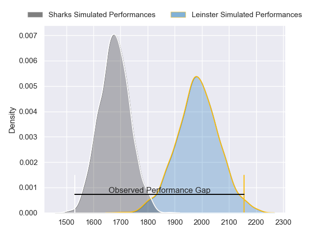
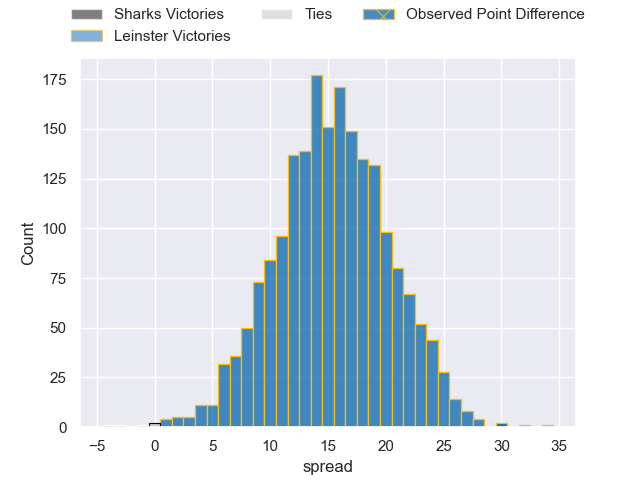

---  
layout: page  
title: Sharks at Leinster; 5-35  
date: 2023-05-06 18:00:00 18:00:00 -0500  
categories: match review  
---
# Sharks at Leinster; 5-35

# Club Level Predictions

The first set of predictions treats a club as the smallest object, as the club develops its members, organizes a gameplan, and deploys its players as needed for each match. This club model has a prediction of 0.851, which translates to predicting Leinster to win by 15.3.

Each club has a rating and a rating deviation (simiar to a Glicko system), and expected performances can be generated. This allows for simulated matches and spreads like the ones below.
## Projected Performances

## Projected Spreads

## Projected Results

# Player Level Predictions

Treating teams instead as an entity made up of the currently active players, I have ratings for each player in an altogether different system. These can be combined to form team ratings once teamsheets are announced, weighting starters a bit higher than the reserves. After the match is played, players can be weighted by their minutes on the field, allowing for an accurate measure of the team's composition. With these compiled team ratings, we can make predictions, measure inaccuracy, and update the individual player ratings.
## Prediction with Player Minutes: Leinster by 18.0

Leinster by 14.0 on a neutral field

There were 2 large changes in win probability in this match
## Prediction without Player Minutes: Leinster by 17.4

Leinster by 13.4 on a neutral pitch

|   Away Minutes | Away Player                |   Away elo |   Away Percentile |   Number |   Home Percentile |   Home elo | Home Player          |   Home Minutes |
|---------------:|:---------------------------|-----------:|------------------:|---------:|------------------:|-----------:|:---------------------|---------------:|
|             59 | Retshegofaditswe Nche      |      79.17 |                55 |        1 |                71 |      83.48 | Michael Milne        |             57 |
|             59 | Mbongeni Mbonambi          |      76.49 |                51 |        2 |                92 |     103.58 | Dan Sheehan          |             58 |
|             25 | Thomas Joubert du Toit     |      77.25 |                51 |        3 |                90 |      99.92 | Tadhg Furlong        |             40 |
|             80 | Corne Rahl                 |      91.46 |                78 |        4 |                81 |      95.16 | Ryan Baird           |             80 |
|             68 | Douw Gerbrandt Grobler     |      76.39 |                50 |        5 |                59 |      81.7  | Jason Howell Jenkins |             80 |
|             80 | James Venter               |      85.03 |                67 |        6 |                53 |      79.42 | Max Deegan           |             80 |
|             80 | Vincent Tshikaya Tshituka  |      77.69 |                52 |        7 |                50 |      75.27 | Scott Penny          |             36 |
|             57 | Sikhumbuzo Notshe          |      78.62 |                50 |        8 |                94 |     108.61 | Caelan Doris         |             67 |
|             80 | Grant Williams             |      74.76 |                45 |        9 |                56 |      79.71 | Luke McGrath         |             67 |
|             57 | Boeta Chamberlain          |      70.08 |                34 |       10 |                50 |      78.13 | Harry Byrne          |             80 |
|             80 | Makazole Mapimpi           |      79.26 |                56 |       11 |                47 |      74.38 | Dave Kearney         |             80 |
|             56 | Ben Tapuai                 |      83.53 |                60 |       12 |                70 |      89.15 | Charlie Ngatai       |             57 |
|             80 | Lukhanyo Am                |      79.6  |                54 |       13 |                42 |      76.53 | Ciaran Frawley       |             80 |
|             72 | Marnus Potgieter           |      95.22 |                82 |       14 |                40 |      71.81 | Jordan Larmour       |             54 |
|             80 | Aphelele Onke Okuhle Fassi |      74.43 |                52 |       15 |                96 |     124.75 | Hugo Keenan          |             80 |
|             55 | Carlu Johann Sadie         |      84.62 |                62 |       16 |                99 |     130.39 | Jack Conan           |             44 |
|             24 | Rohan Janse van Rensburg   |      77.34 |                51 |       17 |               nan |      90.5  | Cian Healy           |             40 |
|             23 | Phendulani Buthelezi       |      77.73 |                51 |       18 |                55 |      80.25 | Liam Turner          |             26 |
|             23 | Nevaldo Fleurs             |      92.01 |                72 |       19 |                72 |      91.11 | Ross Byrne           |             23 |
|             21 | Ntuthuko Mchunu            |      72.09 |                37 |       20 |                68 |      84.85 | Andrew Porter        |             23 |
|             21 | Fezokuhle Mbatha           |      84.48 |                68 |       21 |                73 |      87.43 | John McKee           |             22 |
|             12 | Jeandre Labuschagne        |      59.29 |                16 |       22 |                75 |      91.47 | Jamison Gibson-Park  |             13 |
|              8 | Cameron Robin Wright       |      74.17 |                43 |       23 |               nan |      81.57 | Joe McCarthy         |             13 |

