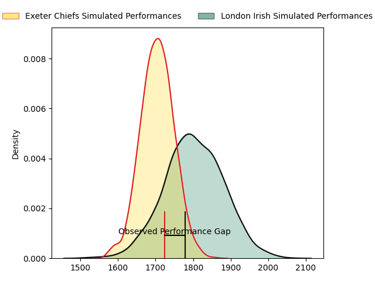
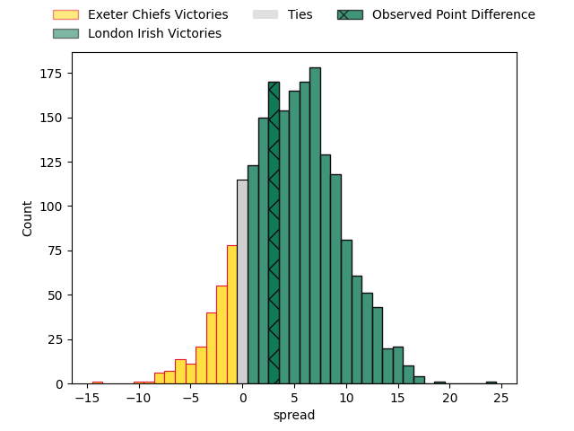
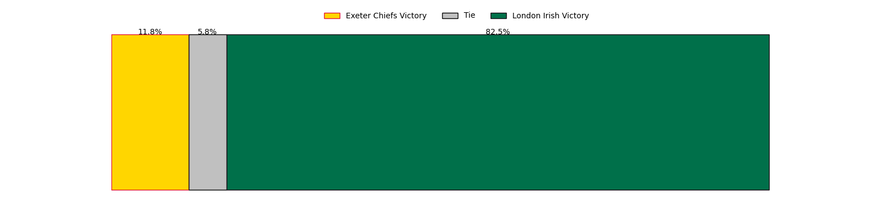

---  
layout: page  
title: Exeter Chiefs at London Irish; 14.0-17.0  
date: 2023-05-06 11:00:00 18:00:00 -0500  
categories: match review  
---
# Exeter Chiefs at London Irish; 14.0-17.0

# Club Level Predictions

The first set of predictions treats a club as the smallest object, as the club develops its members, organizes a gameplan, and deploys its players as needed for each match. This club model has a prediction of 0.637, which translates to predicting London Irish to win by 4.9.

Each club has a rating and a rating deviation (simiar to a Glicko system), and expected performances can be generated. This allows for simulated matches and spreads like the ones below.
## Projected Performances

## Projected Spreads

## Projected Results

# Player Level Predictions

Treating teams instead as an entity made up of the currently active players, I have ratings for each player in an altogether different system. These can be combined to form team ratings once teamsheets are announced, weighting starters a bit higher than the reserves. After the match is played, players can be weighted by their minutes on the field, allowing for an accurate measure of the team's composition. With these compiled team ratings, we can make predictions, measure inaccuracy, and update the individual player ratings.
## Prediction with Player Minutes: London Irish by 33.2

London Irish by 29.2 on a neutral field

There were 8 large changes in win probability in this match
## Prediction without Player Minutes: London Irish by 32.1

London Irish by 28.1 on a neutral pitch

|   Away Minutes | Away Player          |   Away elo |   Away Percentile |   Number |   Home Percentile |   Home elo | Home Player                |   Home Minutes |
|---------------:|:---------------------|-----------:|------------------:|---------:|------------------:|-----------:|:---------------------------|---------------:|
|             51 | Alec Hepburn         |      85.84 |                71 |        1 |                54 |      78.67 | Danilo Fischetti           |             72 |
|             51 | Jack Innard          |      90.65 |                82 |        2 |                97 |     117.3  | Agustin Creevy             |             41 |
|             51 | Josh Iosefa-Scott    |      82.03 |                69 |        3 |                97 |     115.03 | Oli Hoskins                |             54 |
|             66 | Jannes Kirsten       |      87.55 |                73 |        4 |                40 |      72.02 | Api Ratuniyarawa           |             54 |
|             80 | Jack Dunne           |      81.74 |                61 |        5 |                95 |     116.14 | Rob Simmons                |             80 |
|             57 | Jacques Vermeulen    |      86.26 |                70 |        6 |                70 |      86.33 | Matt Rogerson              |             54 |
|             80 | Christ Tshiunza      |      75.75 |                47 |        7 |                60 |      81    | Juan Martin Gonzalez       |             80 |
|             80 | Greg Fisilau         |      73.4  |               nan |        8 |                92 |     106.54 | So'otala Fa'aso'o          |             63 |
|             61 | Stu Townsend         |      90.81 |                84 |        9 |                78 |      93.62 | Ben White                  |             57 |
|             80 | Harvey Skinner       |      67.33 |                33 |       10 |                97 |     129.23 | Paddy Jackson              |             80 |
|             80 | Tom Wyatt            |      70.67 |                34 |       11 |               nan |      90.69 | Lucio Cinti Luna           |             80 |
|             63 | Ollie Devoto         |      86.64 |               nan |       12 |                88 |     104.07 | Rory Jennings              |             80 |
|             80 | Henry Slade          |      97.51 |                80 |       13 |                81 |      98.35 | Benhard Janse van Rensburg |             80 |
|             80 | Immanuel Feyi-Waboso |      73.95 |               nan |       14 |                81 |      99.03 | Ben Loader                 |             80 |
|             80 | Josh Hodge           |      47.95 |                 9 |       15 |                82 |      94.71 | Henry Arundell             |             66 |
|             29 | Iestyn Harris        |      73.23 |               nan |       16 |                76 |      87.52 | Mike Willemse              |             39 |
|             29 | Billy Keast          |      73.58 |               nan |       17 |               nan |      90.36 | Tarek Haffar               |              8 |
|             29 | Marcus Street        |      68.62 |                31 |       18 |                24 |      63.71 | Lovejoy Chawatama          |             26 |
|             14 | Mike Williams        |      65.9  |                39 |       19 |               nan |      92.1  | Josh Caulfield             |             26 |
|             23 | Aidon Davis          |      65.05 |                33 |       20 |                95 |     113.22 | Tom Pearson                |             26 |
|             19 | Tom Cairns           |      73.76 |               nan |       21 |                91 |     103.49 | Chandler Cunningham-South  |             17 |
|             17 | Tom Hendrickson      |      76.79 |               nan |       22 |                28 |      66.7  | Joe Powell                 |             23 |
|              0 | Dan John             |      74.16 |               nan |       23 |                71 |      91.03 | James Stokes               |             14 |

