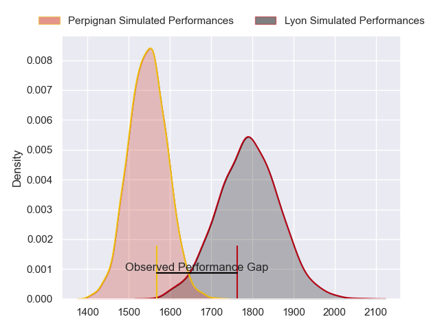
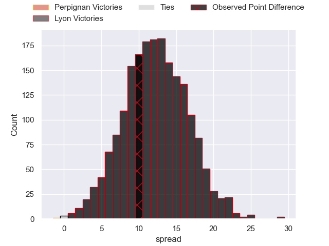
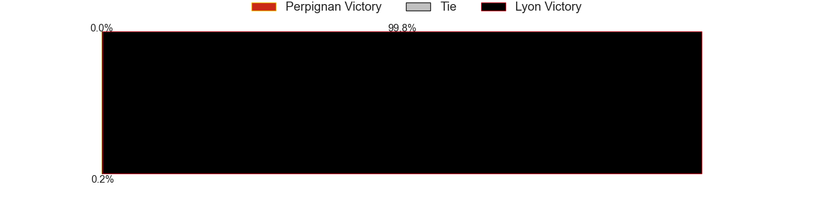

---  
layout: page  
title: Perpignan at Lyon; 31-41  
date: 2023-05-06 17:00:00 18:00:00 -0500  
categories: match review  
---
# Perpignan at Lyon; 31-41

# Club Level Predictions

The first set of predictions treats a club as the smallest object, as the club develops its members, organizes a gameplan, and deploys its players as needed for each match. This club model has a prediction of 0.8, which translates to predicting Lyon to win by 12.1.

Each club has a rating and a rating deviation (simiar to a Glicko system), and expected performances can be generated. This allows for simulated matches and spreads like the ones below.
## Projected Performances

## Projected Spreads

## Projected Results

# Player Level Predictions

Treating teams instead as an entity made up of the currently active players, I have ratings for each player in an altogether different system. These can be combined to form team ratings once teamsheets are announced, weighting starters a bit higher than the reserves. After the match is played, players can be weighted by their minutes on the field, allowing for an accurate measure of the team's composition. With these compiled team ratings, we can make predictions, measure inaccuracy, and update the individual player ratings.
## Prediction with Player Minutes: Perpignan by 16.1

Perpignan by 20.1 on a neutral field

There were 13 large changes in win probability in this match
## Prediction without Player Minutes: Perpignan by 15.2

Perpignan by 19.2 on a neutral pitch

|   Away Minutes | Away Player         |   Away elo |   Away Percentile |   Number |   Home Percentile |   Home elo | Home Player            |   Home Minutes |
|---------------:|:--------------------|-----------:|------------------:|---------:|------------------:|-----------:|:-----------------------|---------------:|
|             63 | Sacha Lotrian       |      69.25 |                27 |        1 |                 3 |      45.56 | Sébastien Taofifenua   |             62 |
|             63 | Victor Montgaillard |      67.62 |                33 |        2 |                 0 |       6.77 | Guillaume Marchand     |             51 |
|             60 | Ma'afu Fia          |      65.63 |                24 |        3 |                 0 |      19.4  | Demba Bamba            |             60 |
|             52 | Taniela Ramasibana  |      78.97 |                54 |        4 |                30 |      66.57 | Killian Geraci         |             15 |
|             52 | Andrei Mahu         |      67.07 |               nan |        5 |                92 |     108.22 | Romain Taofifenua      |             67 |
|             80 | Lucas Bachelier     |      70.33 |                37 |        6 |                 0 |      18.37 | Dylan Cretin           |             80 |
|             60 | Alan Brazo          |      67.22 |               nan |        7 |                81 |      94.81 | Beka Saghinadze        |             80 |
|             80 | Lucas Velarte       |      67.45 |               nan |        8 |                16 |      59.37 | Arno Botha             |             51 |
|             80 | Tom Ecochard        |      65.57 |               nan |        9 |                 3 |      42.06 | Baptiste Couilloud     |             80 |
|             72 | Matteo Rodor        |      63.85 |                22 |       10 |                17 |      60.15 | Léo Berdeu             |             25 |
|             80 | Mathieu Acebes      |      70.74 |                33 |       11 |                89 |     102.82 | Ethan Dumortier        |             80 |
|             80 | Dorian Laborde      |      68.51 |                31 |       12 |                61 |      83.93 | Josua Tuisova          |             80 |
|             80 | George Tilsley      |      67.38 |               nan |       13 |                 0 |      26.62 | Kyle Godwin            |             40 |
|             70 | Nino Seguela        |      67.55 |               nan |       14 |                53 |      77.81 | Tavite Veredamu        |             80 |
|             80 | Boris Goutard       |      45.09 |                 6 |       15 |                44 |      76.12 | Toby Arnold            |             80 |
|             28 | Tristan Labouteley  |      74.69 |                46 |       16 |                11 |      67.08 | Félix Lambey           |             65 |
|             28 | Victor Moreaux      |      79.13 |                54 |       17 |                 0 |     -25.27 | Jean-Marc Doussain     |             55 |
|             20 | Akato Fakatika      |      91.03 |                80 |       18 |               nan |      20.86 | Thibaut Regard         |             40 |
|             20 | Valentin Moro       |      84.95 |                69 |       19 |               nan |       5.47 | Yanis Charcosset       |             29 |
|             17 | Mike Tadjer         |      72.88 |                42 |       20 |                53 |      78.66 | Liam Allen             |             29 |
|             17 | Xavier Chiocci      |      68.07 |               nan |       21 |                 0 |      34.13 | Francisco Gomez Kodela |             20 |
|             10 | Edward Sawailau     |      74.31 |                43 |       22 |               nan |      19.06 | Feao Fotuaika          |             18 |
|              8 | Alexandre Perez     |      72.96 |                40 |       23 |                 0 |      21.75 | Mickael Guillard       |             13 |

