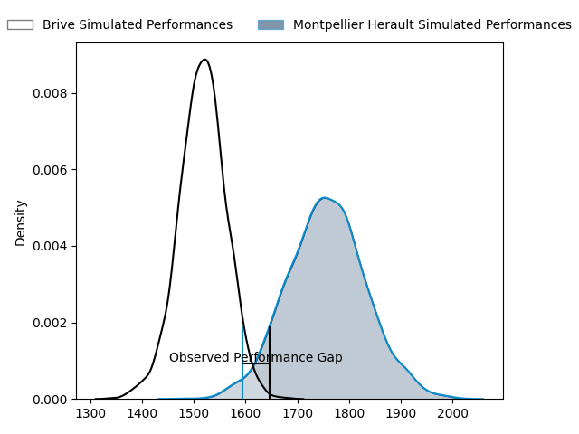
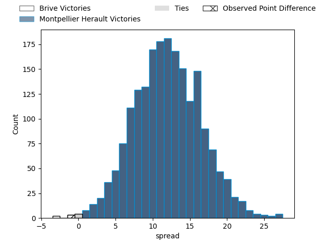

---  
layout: page  
title: Brive at Montpellier Herault; 27-26  
date: 2023-05-06 17:00:00 18:00:00 -0500  
categories: match review  
---
# Brive at Montpellier Herault; 27-26

# Club Level Predictions

The first set of predictions treats a club as the smallest object, as the club develops its members, organizes a gameplan, and deploys its players as needed for each match. This club model has a prediction of 0.796, which translates to predicting Montpellier Herault to win by 11.9.

Each club has a rating and a rating deviation (simiar to a Glicko system), and expected performances can be generated. This allows for simulated matches and spreads like the ones below.
## Projected Performances

## Projected Spreads

## Projected Results

# Player Level Predictions

Treating teams instead as an entity made up of the currently active players, I have ratings for each player in an altogether different system. These can be combined to form team ratings once teamsheets are announced, weighting starters a bit higher than the reserves. After the match is played, players can be weighted by their minutes on the field, allowing for an accurate measure of the team's composition. With these compiled team ratings, we can make predictions, measure inaccuracy, and update the individual player ratings.
## Prediction with Player Minutes: Brive by 1.7

Brive by 5.7 on a neutral field

There were 21 large changes in win probability in this match
## Prediction without Player Minutes: Brive by 3.9

Brive by 7.9 on a neutral pitch

|   Away Minutes | Away Player               |   Away elo |   Away Percentile |   Number |   Home Percentile |   Home elo | Home Player                         |   Home Minutes |
|---------------:|:--------------------------|-----------:|------------------:|---------:|------------------:|-----------:|:------------------------------------|---------------:|
|             50 | Wesley Tapueluelu         |      74.57 |                46 |        1 |                 9 |      54.85 | Enzo Forletta                       |             51 |
|             50 | Motu Farao Matu'u         |      61.65 |                22 |        2 |               nan |      45.3  | Curtis Langdon                      |             47 |
|             50 | Marcel van der Merwe      |      74.02 |                44 |        3 |                20 |      67.17 | Titi Lamositele                     |             45 |
|             80 | Retief Marais             |      74.48 |                45 |        4 |               nan |      61.29 | Florian Verhaeghe                   |             50 |
|             59 | Lucas Martin Paulos Adler |      63.83 |                24 |        5 |                19 |      60.93 | Bastien Chalureau                   |             62 |
|             80 | Esteban Abadie            |      65.45 |                27 |        6 |                93 |     107.96 | Lenni Nouchi                        |             80 |
|             57 | Ross Moriarty             |      74.49 |                46 |        7 |                 0 |      25.27 | Alexandre Bécognée                  |             80 |
|             41 | Rodrigo Bruni             |      69.97 |                32 |        8 |                57 |      81.05 | Zach Mercer                         |             80 |
|             80 | Mathis Ferté              |      77.45 |                51 |        9 |                22 |      65.71 | Léo Coly                            |             39 |
|             80 | Nicolas Sanchez           |      74.78 |                46 |       10 |                75 |      92.88 | Paolo Garbisi                       |             80 |
|             80 | Axel Muller               |      63.18 |                23 |       11 |                55 |      78.56 | George Bridge                       |             80 |
|             36 | Stuart Olding             |      67.54 |                30 |       12 |                14 |      57    | Jan Lodewyk Serfontein              |             50 |
|             80 | Setariki Tuicuvu          |      68.43 |                31 |       13 |                43 |      74.05 | Thomas Darmon                       |             80 |
|             80 | Arthur Bonneval           |      70.95 |                38 |       14 |                 5 |      45.01 | Julien Tisseron                     |             80 |
|             52 | Thomas Laranjeira         |      64.65 |                23 |       15 |                46 |      77.2  | Anthony Bouthier                    |             80 |
|             44 | Nicolaas Jacobus Lee      |      80.6  |                55 |       16 |               nan |      74.82 | Gela Aprasidze                      |             41 |
|             39 | Julien Delannoy           |      62    |                21 |       17 |                 0 |      30.4  | Mohamed Haouas                      |             35 |
|             30 | Pietro Ceccarelli         |      70.97 |               nan |       18 |                22 |      61.45 | Vincent Giudicelli                  |             33 |
|             30 | Daniel Brennan            |      64.87 |                19 |       19 |                51 |      76.91 | Nicolaas Jacobus Janse van Rensburg |             30 |
|             30 | Lucas Da Silva            |      74.49 |                47 |       20 |               nan |      48.05 | Pierre Lucas                        |             30 |
|             28 | Paul Abadie               |      72.18 |               nan |       21 |               nan |      58.13 | Simon-Pierre Chauvac                |             29 |
|             23 | Saïd Hireche              |      66.65 |                27 |       22 |                36 |      72.24 | Tyler Evan Duguid                   |             18 |
|             21 | Mesulame Kunavula         |      77.08 |                44 |       23 |               nan |     nan    | nan                                 |            nan |

