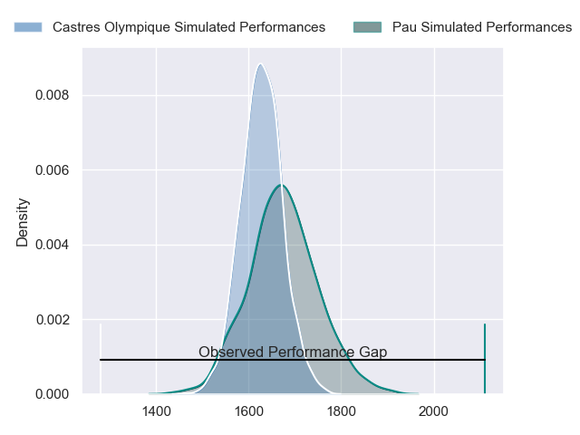
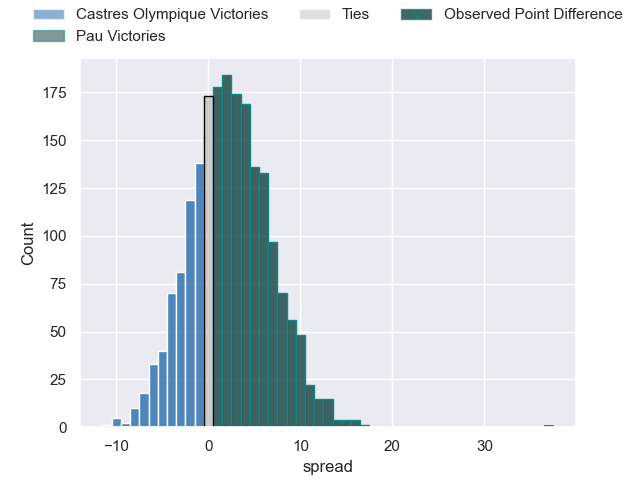

---  
layout: page  
title: Castres Olympique at Pau; 3-40  
date: 2023-05-06 17:00:00 18:00:00 -0500  
categories: match review  
---
# Castres Olympique at Pau; 3-40

# Club Level Predictions

The first set of predictions treats a club as the smallest object, as the club develops its members, organizes a gameplan, and deploys its players as needed for each match. This club model has a prediction of 0.566, which translates to predicting Pau to win by 2.3.

Each club has a rating and a rating deviation (simiar to a Glicko system), and expected performances can be generated. This allows for simulated matches and spreads like the ones below.
## Projected Performances

## Projected Spreads

## Projected Results

# Player Level Predictions

Treating teams instead as an entity made up of the currently active players, I have ratings for each player in an altogether different system. These can be combined to form team ratings once teamsheets are announced, weighting starters a bit higher than the reserves. After the match is played, players can be weighted by their minutes on the field, allowing for an accurate measure of the team's composition. With these compiled team ratings, we can make predictions, measure inaccuracy, and update the individual player ratings.
## Prediction with Player Minutes: Pau by 2.9

Castres Olympique by 1.1 on a neutral field

There were 2 large changes in win probability in this match
## Prediction without Player Minutes: Pau by 2.2

Castres Olympique by 1.8 on a neutral pitch

|   Away Minutes | Away Player             |   Away elo |   Away Percentile |   Number |   Home Percentile |   Home elo | Home Player              |   Home Minutes |
|---------------:|:------------------------|-----------:|------------------:|---------:|------------------:|-----------:|:-------------------------|---------------:|
|             57 | Quentin Walcker         |      77.5  |                52 |        1 |                21 |      62.64 | Ignacio David Calles     |             57 |
|             64 | Pierre Colonna          |      91.76 |                83 |        2 |                46 |      74.44 | Lucas Rey                |             64 |
|             57 | Wilfried Hounkpatin     |      65.24 |                25 |        3 |                45 |      70.2  | Siate Tokolahi           |             57 |
|             64 | Florent Vanverberghe    |      83.53 |                64 |        4 |               nan |      64.09 | Santiago Grondona        |             80 |
|             80 | Thomas Staniforth       |      69.23 |                34 |        5 |                43 |      73.31 | Lekima Vuda Tagitagivalu |             57 |
|             57 | Mathieu Babillot        |      69.61 |               nan |        6 |                49 |      74.53 | Martin Puech             |             48 |
|             80 | Baptiste Delaporte      |      77.02 |                50 |        7 |                35 |      69.85 | Luke Whitelock           |             80 |
|             64 | Baptiste Cope           |      89.7  |                74 |        8 |                58 |      81.37 | Beka Gorgadze            |             80 |
|             57 | Jeremy Fernandez        |      63.4  |                21 |        9 |                29 |      65.67 | Thibault Daubagna        |             64 |
|             80 | Benjamin Urdapilleta    |      63.89 |                23 |       10 |                32 |      69.49 | Zack Henry               |             64 |
|             80 | Josaia Raisuqe          |      72.57 |                40 |       11 |                34 |      68.87 | Aminiasi Tuimaba         |             80 |
|             57 | Vilimoni Botitu         |      77.29 |                49 |       12 |                47 |      76.18 | Tumua Manu               |             64 |
|             80 | Adrien Seguret          |      74.95 |                45 |       13 |                85 |      98.27 | Émilien Gailleton        |             80 |
|             80 | Geoffrey Palis          |      70.15 |                36 |       14 |                57 |      80.36 | Clément Laporte          |             80 |
|             80 | Julien Dumora           |      64.75 |                24 |       15 |               nan |      67.1  | Mathias Colombet         |             80 |
|             23 | Aurélien Azar           |      70.66 |                40 |       16 |                11 |      54.64 | Sacha Zegueur            |             32 |
|             23 | Antoine Tichit          |      71.65 |                44 |       17 |                29 |      66.1  | Guillaume Ducat          |             23 |
|             23 | Kevin Kornath           |      64.67 |                21 |       18 |               nan |      71.69 | Rémi Seneca              |             23 |
|             23 | Santiago Arata Perrone  |      71.65 |                38 |       19 |                48 |      75.87 | Guram Papidze            |             23 |
|             23 | Adrea Cocagi            |      62.89 |                21 |       20 |               nan |      68.37 | Youri Delhommel          |             16 |
|             16 | Brice Humbert           |      84.62 |                68 |       21 |                34 |      70.26 | Dan Robson               |             16 |
|             16 | Théo Hannoyer           |      69.91 |               nan |       22 |                47 |      75.36 | Thibault Debaes          |             16 |
|             16 | Asier Latierro Usarraga |      75    |                46 |       23 |                24 |      64.42 | Jale Vatubua             |             16 |

