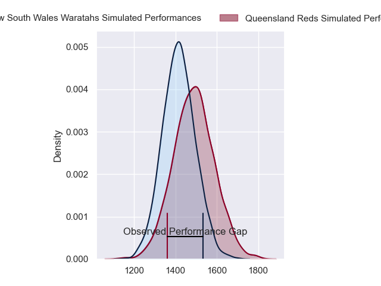
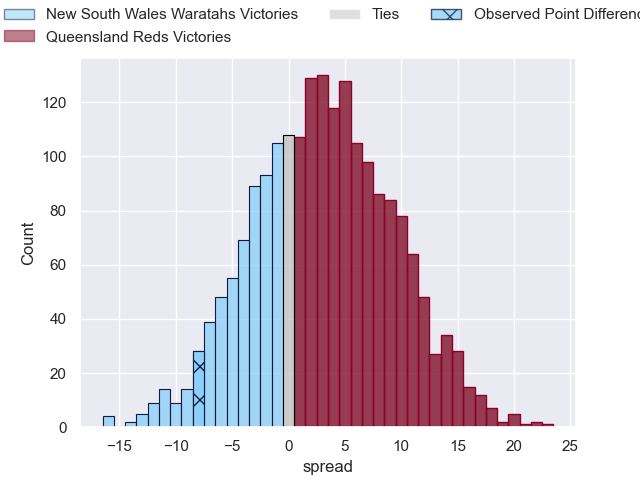

---  
layout: page  
title: New South Wales Waratahs at Queensland Reds; 32.0-24.0  
date: 2023-05-06 05:35:00 18:00:00 -0500  
categories: match review  
---
# New South Wales Waratahs at Queensland Reds; 32.0-24.0

# Club Level Predictions

The first set of predictions treats a club as the smallest object, as the club develops its members, organizes a gameplan, and deploys its players as needed for each match. This club model has a prediction of 0.585, which translates to predicting Queensland Reds to win by 3.1.

Each club has a rating and a rating deviation (simiar to a Glicko system), and expected performances can be generated. This allows for simulated matches and spreads like the ones below.
## Projected Performances

## Projected Spreads

## Projected Results

# Player Level Predictions

Treating teams instead as an entity made up of the currently active players, I have ratings for each player in an altogether different system. These can be combined to form team ratings once teamsheets are announced, weighting starters a bit higher than the reserves. After the match is played, players can be weighted by their minutes on the field, allowing for an accurate measure of the team's composition. With these compiled team ratings, we can make predictions, measure inaccuracy, and update the individual player ratings.
## Prediction with Player Minutes: New South Wales Waratahs by 2.1

New South Wales Waratahs by 6.1 on a neutral field

There were 10 large changes in win probability in this match
## Prediction without Player Minutes: Queensland Reds by 2.1

New South Wales Waratahs by 1.9 on a neutral pitch

|   Away Minutes | Away Player          |   Away elo |   Away Percentile |   Number |   Home Percentile |   Home elo | Home Player      |   Home Minutes |
|---------------:|:---------------------|-----------:|------------------:|---------:|------------------:|-----------:|:-----------------|---------------:|
|             49 | Tetera Faulkner      |      84.21 |                67 |        1 |                66 |      83.23 | Sef Fa'agase     |             52 |
|             68 | Dave Porecki         |     106.72 |                94 |        2 |                54 |      78.05 | Matt Faessler    |             62 |
|             63 | Harry Johnson-Holmes |      83.9  |                67 |        3 |                77 |      89.21 | Zane Nonggorr    |             57 |
|             82 | Jed Holloway         |      77.09 |                51 |        4 |                50 |      76.36 | Connor Vest      |             62 |
|             82 | Hugh Sinclair        |      93.71 |                81 |        5 |                71 |      88.21 | Ryan Smith       |             56 |
|             41 | Taleni Seu           |      80.51 |                58 |        6 |                95 |     111.87 | Liam Wright      |             82 |
|             82 | Michael Hooper       |     145.45 |                99 |        7 |                47 |      75.01 | Fraser McReight  |             82 |
|             63 | Langi Gleeson        |      88.27 |                72 |        8 |                86 |      99.89 | Harry Wilson     |              4 |
|             77 | Jake Gordon          |     112.41 |                95 |        9 |                82 |      97.31 | Tate McDermott   |             71 |
|             82 | Ben Donaldson        |      87.51 |                66 |       10 |                77 |      93.69 | Lawson Creighton |             82 |
|             82 | Dylan Pietsch        |      93.91 |                80 |       11 |                70 |      86.41 | Jock Campbell    |             82 |
|             82 | Lalakai Foketi       |      90.94 |                73 |       12 |                78 |      95    | James O'Connor   |             82 |
|             73 | Izaia Perese         |      74.16 |                43 |       13 |                56 |      80.55 | Josh Flook       |             82 |
|             82 | Mark Nawaqanitawase  |      88.87 |                73 |       14 |                84 |      97.61 | Suliasi Vunivalu |             82 |
|             78 | Max Jorgensen        |      96.77 |                79 |       15 |                85 |     102.56 | Jordan Petaia    |             68 |
|             14 | Mahe Vailanu         |      48.32 |                 9 |       16 |                92 |     106.02 | Richie Asiata    |             20 |
|             33 | Nephi Leatigaga      |      74.88 |               nan |       17 |               nan |      86.1  | George Blake     |             30 |
|             19 | Daniel Botha         |      84.67 |               nan |       18 |                57 |      84.41 | Peni Ravai       |             25 |
|             19 | Will Harris          |      90.66 |                79 |       19 |                91 |     106.51 | Angus Blyth      |             20 |
|             41 | Charlie Gamble       |      83.93 |                68 |       20 |                43 |      73.21 | Seru Uru         |             26 |
|              5 | Harrison Goddard     |      84.55 |               nan |       21 |                72 |      88.8  | Kalani Thomas    |             11 |
|              4 | Harry Wilson         |      86.32 |                65 |       22 |                71 |      92.72 | Tom Lynagh       |             14 |
|              9 | Joey Walton          |      79.52 |                54 |       23 |                87 |     100.88 | Filipo Daugunu   |             52 |

