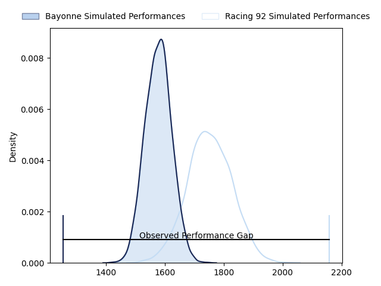
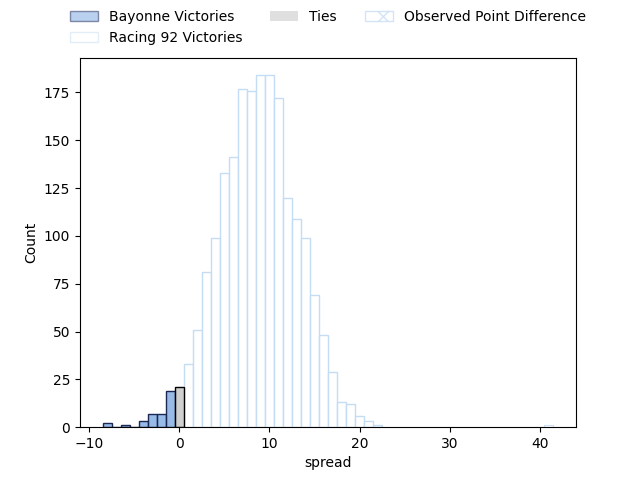
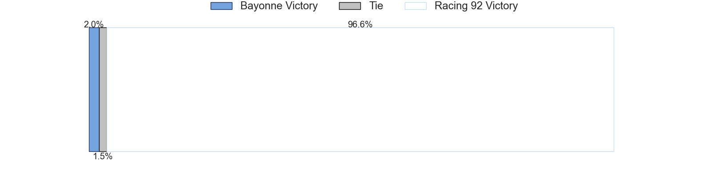

---  
layout: page  
title: Bayonne at Racing 92; 14-55  
date: 2023-05-06 17:00:00 18:00:00 -0500  
categories: match review  
---
# Bayonne at Racing 92; 14-55

# Club Level Predictions

The first set of predictions treats a club as the smallest object, as the club develops its members, organizes a gameplan, and deploys its players as needed for each match. This club model has a prediction of 0.735, which translates to predicting Racing 92 to win by 9.0.

Each club has a rating and a rating deviation (simiar to a Glicko system), and expected performances can be generated. This allows for simulated matches and spreads like the ones below.
## Projected Performances

## Projected Spreads

## Projected Results

# Player Level Predictions

Treating teams instead as an entity made up of the currently active players, I have ratings for each player in an altogether different system. These can be combined to form team ratings once teamsheets are announced, weighting starters a bit higher than the reserves. After the match is played, players can be weighted by their minutes on the field, allowing for an accurate measure of the team's composition. With these compiled team ratings, we can make predictions, measure inaccuracy, and update the individual player ratings.
## Prediction with Player Minutes: Racing 92 by 2.0

Bayonne by 2.0 on a neutral field

There were 6 large changes in win probability in this match
## Prediction without Player Minutes: Bayonne by 0.1

Bayonne by 4.1 on a neutral pitch

|   Away Minutes | Away Player           |   Away elo |   Away Percentile |   Number |   Home Percentile |   Home elo | Home Player           |   Home Minutes |
|---------------:|:----------------------|-----------:|------------------:|---------:|------------------:|-----------:|:----------------------|---------------:|
|             48 | Matis Perchaud        |      86.18 |                80 |        1 |                 6 |      50.66 | Guram Gogichashvili   |             50 |
|             55 | Facundo Bosch         |      66.84 |                32 |        2 |                21 |      61.09 | Janick Tarrit         |             50 |
|             48 | Pascal Cotet          |      76.19 |                49 |        3 |                50 |      76.57 | Trevor Ntando Nyakane |             54 |
|             55 | Denis Marchois        |      70.12 |                36 |        4 |                44 |      73.59 | Anthime Hemery        |             52 |
|             80 | Thomas Ceyte          |     106.12 |                91 |        5 |                23 |      63.2  | Fabien Sanconnie      |             80 |
|             80 | Pierre Huguet         |      78.67 |                54 |        6 |                14 |      56.8  | Ibrahim Diallo        |             59 |
|             80 | Baptiste Heguy        |      61.13 |                20 |        7 |                46 |      74.84 | Baptiste Chouzenoux   |             80 |
|             59 | Uzair Cassiem         |      69.94 |                32 |        8 |                11 |      60.34 | Kitione Kamikamica    |             80 |
|             80 | Maxime Machenaud      |      72.1  |                39 |        9 |                70 |      87.77 | Nolann Le Garrec      |             71 |
|             80 | Camille Lopez         |      58.62 |                15 |       10 |                91 |     106.98 | Finn Russell          |             80 |
|             32 | Rémy Baget            |      78.54 |                55 |       11 |                71 |      87.02 | Juan Imhoff           |             80 |
|             80 | Guillaume Martocq     |      72.68 |                40 |       12 |                37 |      71.74 | Henry Chavancy        |             65 |
|             55 | Sireli Maqala         |     103.75 |                88 |       13 |                80 |      97.15 | Gael Fickou           |             80 |
|             80 | Marland Yarde         |      62.73 |                28 |       14 |                22 |      62.51 | Vinaya Habosi         |             80 |
|             59 | Tom Spring            |      68.4  |                30 |       15 |                35 |      70.39 | Max Spring            |             65 |
|             48 | Arthur Duhau          |      72.91 |               nan |       16 |                42 |      75.4  | Eddy Ben Arous        |             30 |
|             32 | Quentin Béthune       |      81.12 |                66 |       17 |               nan |      69.19 | Camille Chat          |             30 |
|             32 | Pieter Ernst Scholtz  |      71.5  |                38 |       18 |                40 |      67.96 | Cameron Woki          |             28 |
|             25 | Torsten van Jaarsveld |      81.33 |               nan |       19 |                29 |      67.89 | Ali Oz                |             26 |
|             25 | Manuel Leindekar      |      81.09 |               nan |       20 |                47 |      75.11 | Wenceslas Lauret      |             21 |
|             25 | Peyo Muscarditz       |      80.83 |                56 |       21 |                29 |      66.45 | Warrick Wayne Gelant  |             15 |
|             21 | Thomas Dolhagaray     |      87.54 |                71 |       22 |                59 |      78.97 | Francis Saili         |             15 |
|             21 | Olajuwon Noah         |      73.09 |               nan |       23 |                34 |      69.95 | Antoine Gibert        |              9 |

