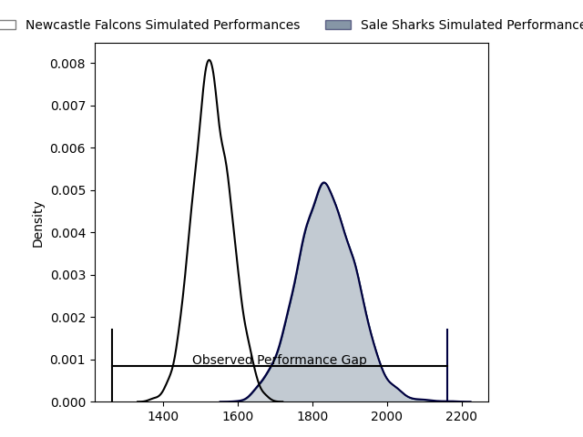
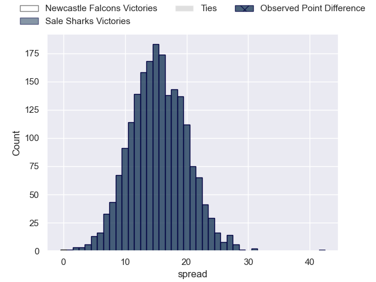

---  
layout: page  
title: Newcastle Falcons at Sale Sharks; 12-54  
date: 2023-05-06 17:00:00 18:00:00 -0500  
categories: match review  
---
# Newcastle Falcons at Sale Sharks; 12-54

# Club Level Predictions

The first set of predictions treats a club as the smallest object, as the club develops its members, organizes a gameplan, and deploys its players as needed for each match. This club model has a prediction of 0.853, which translates to predicting Sale Sharks to win by 15.4.

Each club has a rating and a rating deviation (simiar to a Glicko system), and expected performances can be generated. This allows for simulated matches and spreads like the ones below.
## Projected Performances

## Projected Spreads

## Projected Results

# Player Level Predictions

Treating teams instead as an entity made up of the currently active players, I have ratings for each player in an altogether different system. These can be combined to form team ratings once teamsheets are announced, weighting starters a bit higher than the reserves. After the match is played, players can be weighted by their minutes on the field, allowing for an accurate measure of the team's composition. With these compiled team ratings, we can make predictions, measure inaccuracy, and update the individual player ratings.
## Prediction with Player Minutes: Sale Sharks by 17.7

Sale Sharks by 13.7 on a neutral field

There were 3 large changes in win probability in this match
## Prediction without Player Minutes: Sale Sharks by 22.6

Sale Sharks by 18.6 on a neutral pitch

|   Away Minutes | Away Player                        |   Away elo |   Away Percentile |   Number |   Home Percentile |   Home elo | Home Player       |   Home Minutes |
|---------------:|:-----------------------------------|-----------:|------------------:|---------:|------------------:|-----------:|:------------------|---------------:|
|              9 | Adam Brocklebank                   |      89.59 |                83 |        1 |                94 |     106.43 | Bevan Rodd        |             48 |
|             75 | Jamie Blamire                      |      86.12 |                72 |        2 |                78 |      88.61 | Ewan Ashman       |             63 |
|             50 | Mark Tampin                        |      75.84 |                49 |        3 |                97 |     111.85 | Coenie Oosthuizen |             48 |
|             80 | Greg Peterson                      |      83.34 |                63 |        4 |                89 |     102.62 | Jean-Luc du Preez |             48 |
|             80 | Sebastian de Chaves                |      47.33 |                 6 |        5 |                75 |      90.38 | Jonny Hill        |             63 |
|             80 | Pedro Rubiolo                      |      79.41 |                55 |        6 |                68 |      81.76 | Sam Dugdale       |             80 |
|             59 | Philip van der Walt                |      89.41 |                77 |        7 |                58 |      80.57 | Ben Curry         |             80 |
|             29 | Callum Chick                       |      62.89 |                21 |        8 |                62 |      83.24 | Jono Ross         |             55 |
|             59 | Sam Stuart                         |      76.56 |               nan |        9 |                91 |     105.86 | Raffi Quirke      |             63 |
|             70 | Brett Connon                       |      84.05 |                61 |       10 |                87 |     101.8  | George Ford       |             80 |
|             80 | Mateo Carreras                     |      67.53 |                32 |       11 |                86 |      99.68 | Tom O'Flaherty    |             80 |
|             55 | Matias Orlando                     |      62.58 |                22 |       12 |                97 |     121.16 | Manu Tuilagi      |             15 |
|             80 | Matias Moroni                      |      83.6  |                62 |       13 |                78 |      94.84 | Robert du Preez   |             80 |
|             80 | Adam Radwan                        |     123.49 |                97 |       14 |                63 |      82.86 | Tom Roebuck       |             80 |
|             80 | Elliott Obatoyinbo                 |      89.98 |                70 |       15 |                19 |      61.59 | Joe Carpenter     |             80 |
|             71 | Phil Brantingham                   |      76.75 |               nan |       16 |                92 |     108.49 | Sam James         |             65 |
|             51 | Carl Fearns                        |      97.79 |                85 |       17 |                15 |      58.26 | James Harper      |             32 |
|             30 | Richard Palframan                  |      87.19 |                73 |       18 |                26 |      64.88 | Tom Ellis         |             32 |
|             25 | Christian (Tian) Francois Schoeman |      76.95 |               nan |       19 |                92 |     102.5  | Simon McIntyre    |             32 |
|             21 | Freddie Lockwood                   |      74.05 |                45 |       20 |               nan |      81.24 | Josh Beaumont     |             25 |
|             21 | Josh Barton                        |      76.2  |               nan |       21 |               nan |      85.15 | Alex Groves       |             17 |
|             10 | Josh Thomas                        |      76.37 |               nan |       22 |               nan |      85.34 | Will Cliff        |             17 |
|              5 | Conrad Cade                        |      73.81 |                47 |       23 |                17 |      57.95 | Ethan Caine       |             17 |

