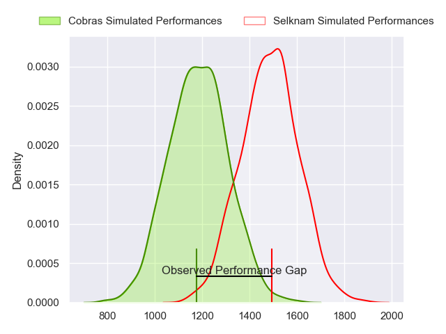
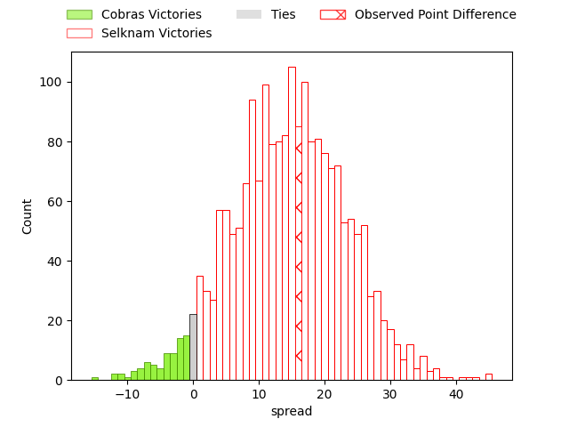
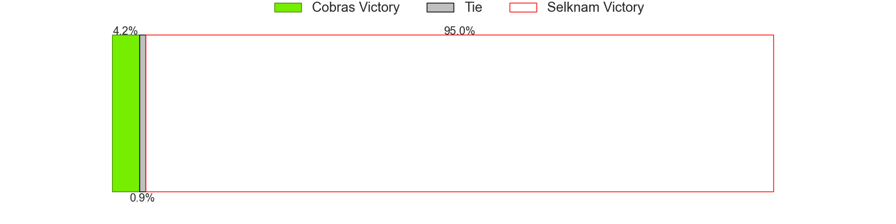

---  
layout: page  
title: Cobras at Selknam; 17-33  
date: 2023-05-06 22:00:00 18:00:00 -0500  
categories: match review  
---
# Cobras at Selknam; 17-33

# Club Level Predictions

The first set of predictions treats a club as the smallest object, as the club develops its members, organizes a gameplan, and deploys its players as needed for each match. This club model has a prediction of 0.83, which translates to predicting Selknam to win by 14.7.

Each club has a rating and a rating deviation (simiar to a Glicko system), and expected performances can be generated. This allows for simulated matches and spreads like the ones below.
## Projected Performances

## Projected Spreads

## Projected Results

# Player Level Predictions

Treating teams instead as an entity made up of the currently active players, I have ratings for each player in an altogether different system. These can be combined to form team ratings once teamsheets are announced, weighting starters a bit higher than the reserves. After the match is played, players can be weighted by their minutes on the field, allowing for an accurate measure of the team's composition. With these compiled team ratings, we can make predictions, measure inaccuracy, and update the individual player ratings.
## Prediction with Player Minutes: Cobras by 0.2

Cobras by 4.2 on a neutral field

There were 4 large changes in win probability in this match
## Prediction without Player Minutes: Selknam by 0.0

Cobras by 4.0 on a neutral pitch

|   Away Minutes | Away Player                   |   Away elo |   Away Percentile |   Number |   Home Percentile |   Home elo | Home Player             |   Home Minutes |
|---------------:|:------------------------------|-----------:|------------------:|---------:|------------------:|-----------:|:------------------------|---------------:|
|             73 | Levy Marinho                  |      45.55 |                 3 |        1 |                 4 |      46.3  | Salvador Lues           |             57 |
|             76 | Endy Willian                  |      46.02 |                 6 |        2 |                 2 |      39.58 | Diego Escobar           |             47 |
|             45 | Bautista Vidal                |      57.24 |                13 |        3 |                 7 |      52.36 | Esteban Inostroza       |             40 |
|             40 | Gabriel Paganini              |      51.79 |                 8 |        4 |                 8 |      51.87 | Clemente Saavedra       |             80 |
|             80 | Lucio Anconetani              |      57.73 |                14 |        5 |                15 |      58.1  | Pablo Huete             |             74 |
|             80 | Cleber Dias                   |      59.05 |                15 |        6 |                 7 |      46.82 | Alfonso Escobar Alvarez |             80 |
|             53 | Matheus Claudio               |      46.97 |                 5 |        7 |                10 |      53.4  | Ignacio Silva           |             50 |
|             66 | Andre Arruda                  |      61.68 |                19 |        8 |                45 |      73.71 | Joaquin Milesi          |             76 |
|             56 | Facundo Villalba              |      60.4  |                17 |        9 |                 8 |      49.99 | Lukas Carvallo          |             61 |
|             80 | Lucas Ferrer Spago            |      54.32 |                11 |       10 |                11 |      53.1  | Francisco Urroz         |             80 |
|             73 | Ariel Rodrigues               |      60.67 |                20 |       11 |                12 |      55.71 | Jose Ignacio Larenas    |             80 |
|             80 | Robert Tenorio                |      69.15 |                32 |       12 |                 1 |      37.56 | Pablo Casas             |             74 |
|             80 | Victor Silva                  |      55.52 |                12 |       13 |                41 |      73.63 | Domingo Saavedra        |             80 |
|             80 | Alain Andres Altahona Fulleda |      48.34 |                 7 |       14 |                 5 |      44.98 | Gaspar Moltedo          |             80 |
|             80 | Lucas Tranquez                |      74.39 |                40 |       15 |                31 |      68.66 | Benjamin Videla         |             80 |
|             40 | Ben Donald                    |      63.63 |                24 |       16 |                 7 |      51.69 | Inaki Gurruchaga        |             40 |
|             35 | Henrique Ribeiro Ferreira     |      51.68 |                 6 |       17 |               nan |      54.07 | Augusto Bohme           |             33 |
|             27 | Adrio Luiz de Melo            |      47.23 |                 5 |       18 |                 3 |      40.48 | Raimundo Martinez       |             30 |
|             24 | Donnacha Byrne                |      57.19 |                14 |       19 |               nan |      53.84 | Vittorio Lastra         |             23 |
|             14 | Douglas Rauth                 |      56.04 |                11 |       20 |                 4 |      46.93 | Nicolas Herreros        |             19 |
|              7 | Robson Alves de Morais        |      47.46 |                 4 |       21 |                12 |      53.27 | Santiago Pedrero        |              6 |
|              7 | Alexandre Alves               |      55.47 |                10 |       22 |                 3 |      45.68 | Marcelo Torrealba       |              6 |
|              4 | Leonardo de Souza da Silva    |      42.94 |                 4 |       23 |                28 |      65.95 | Santiago Edwards        |              4 |

