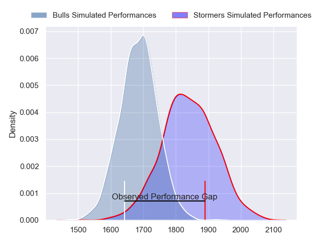
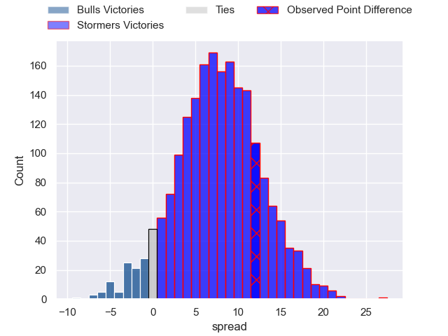
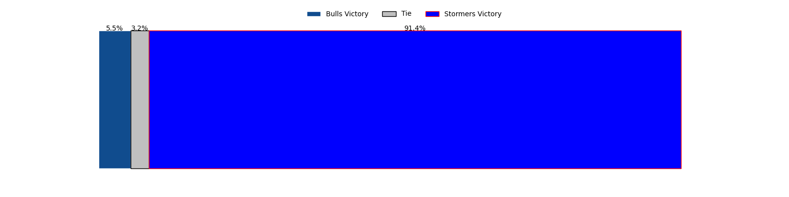

---  
layout: page  
title: Bulls at Stormers; 21-33  
date: 2023-05-06 15:30:00 18:00:00 -0500  
categories: match review  
---
# Bulls at Stormers; 21-33

# Club Level Predictions

The first set of predictions treats a club as the smallest object, as the club develops its members, organizes a gameplan, and deploys its players as needed for each match. This club model has a prediction of 0.708, which translates to predicting Stormers to win by 7.8.

Each club has a rating and a rating deviation (simiar to a Glicko system), and expected performances can be generated. This allows for simulated matches and spreads like the ones below.
## Projected Performances

## Projected Spreads

## Projected Results

# Player Level Predictions

Treating teams instead as an entity made up of the currently active players, I have ratings for each player in an altogether different system. These can be combined to form team ratings once teamsheets are announced, weighting starters a bit higher than the reserves. After the match is played, players can be weighted by their minutes on the field, allowing for an accurate measure of the team's composition. With these compiled team ratings, we can make predictions, measure inaccuracy, and update the individual player ratings.
## Prediction with Player Minutes: Bulls by 6.7

Bulls by 10.7 on a neutral field

There were 7 large changes in win probability in this match
## Prediction without Player Minutes: Bulls by 4.7

Bulls by 8.7 on a neutral pitch

|   Away Minutes | Away Player                  |   Away elo |   Away Percentile |   Number |   Home Percentile |   Home elo | Home Player                  |   Home Minutes |
|---------------:|:-----------------------------|-----------:|------------------:|---------:|------------------:|-----------:|:-----------------------------|---------------:|
|             62 | Gerhardus Cornelis Steenkamp |      81.57 |                61 |        1 |                49 |      76.1  | Steven Kitshoff              |             72 |
|             71 | Cornelis Johannes Grobbelaar |      92.75 |                80 |        2 |                54 |      78.17 | Joseph Dweba                 |             62 |
|             62 | Dylan Thomas Smith           |      69.5  |                23 |        3 |                45 |      75.29 | Jozua Francois Malherbe      |             68 |
|             72 | Ruan Stefan Vermaak          |      87.74 |                71 |        4 |                50 |      75.98 | Ruben van Heerden            |             72 |
|             80 | Ruan Nortje                  |      96.77 |                84 |        5 |                57 |      80.18 | Marvin Orie                  |             80 |
|             52 | Marco Gerhardt van Staden    |      87.55 |                71 |        6 |                77 |      91.56 | Deon Fourie                  |             45 |
|             80 | Cyle Justin Brink            |      88.8  |                74 |        7 |                60 |      81.41 | Hacjivah Dayimani            |             55 |
|             80 | Elrigh Louw                  |      95.67 |                82 |        8 |                45 |      75.18 | Evan Roos                    |             80 |
|             62 | Embrose Cheldon Papier       |      75.94 |                48 |        9 |                52 |      75.79 | Herschel Jerome Jantjies     |             71 |
|             80 | Chris Smith                  |      89.31 |                66 |       10 |                55 |      81.53 | Immanuel Libbok              |             80 |
|             80 | David Kriel                  |      88.5  |                73 |       11 |               nan |      75.54 | Leolin Lucien Zas            |             71 |
|             80 | Harold William Vorster       |      97.55 |                81 |       12 |                65 |      85.41 | Daniel Michael du Plessis    |             80 |
|             75 | Stedman-Gee Rivett Gans      |      94.87 |                78 |       13 |                14 |      56.93 | Adriaan Ruhan Nel            |             80 |
|             80 | Kurt-Lee Arendse             |      87.78 |                66 |       14 |                93 |     108.16 | Angelo Davids                |             80 |
|             42 | Johannes Lodewikus Goosen    |      68.6  |                31 |       15 |                56 |      80.52 | Damian Willemse              |             80 |
|             38 | Sibongile Vukile Novuka      |      80.82 |                59 |       16 |                30 |      67.63 | Willem Gerhardus Engelbrecht |             35 |
|             28 | Nizaam Carr                  |      70.13 |                33 |       17 |                86 |      99.74 | Ben-Jason Dixon              |             25 |
|             18 | Keagan Johannes              |      93.51 |                77 |       18 |                47 |      74.58 | JJ Kotze                     |             18 |
|             18 | Francois Klopper             |      74.22 |                44 |       19 |                46 |      75.15 | Johan Neethling Fouche       |             12 |
|             18 | Simphiwe Matanzima           |      70.79 |                33 |       20 |                47 |      75.85 | Albertus Paul de Wet         |              9 |
|              9 | Bismarck du Plessis          |      70.38 |               nan |       21 |                66 |      86.25 | Sacha Mngomezulu             |              9 |
|              8 | Janko Swanepoel              |      76.18 |                50 |       22 |                50 |      78.29 | Gary Porter                  |              8 |
|              5 | Lionel Granton Mapoe         |      70.14 |                35 |       23 |                34 |      69.72 | Alistair Fernando Vermaak    |              8 |

