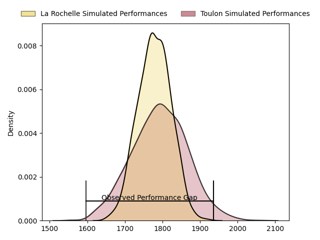
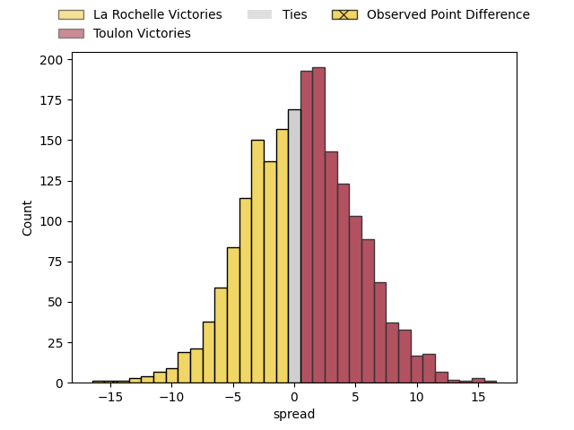

---  
layout: page  
title: La Rochelle at Toulon; 23-8  
date: 2023-05-06 21:05:00 18:00:00 -0500  
categories: match review  
---
# La Rochelle at Toulon; 23-8

# Club Level Predictions

The first set of predictions treats a club as the smallest object, as the club develops its members, organizes a gameplan, and deploys its players as needed for each match. This club model has a prediction of 0.517, which translates to predicting Toulon to win by 0.6.

Each club has a rating and a rating deviation (simiar to a Glicko system), and expected performances can be generated. This allows for simulated matches and spreads like the ones below.
## Projected Performances

## Projected Spreads

## Projected Results

# Player Level Predictions

Treating teams instead as an entity made up of the currently active players, I have ratings for each player in an altogether different system. These can be combined to form team ratings once teamsheets are announced, weighting starters a bit higher than the reserves. After the match is played, players can be weighted by their minutes on the field, allowing for an accurate measure of the team's composition. With these compiled team ratings, we can make predictions, measure inaccuracy, and update the individual player ratings.
## Prediction with Player Minutes: La Rochelle by 23.1

La Rochelle by 27.1 on a neutral field

There were 2 large changes in win probability in this match
## Prediction without Player Minutes: La Rochelle by 23.1

La Rochelle by 27.1 on a neutral pitch

|   Away Minutes | Away Player               |   Away elo |   Away Percentile |   Number |   Home Percentile |   Home elo | Home Player         |   Home Minutes |
|---------------:|:--------------------------|-----------:|------------------:|---------:|------------------:|-----------:|:--------------------|---------------:|
|             26 | Joel Sclavi               |      84.6  |                64 |        1 |                26 |      65.55 | Dany Priso          |             49 |
|             50 | Pierre Bourgarit          |      95.94 |                84 |        2 |                35 |      70.4  | Christopher Tolofua |             49 |
|             44 | Uini Atonio               |     106.06 |                94 |        3 |                51 |      77.05 | Beka Gigashvili     |             49 |
|             55 | Thomas Lavault            |      97.92 |                83 |        4 |                49 |      75.93 | Mathieu Tanguy      |             52 |
|             80 | William Skelton           |      95.55 |                83 |        5 |                 5 |      45    | Brian Alainu'uese   |             80 |
|             64 | Rémi Bourdeau             |      79.1  |                53 |        6 |                 7 |      50.41 | Cornell du Preez    |             69 |
|             80 | Paul Boudehent            |      85.77 |                61 |        7 |                96 |     117.84 | Charles Ollivon     |             80 |
|             80 | Gregory Alldritt          |     112.61 |                95 |        8 |                90 |     103.9  | Sergio Parisse      |             52 |
|             80 | Thomas Berjon             |      73.4  |                41 |        9 |                19 |      60.86 | Baptiste Serin      |             71 |
|             80 | Antoine Hastoy            |      93.03 |                75 |       10 |                 8 |      51.88 | Ihaia West          |             49 |
|             80 | Dillyn Leyds              |      65.77 |                28 |       11 |                13 |      55.5  | Jiuta Wainiqolo     |             80 |
|             45 | UJ Seuteni                |     101.39 |                85 |       12 |                 7 |      49.52 | Duncan Paia'aua     |             80 |
|             80 | Raymond Rhule             |     100.24 |                87 |       13 |                42 |      75.15 | Jérémy Sinzelle     |             80 |
|             26 | Teddy Thomas              |      83.24 |                61 |       14 |                65 |      87.46 | Cheslin Kolbe       |             80 |
|             73 | Brice Dulin               |      90.6  |                70 |       15 |                58 |      80.54 | Aymeric Luc         |             80 |
|             54 | Reda Wardi                |      89.1  |                77 |       16 |                33 |      67.56 | Teddy Baubigny      |             31 |
|             54 | Tawera Kerr-Barlow        |     110.77 |                94 |       17 |               nan |      71.91 | Jean-Baptiste Gros  |             31 |
|             36 | Georges-Henri Colombe     |      92    |                68 |       18 |                54 |      69.33 | Kieran Brookes      |             31 |
|             35 | Ultan Dillane             |      94.99 |                81 |       19 |                98 |     129.62 | Dan Biggar          |             31 |
|             30 | Quentin Lespiaucq-Brettes |      82.75 |                61 |       20 |                41 |      70.87 | Mathieu Bastareaud  |             28 |
|             25 | Romain Sazy               |      83.7  |                64 |       21 |                74 |      91.28 | Adrien Warion       |             28 |
|             16 | Kyle Hatherell            |      86.13 |                68 |       22 |                84 |      96.85 | Mattéo Le Corvec    |             11 |
|              7 | Hugo Reus                 |      73.32 |                43 |       23 |                36 |      72.88 | Benoit Paillaugue   |              9 |

