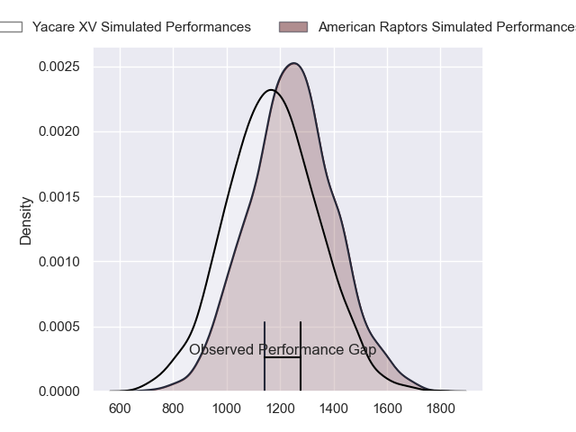
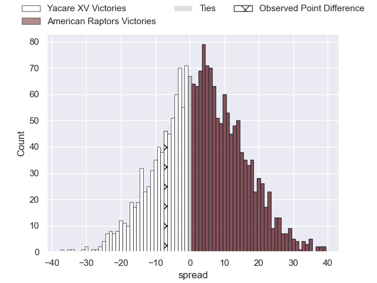
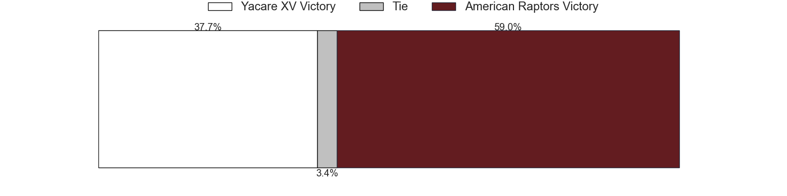

---  
layout: page  
title: Yacare XV at American Raptors; 44-37  
date: 2023-05-07 22:00:00 18:00:00 -0500  
categories: match review  
---
# Yacare XV at American Raptors; 44-37

# Club Level Predictions

The first set of predictions treats a club as the smallest object, as the club develops its members, organizes a gameplan, and deploys its players as needed for each match. This club model has a prediction of 0.586, which translates to predicting American Raptors to win by 3.4.

Each club has a rating and a rating deviation (simiar to a Glicko system), and expected performances can be generated. This allows for simulated matches and spreads like the ones below.
## Projected Performances

## Projected Spreads

## Projected Results

# Player Level Predictions

Treating teams instead as an entity made up of the currently active players, I have ratings for each player in an altogether different system. These can be combined to form team ratings once teamsheets are announced, weighting starters a bit higher than the reserves. After the match is played, players can be weighted by their minutes on the field, allowing for an accurate measure of the team's composition. With these compiled team ratings, we can make predictions, measure inaccuracy, and update the individual player ratings.
## Prediction with Player Minutes: Yacare XV by 0.6

Yacare XV by 4.6 on a neutral field

There were 9 large changes in win probability in this match
## Prediction without Player Minutes: Yacare XV by 1.0

Yacare XV by 5.0 on a neutral pitch

|   Away Minutes | Away Player            |   Away elo |   Away Percentile |   Number |   Home Percentile |   Home elo | Home Player              |   Home Minutes |
|---------------:|:-----------------------|-----------:|------------------:|---------:|------------------:|-----------:|:-------------------------|---------------:|
|             56 | Lucas Noguera Paz      |      53.17 |                 8 |        1 |                28 |      67.43 | Payton Telea-Ilalio      |             65 |
|             56 | Mariano Muntaner       |      38.33 |                 2 |        2 |                47 |      74.37 | Diego Fortuny            |             80 |
|             67 | Facundo Pomponio       |      68.93 |                32 |        3 |                10 |      54.99 | Ma'ake Muti              |             80 |
|             70 | Lucas Sommer           |      87.64 |                71 |        4 |                 6 |      48.4  | Diego Magno              |             80 |
|             80 | Mariano Garcete Elli   |      50.93 |                 8 |        5 |                 0 |      32.02 | Will Crawford            |             65 |
|             80 | Felipe Villagran       |      46.67 |                 5 |        6 |                 6 |      49.82 | Shawn Clark              |             80 |
|             80 | Felipe Puertas         |      89.76 |                75 |        7 |               nan |      50.94 | Mo Vainikolo             |             47 |
|             80 | Juan Cruz Perez Rachel |      35.81 |                 2 |        8 |                26 |      64.62 | Ronan Murphy             |             80 |
|             80 | Ignacio Inchauspe      |      81.06 |                58 |        9 |                 1 |      40.04 | Martin Landajo           |             56 |
|             80 | Federico Cacciabúe     |      42.5  |                 4 |       10 |                 9 |      51.69 | Lucas Gonzalez Amorosino |             80 |
|             80 | Juan Daniel Gonzalez   |      28.41 |                 1 |       11 |                 5 |      44.48 | Ramiro Moyano            |             80 |
|             80 | Sebastian Urbieta      |      66.5  |                28 |       12 |                18 |      59.37 | Aki Pulu                 |             80 |
|             80 | Ramiro Amarilla        |      55.49 |                11 |       13 |                 8 |      50.96 | Watson Filikitonga       |             80 |
|             80 | Arturo Lopez           |      55.36 |                13 |       14 |                 6 |      48.46 | Ryan James               |             80 |
|             17 | Tomas McCall           |      44.6  |                 6 |       15 |                14 |      56.97 | Line Latu                |             80 |
|             63 | Federico Gauna         |      57.79 |                16 |       16 |                 5 |      45.54 | Mikey Grandy             |             33 |
|             24 | Julian Martin          |      36.97 |                 1 |       17 |                42 |      72.83 | Ethan McVeigh            |             24 |
|             24 | Emilio Gorostiaga      |      61.91 |                21 |       18 |               nan |      54.25 | Sebastian Otero          |             15 |
|             13 | Rolando Edgar Portillo |      46.96 |               nan |       19 |               nan |      48.85 | Tavius Sykora-Matthess   |             15 |
|             10 | Ignacio Martinez       |      42.42 |                 3 |       20 |               nan |     nan    | nan                      |            nan |

